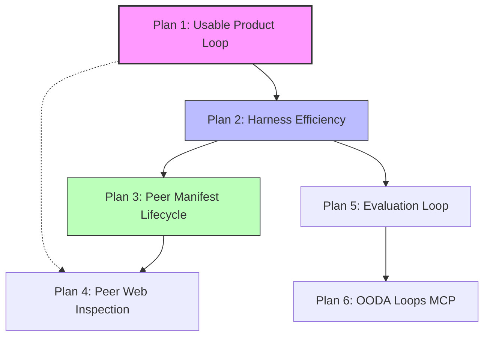

# High-Value Implementation Plan

> **Status**: Proposed prioritization
> **Created**: 2026-06-03
> **Scope**: Review of `.specs/` (171 files) cross-checked against current codebase at `main`
> **Method**: Score each spec suite on (1) user-visible product value, (2) leverage on existing partial implementations, (3) risk reduction, (4) effort-to-impact ratio, (5) dependency unlock for downstream work

## Executive Summary

The `.specs/` folder contains strong ideas across three different maturity layers:

1. **Product cutline specs** — make Thoughtbox usable end-to-end for a paying Claude Code user (`thoughtbox-v1-finalstretch/`, `SPEC-USABILITY-CUTLINE.md`).
2. **Harness efficiency specs** — reduce token tax and session continuity failures for agents already using Thoughtbox (`SPEC-CHX-001`, `SPEC-SRC-006`, `harness-optimization/`).
3. **Platform expansion specs** — peer notebooks, evaluation loops, notebook/srcbook features, governance substrate (`mcp-peer-notebooks/`, `SPEC-EVAL-001`, `SPEC-SRC-*`, `agent-governance-substrate/`).

**Recommendation:** Ship the product cutline first, then a bundled harness-efficiency slice, then continue ADR-022 peer-notebook delivery in its prescribed order. Defer notebook preview (SRC), RLM, Letta/DGM, and governance-substrate research until the core loop is demoable and agents aren't losing sessions.

Several specs describe work that is **already partially or fully implemented** but not reflected in spec status fields — this plan calls those out so effort isn't duplicated.

---

## Current State Snapshot (Verified Against Code)

| Area | Spec says | Code reality |
|------|-----------|--------------|
| Code Mode (`SPEC-CORE-002`) | Draft / migration | **Shipped**: `thoughtbox_search` + `thoughtbox_execute`, `src/code-mode/` |
| LangSmith tracing (`SPEC-EVAL-001` L1) | Draft | **Shipped**: `src/evaluation/trace-listener.ts`, wired in `src/index.ts` |
| Structured thought UI (`SPEC-AUD-001`) | Draft / Observatory | **Mostly shipped** in web app: `apps/web/src/components/session-area/thought-card.tsx` |
| Plugin init (`SPEC-CLI-INIT`) | Draft, full npm package | **Partial**: `plugins/thoughtbox-claude-code/src/cli/main.ts` writes MCP + OTLP config locally |
| OODA loops MCP (`IMPLEMENTATION-READY.md`) | Approved, ready | **Not present** at `main`: no `scripts/embed-loops.ts`, no `src/resources/loops-*`, build has no `embed-loops` step |
| Gateway schema dedup (`SPEC-GW-011`) | High priority | **Not implemented**: no `sessionSchemasSeen`; less critical now that Code Mode is primary |
| Session recovery (`SPEC-SRC-006`) | P0 critical | **Not implemented**: no `mcpRootUri` in session metadata |
| Cognitive harness (`SPEC-CHX-001`) | High, 11 items | **Not implemented**: no `tb.t()`, no mid-session recall ops |
| Peer notebooks Part 1 (`mcp-peer-notebooks/`) | Next = Part 2 | **Shipped**: durable Supabase control plane in `src/peer-notebook/` |
| Usability cutline (`SPEC-USABILITY-CUTLINE`) | Draft | **Gap remains**: no `/runs` product view, ship checklist E2E items unchecked |
| Harness T2 defaults | Draft | **Not implemented**: `thoughtType` still required in schema |

This snapshot drives prioritization: **finish incomplete high-leverage slices before starting greenfield spec suites.**

---

## Prioritization Framework

Each proposed plan is scored 1–5 on:

- **Impact** — Does this change what a user or agent can actually do?
- **Leverage** — Does existing code get us 30%+ of the way there?
- **Urgency** — Is there a known incident, blocker, or ADR sequencing constraint?
- **Effort** — Rough engineering scope (S / M / L / XL)

---

## Plan 1: Complete the First Usable Product Loop

**Primary specs**

- `.specs/thoughtbox-v1-finalstretch/SPEC-USABILITY-CUTLINE.md`
- `.specs/thoughtbox-v1-finalstretch/SPEC-CORRELATION-CONTRACT.md`
- `.specs/thoughtbox-v1-finalstretch/SPEC-HOOK-CAPTURE.md` (simplified per cutline)
- `.specs/thoughtbox-v1-finalstretch/SHIP-CHECKLIST.md`

**Score:** Impact 5 · Leverage 4 · Urgency 5 · Effort L

### What to build

1. **Harden `thoughtbox init`** (extend existing plugin CLI, not a new npm package):
   - Validate API key against deployed server.
   - Write MCP URL + OTLP export env vars into `.claude/settings.local.json` (already started in `plugins/thoughtbox-claude-code/src/cli/main.ts`).
   - Emit binding events that populate the `runs` correlation row (per `SPEC-CORRELATION-CONTRACT`).

2. **Finish run ↔ session ↔ OTEL binding**:
   - Prove one real Claude Code work period creates exactly one `runs` row with both Thoughtbox session id and raw OTEL session id.
   - Surface `binding_missing` explicitly in queries (15s timeout per spec).

3. **Ship a `/w/[workspaceSlug]/runs/[runId]` view** (or equivalent under observability):
   - Interleave reasoning timeline (existing session UI) with tool/cost telemetry from OTEL.
   - Minimal blast radius: file touch counts, tool counts — not `SPEC-BLAST-RADIUS` graph analysis.

4. **Close ship checklist §6**: fresh API key → Claude Code task → verify binding → verify web render.

### Why this ranks first

The cutline spec states the product thesis plainly: *init → run agent → open Thoughtbox → see one coherent work period*. Everything else in `.specs/` assumes that loop works. Auth, workspaces, Supabase persistence, OTLP ingestion, and session/thought UI already exist — the missing piece is **correlation + onboarding + a unified run view**, not new infrastructure.

Investing in peer notebooks, evaluation datasets, or notebook preview before this loop works produces features nobody can reach through a credible demo path.

### What to defer from this bundle

- `SPEC-PROJECT-MODEL` module graph upload (cutline explicitly defers).
- Full blast-radius dependency graphs.
- Notebook / RLM surfaces.

### Acceptance gate

All items in `SHIP-CHECKLIST.md` §6 (End-To-End Demo Proof) pass on deployed infrastructure without inference-based joins.

---

## Plan 2: Agent Harness Efficiency Bundle

**Primary specs**

- `.specs/SPEC-CHX-001-cognitive-harness-improvements.md` — items **#1, #2, #3, #7** only
- `.specs/SPEC-SRC-006-session-recovery-via-mcp-root.md`
- `.specs/harness-optimization/SPEC-HARNESS-T2.md` — items **1–2** (defaults + auto-resume overlap)

**Score:** Impact 4 · Leverage 4 · Urgency 4 · Effort M

### What to build

**Phase A — Quick wins (same PR or back-to-back PRs)**

| Item | Change | Reason |
|------|--------|--------|
| CHX #1 | Document auto-numbering in `sdk-types.ts`, onboarding skill, canonical examples | Server already auto-assigns numbers; agents still manually track because types/examples say otherwise — pure confusion tax |
| CHX #2 | Add `tb.t()` / `tb.end()` shorthands in Code Mode execute layer | ~17k tokens/session of boilerplate observed in source session; no schema/storage change |
| HARNESS-T2 §1 | Default `thoughtType` to `"reasoning"` in Zod + SDK types | Handler already defaults at runtime; schema mismatch forces agents to specify anyway |
| CHX #7 | Allow `decision_frame` with `decisionState: "deliberating"` (zero selected options) | Prevents agents from avoiding structured decisions during research sessions |

**Phase B — Session continuity (data-loss prevention)**

| Item | Change | Reason |
|------|--------|--------|
| SRC-006 | Persist `mcpRootUri` on session; make `load_context` accept omitted `sessionId` | Documented incident: 67 thoughts orphaned when MCP client rotated sessions every ~15 min |
| HARNESS-T2 §2 | Auto-resume most recent session for bound MCP root on init | Composes directly with SRC-006 |

**Phase C — Mid-session recall**

| Item | Change | Reason |
|------|--------|--------|
| CHX #3 | `session_get_thought`, `session_recent_thoughts`, `session_search_within` | Agents currently pull full session blobs or hold conclusions in working memory |

### Why this ranks second

These specs attack **recurring friction observed in real 100+ thought sessions**, not hypothetical UX. They are mostly thin layers on existing handlers (`thought-handler.ts`, `init/operations.ts`, `sessions/handlers.ts`, `code-mode/execute-tool.ts`).

Session recovery (SRC-006) is explicitly P0 because it prevents **silent data loss** — higher urgency than observability polish or new runtime classes.

### What to defer from CHX-001

| Item | Defer reason |
|------|--------------|
| #4 Subagent attach | 8–12h, cross-cuts Agent runtime; do after structured returns (#11) |
| #5 Hook suppression | Plugin-side; lower impact than server-side defaults |
| #6 Cipher mode toggle | Nice compression; prose sessions work without it |
| #8 Per-session-type audit | Depends on audit manifest maturity |
| #9 Named checkpoints | Overlaps with CHX #3; ship recall first |
| #10 KG persistence shortcut | Knowledge graph product surface immature |
| #11 Structured return schemas | Valuable but pairs with #4; batch together later |

### Acceptance gate

- Agent can call `tb.t("...")` without `thoughtNumber` / `thoughtType` / `nextThoughtNeeded`.
- `load_context` with no args resumes the latest session for the current MCP root after client timeout.
- `session.recent(sessionId, 5)` returns last five thoughts without full session payload.

---

## Plan 3: ADR-022 Peer Notebook — Manifest Lifecycle (Part 2/5)

**Primary specs**

- `.specs/mcp-peer-notebooks/NEXT-IMPLEMENTATION-HANDOFF.md`
- `.specs/mcp-peer-notebooks/PROMPT-PART-2-MANIFEST-LIFECYCLE.md`
- `.specs/mcp-peer-notebooks/SPEC-CONTROL-PLANE.md`
- `.adr/staging/ADR-022.json`

**Score:** Impact 4 · Leverage 5 · Urgency 4 · Effort L

### What to build

Per the handoff (already scoped and tracker-referenced as `thoughtbox-g5t`):

1. Compile `peer.manifest.json` from **actual notebook sources** without executing notebook code.
2. Store draft manifests durably (Supabase tables exist from Part 1).
3. Implement approve → activate → retire lifecycle with explicit manifest hash enforcement at invocation.
4. Prove notebook edits do **not** silently change active capabilities.

Use `.claude/skills/peer-notebook-delivery-guard/SKILL.md` — mocks remain contract fixtures only.

### Why this ranks third (not first)

Part 1 already landed the broker shape, Supabase persistence, MCP surface, and mock runtime. **Stopping before Part 2 leaves a pilot that cannot graduate real notebooks** — but it is still secondary to the consumer product loop (Plan 1) because peer notebooks target multi-agent fleet orchestration, not first-time user onboarding.

The handoff explicitly says: do not build web app pages, `local-process`, or smolvm in this unit. That sequencing is correct.

### Why not skip to Part 3 (web inspection) or Part 4 (real runtime)

Without manifest lifecycle, the web app would display statically bootstrapped peers — misleading governance UX. Lifecycle is the authority boundary; inspection and runtime providers depend on it.

### Acceptance gate

- Notebook-authored manifest draft → approval → activation changes enforced `manifestHash` at broker.
- Editing notebook after activation does not alter active capabilities until explicit re-approval.

---

## Plan 4: Peer Notebook Web Inspection (Part 3/5)

**Primary specs**

- `.specs/mcp-peer-notebooks/README.md` § Web App Surface
- `.specs/mcp-peer-notebooks/NEXT-IMPLEMENTATION-HANDOFF.md` (unit 2)

**Score:** Impact 3 · Leverage 4 · Urgency 3 · Effort L

### What to build

Next.js routes under `apps/web/src/app/w/[workspaceSlug]/peers/`:

- Registry list (peer status, active manifest hash, last invocation)
- Invocation list + detail with trace timeline (including denied outbound calls)
- Artifact preview from Supabase Storage rows (not in-memory fixtures)

### Why this ranks fourth

Peer notebook value is **observable, auditable work**. Traces already persist to Supabase; without a UI, operators must use MCP tools to inspect invocations — acceptable for development, not for product claims about governance.

Depends on Plan 3 so the UI reflects real manifest lifecycle, not static bootstrap data.

### Acceptance gate

Denied outbound tool call visible in web timeline for a real invocation (success condition from pilot spec).

---

## Plan 5: Close the Evaluation Loop (EVAL-001 Phases 2–4)

**Primary specs**

- `.specs/SPEC-EVAL-001-unified-evaluation-system.md`
- `.specs/evaluation/thoughtbox-eval-strategy.md`

**Score:** Impact 3 · Leverage 3 · Urgency 2 · Effort L

### What to build

Layer 1 (LangSmith trace listener) is **already implemented**. Remaining layers:

1. **Layer 2 — Datasets**: ALMA-style collection/deployment task examples in LangSmith.
2. **Layer 3 — Custom evaluators**: session quality, memory quality, DGM fitness (replace 0.0 stub scores).
3. **Layer 4 — Experiment runner**: compare configs, feed winners toward QD archive.

Wire scores back to `.eval/baselines.json` and DGM fitness signals.

### Why this ranks fifth

Evaluation does not unblock user-facing functionality today, but it **unblocks the improvement loop** the repo claims to want (SIL, DGM, regression detection). With tracing live, datasets + evaluators are the highest-leverage next step — not rebuilding tracing.

Defer Layer 5 (online monitoring/alerts) until baselines have non-zero sample sizes.

### Acceptance gate

At least one LangSmith experiment run produces comparable scores for two agent configurations; DGM fitness evaluator returns non-zero scores on a benchmark session.

---

## Plan 6: Restore OODA Loops MCP (IMPLEMENTATION-READY)

**Primary specs**

- `.specs/IMPLEMENTATION-READY.md`
- `.specs/README.md` (loops-mcp-composition-system — referenced but **files not present** in `.specs/` at `main`; content may live only in git history)

**Score:** Impact 3 · Leverage 2 · Urgency 2 · Effort M

### What to build

CHANGELOG references implementation (`scripts/embed-loops.ts`, loop resources, usage analytics) but **`main` lacks these files**. Either:

1. **Restore** the loops embedding pipeline from history if it was regressed, or
2. **Re-implement** per IMPLEMENTATION-READY requirements (embed → resource templates → `.claude/thoughtbox/loop-usage.jsonl` analytics).

Deliverables:

- `thoughtbox://loops/{category}/{name}` resources
- Build-time embedding with 50KB warn / 100KB fail limits
- Hot-loop promotion via usage aggregation

### Why this ranks sixth

Loops enable **codebase-as-learning-substrate** — aligned with Thoughtbox philosophy — but agents already have Code Mode search, workflow prompts, and `.claude/skills/`. Loops are high leverage for agent quality over time, not for first demo or session continuity.

**Action before coding:** locate canonical loop spec files (README links 404 at current tree) and reconcile with CHANGELOG vs `package.json` (no `embed-loops` script).

---

## Explicitly Deprioritized (Do Not Implement Next)

| Spec / suite | Reason to defer |
|--------------|-----------------|
| `SPEC-SRC-001`–`005` (Srcbook / notebook preview) | Usability cutline defers notebooks; large surface, separate product bet |
| `SPEC-RLM-001` | Research/experimental; depends on notebook runtime maturity |
| `SPEC-GW-011` gateway schema dedup | Code Mode is primary surface; gateway repetition tax reduced for modern clients |
| `SPEC-WRK-001` workflow resources tool | Overlaps Code Mode `thoughtbox_search`; marginal gain |
| `letta-specific/SPEC-DGM-*` | Letta integration niche; eval loop (Plan 5) extracts DGM fitness without full Letta stack |
| `agent-governance-substrate/` | Research artifacts, not accepted ADRs; Tier A actions are repo hygiene, not Thoughtbox features |
| `SPEC-HUB-002` hierarchical agent roles | Hub storage scope unclear; peer notebooks subsume much of multi-agent story |
| `gcp-stabilization-terraform.md`, `gcp-02-secret-manager.md` | Ops maintenance; schedule separately from product specs |
| `monorepo-merge/SPEC-KNOWLEDGE-GRAPH-UI` | No KG product cutline yet |
| `old-specs/continual-improvement/` | Superseded by eval + workflow skills; archive-only |
| `codebase-control/audits/` | Diagnostic research, not implementation units |
| `SPEC-BRANCH-WORKERS.md` | Depends on peer runtime provider (ADR-022 Part 4+) |

---

## Recommended Execution Order

**Parallelization notes**

- Plan 1 web app work and Plan 1 plugin CLI work can run in parallel after correlation contract is frozen.
- Plan 2 Phase A (docs + shorthands) can start immediately — no dependency on Plan 1.
- Plan 4 UI can begin read-model/query design while Plan 3 backend finishes, but should not ship first.
- Plan 5 is independent once Plan 2 session continuity stabilizes session IDs for eval datasets.

---

## Suggested PR / Branch Breakdown

| Order | Branch prefix | Spec anchor | Unit size |
|-------|---------------|-------------|-----------|
| 1 | `feat/run-correlation-binding` | SPEC-CORRELATION-CONTRACT | M |
| 2 | `feat/init-otlp-binding` | SPEC-USABILITY-CUTLINE + plugin CLI | S |
| 3 | `feat/runs-timeline-view` | SHIP-CHECKLIST §4–6 | M |
| 4 | `feat/code-mode-terse-api` | CHX #1, #2, HARNESS-T2 §1, CHX #7 | S |
| 5 | `feat/session-mcp-root-recovery` | SPEC-SRC-006 | M |
| 6 | `feat/session-recall-ops` | CHX #3 | M |
| 7 | `feat/peer-manifest-lifecycle` | ADR-022 Part 2 | L |
| 8 | `feat/peer-web-inspection` | ADR-022 Part 3 | L |
| 9 | `feat/eval-datasets-evaluators` | SPEC-EVAL-001 L2–L4 | L |
| 10 | `feat/ooda-loops-mcp` | IMPLEMENTATION-READY | M |

Each PR should update the touched spec's status section and, where behavior changes, acceptance criteria checkboxes in the same commit (per `AGENTS.md`).

---

## Spec Hygiene Follow-ups

These are not product features but prevent future mis-prioritization:

1. **Reconcile IMPLEMENTATION-READY / README loop links** — referenced `loops-mcp-*.md` files are missing from the tree; either restore or mark IMPLEMENTATION-READY stale.
2. **Update spec status fields** for shipped work: Code Mode, eval trace listener, peer notebook Part 1, web thought cards.
3. **Move `old-specs/` and research-only suites** behind an index note pointing to this plan's deprioritized table.
4. **Consolidate overlapping harness specs** — `SPEC-CHX-001`, `SPEC-HARNESS-T1/T2/T3`, and parts of `code-mode/target-state.md` describe related changes; reference this plan as the canonical sequencing doc.

---

## Decision Log (Why Not X?)

**Why peer notebooks aren't Plan 1:** ADR-022 is architecturally important but targets governed multi-agent fleets. The usability cutline explicitly excludes notebooks from the first shippable path.

**Why not cognitive harness item #4 (subagent attach) earlier:** Highest effort item in CHX-001; requires Agent runtime contract changes. Items #1–#3 deliver most token savings and recall value at lower risk.

**Why not SPEC-GW-011 despite "High" priority in spec:** Written for gateway-primary clients. Code Mode embeds SDK types in `thoughtbox_execute` description; gateway schema repetition is a second-order cost for legacy paths.

**Why evaluation before OODA loops:** Tracing infrastructure exists; connecting evaluators closes a feedback loop the repo references in SIL/DGM docs. Loops improve agent playbook discovery but don't measure whether changes help.

---

## References

- Product cutline: `.specs/thoughtbox-v1-finalstretch/SPEC-USABILITY-CUTLINE.md`
- Ship gate: `.specs/thoughtbox-v1-finalstretch/SHIP-CHECKLIST.md`
- Harness friction evidence: `.specs/SPEC-CHX-001-cognitive-harness-improvements.md`
- Session loss incident: `.specs/SPEC-SRC-006-session-recovery-via-mcp-root.md`
- Peer notebook sequencing: `.specs/mcp-peer-notebooks/NEXT-IMPLEMENTATION-HANDOFF.md`
- Evaluation architecture: `.specs/SPEC-EVAL-001-unified-evaluation-system.md`
- Code Mode shipped state: `.specs/code-mode/target-state.md`, `src/code-mode/`
