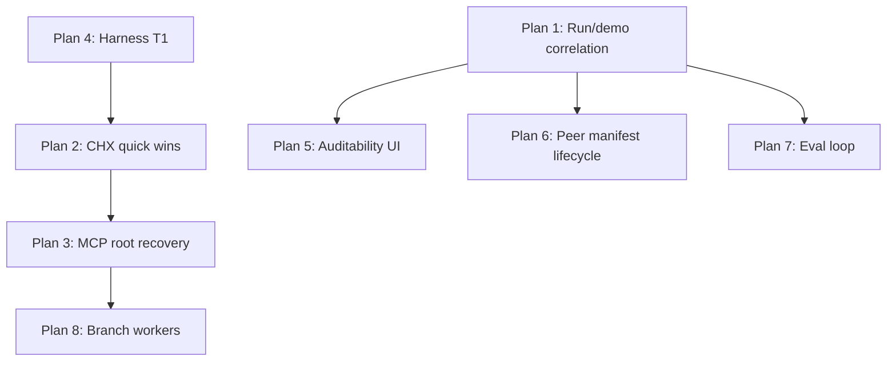

# Highest-Value Implementation Plans (from `.specs/` review)

> **Status**: Proposed prioritization document  
> **Created**: 2026-06-03  
> **Scope**: Actionable plans for the highest-leverage designs in `.specs/`, with explicit reasoning—not a full inventory of all 171 files.

## How this was prioritized

Each candidate was scored on five axes (qualitative, not a formula):

| Axis | Question |
|------|----------|
| **Ship leverage** | Does it unblock demo, billing, or “one coherent run” proof? |
| **Agent leverage** | Does every session get cheaper, safer, or more capable? |
| **Evidence quality** | Is the spec grounded in a real session, incident, or accepted ADR? |
| **Implementation clarity** | Are files, APIs, and acceptance criteria named? |
| **Current gap** | Is it mostly unbuilt vs. already shipped? |

**Deliberately deprioritized** (good ideas, wrong moment):

- **Full Canonical IR / TBX-C1** (`SPEC-CORE-002`) — Code Mode MVP already ships `thoughtbox_search` + `thoughtbox_execute`; the long IR rewrite is a separate epoch.
- **OODA loops MCP suite** (`IMPLEMENTATION-READY.md`, `README.md`) — References `loops-mcp-*.md` and `embed-loops.ts` that are not present in the tree today; `package.json` has `embed-templates` only. Treat as **reconcile-or-rewrite** before implementation.
- **Letta-specific DGM archive** (`letta-specific/SPEC-DGM-*`) — Valuable for a Letta integration track, not the core Thoughtbox wedge.
- **Unified autonomy control plane** (`unified-autonomy-control-plane/`) — Auto-generated manifest; meta-governance, not product surface.
- **Srcbook full stack** (`SPEC-SRC-001`–`005`) — Large product bet; defer until run/demo path is green.
- **Agent governance substrate** (`agent-governance-substrate/`) — Explicitly “not for implementation without user approval”; still valuable as a **2-hour ops** slice (see Plan 7).

---

## Recommended sequence (summary)

| Order | Plan | Primary specs | Why now |
|-------|------|---------------|---------|
| 1 | Finish v1 run/demo correlation | `thoughtbox-v1-finalstretch/SHIP-CHECKLIST.md` | Product truth: one run, one session, OTEL + thoughts |
| 2 | Cognitive harness quick wins | `SPEC-CHX-001`, `cognitive-harness-improvements/*` | Low cost, proven friction in 146-thought session |
| 3 | Session recovery by MCP root | `SPEC-SRC-006` | Prevents real data loss on MCP client timeout |
| 4 | Harness T1 (plugin defaults) | `harness-optimization/SPEC-HARNESS-T1` | Makes interleaved thinking the default |
| 5 | Auditability timeline cards | `auditability/SPEC-AUD-001` (+ 010) | Turns structured thoughts into scannable UI |
| 6 | Peer notebook manifest lifecycle | `mcp-peer-notebooks/NEXT-IMPLEMENTATION-HANDOFF.md` | ADR-022 Part 2; builds on shipped control plane |
| 7 | Evaluation loop completion | `SPEC-EVAL-001` | Close DGM fitness + regression detection |
| 8 | Parallel branch workers | `SPEC-BRANCH-WORKERS.md` | Unlocks safe parallel exploration (today: singleton races) |

Plans 1–4 are **weeks-scale** and mostly independent. Plans 5–8 are **parallel tracks** after or beside Plan 1.

---

## Plan 1: Ship one coherent run (v1 final stretch)

**Specs**: `thoughtbox-v1-finalstretch/SHIP-CHECKLIST.md`, `DEPENDENCY-LEDGER.md`, `SPEC-CORRELATION-CONTRACT.md`, `WEB-APP-OTEL-QUERY-FIX.md`

**Current state**: Schema and server paths for `runs` binding are largely implemented (checklist items 1–4 marked done). **Remaining gap** is end-to-end proof on a fresh real Claude Code work period—not more schema design.

### Proposed implementation

**Phase A — Operational prerequisites**

1. Apply pending migrations to the environment that receives OTLP (ledger calls this out explicitly).
2. Verify hook OTLP path: `thoughtbox.run_binding` with `mcp.session_id`, `thoughtbox.session_id`, and OTEL `session.id` (no inferred joins).

**Phase B — Empty/error states (checklist §5)**

1. Web run view: explicit UI when run exists but OTEL missing, or thoughts missing, or no runs.
2. Remove ambiguous blank states called out in the checklist.

**Phase C — E2E demo proof (checklist §6)**

1. Fresh API key from live web app → Claude Code against deployed MCP → one short task.
2. Assert: exactly one `runs` row, OTEL rows for bound `otel_session_id`, thoughts for bound `session_id`, web renders one run view.

**Phase D — Kill-switch enforcement**

1. If any query path still infers correlation (e.g. `sessions.id` = `otel_events.session_id`), stop and fix before new features.

### Reasoning

- **Highest business value**: Without this, Observatory and evaluation arguments are unprovable in a demo.
- **Lowest architecture risk**: Binding model is already decided; work is verification and UX, not greenfield design.
- **Unblocks Plans 5 and 7**: Auditability and LangSmith scoring assume trustworthy run/session identity.

### Acceptance

- All unchecked items in `SHIP-CHECKLIST.md` §5–6 and kill-switch are satisfied on a recorded demo path.

---

## Plan 2: Cognitive harness quick wins (CHX Tier 1)

**Specs**: `SPEC-CHX-001`, detail specs `cognitive-harness-improvements/01`–`05`, `VALIDATORS.md`

**Current state**: Server auto-numbering exists (`thought-handler.ts`); Code Mode is live. **Not shipped**: `tb.t()`, mid-session recall ops, hook suppression, doc/example fixes that still teach manual `thoughtNumber`.

### Proposed implementation (four PRs, parallelizable)

| PR | Deliverable | Files (indicative) | Effort |
|----|-------------|-------------------|--------|
| 2a | Auto-numbering surfacing | `src/code-mode/sdk-types.ts`, `src/thought/operations.ts`, `.claude/skills/thoughtbox-onboard/SKILL.md` | ~1h |
| 2b | `tb.t()` / `tb.end()` | `src/code-mode/execute-tool.ts`, `sdk-types.ts`, tests per `VALIDATORS.md` V2.1 | ~4h |
| 2c | Mid-session recall | `session_get_thought`, `session_recent_thoughts`, `session_search_within` in `src/sessions/*`, SDK exposure | ~6h |
| 2d | Hook suppression during active TB session | Plugin/hook config per CHX #5; coordinate with Plan 4 | ~3h |

**Defer within CHX** (still high value, second wave): #4/#11 subagent attach, #6 cipher toggle, #7/#8 audit session types, #9 checkpoints, #10 `persistAs` knowledge shortcut.

### Reasoning

- **Evidence-backed**: SPEC-CHX-001 cites a 146-thought production-style session; friction is measured (~17.5k tokens of boilerplate).
- **Compounds Code Mode**: You already paid the cost of `thoughtbox_execute`; these changes multiply every thought call.
- **No storage migration**: PRs 2a–2c are additive API and docs; lowest regression risk in the portfolio.
- **Why before Canonical IR**: Same user outcome (cheaper reasoning) without a persistence rewrite.

### Acceptance

- Validation bullets in `SPEC-CHX-001` §Validation for items #1–#3 and #5 on a 50+ thought session.

---

## Plan 3: Session recovery via MCP root

**Spec**: `SPEC-SRC-006-session-recovery-via-mcp-root.md`

**Current state**: No `mcpRootUri` in codebase (grep clean). Agents must remember `sessionId` across MCP client reconnects (~15 min); **67-thought loss incident** documented in spec.

### Proposed implementation

**Phase A — Metadata**

1. Extend session metadata (filesystem + Supabase) with `mcpRootUri` (normalized `file://` URI).
2. Set on `init` / first thought from MCP context roots.

**Phase B — Recovery API**

1. New operation: `session_recover_latest` (or `init` flag `recover: true`) — input: `mcpRootUri`; output: latest session by `updatedAt` for that root.
2. Code Mode: `tb.session.recover()` wrapping the same handler.

**Phase C — Agent contract**

1. Update onboarding skill: after compaction or new MCP session, call recover before creating a duplicate session.
2. Optional: emit Observatory event when recovery links an orphaned prior session.

### Reasoning

- **P0 for reliability**: Data loss is worse than missing UI polish.
- **Small surface area**: One field + one query + init path change.
- **Complements Plan 2c**: Recall ops matter more when session identity survives reconnects.
- **Why not full SRC-001 Observatory channel**: Recovery fixes core MCP; preview WebSocket is a separate product bet.

### Acceptance

- Simulated MCP session swap (new MCP session id, same project root) resumes prior session without agent-supplied id.

---

## Plan 4: Harness optimization Tier 1

**Spec**: `harness-optimization/SPEC-HARNESS-T1.md`

**Current state**: Interleaved-thinking prompt content references Code Mode (`thoughtbox_execute`), but **SessionStart primer** and **PostToolUse session tracker** from T1 are not verified in plugin hooks.

### Proposed implementation

1. **SessionStart primer** — Inject `<thoughtbox-primer>` when Thoughtbox MCP is configured and agent is not a subagent (`CLAUDE_AGENT_ID` unset). Exact copy in spec (~55 words).
2. **Interleaved thinking rewrite** — Replace 5-phase ceremony with OODA loop controller (spec provides full replacement text for `interleaved-thinking-content.ts`; server copy may already be partially updated—diff and align plugin + server).
3. **PostToolUse session tracker** — Persist active `sessionId` to `.claude/state/` (or equivalent) for tooling and recovery hints.

### Reasoning

- **Behavior change without server deploy** — Improves adoption of everything in Plans 2–3.
- **Fixes stale tool names** — Old `mcp__thoughtbox__thoughtbox` references actively mislead agents.
- **Pairs with Plan 2d** — Primer brings agents in; hook suppression stops competing nudges.

### Acceptance

- Manual session: primer appears once at start; interleaved prompt describes Think/Act loop; session id file updates on thought calls.

---

## Plan 5: Auditability MVP — structured timeline

**Specs**: `auditability/SPEC-AUD-001`, `SPEC-AUD-010`, prompts `PROMPT-AUD-001`

**Current state**: Web app has thought-type parsing in `apps/web/src/lib/session/view-models.ts` and typed export formatters. Gap is **live Observatory timeline** cards and WebSocket payloads including `thoughtType` per AUD-001 R1.

### Proposed implementation

**Phase A — Transport**

1. Ensure thought WebSocket events include `thoughtType` (and fields needed for parsers).

**Phase B — UI cards**

1. `decision_frame`, `action_report`, `belief_snapshot`, `assumption_update` card components per R2–R4.
2. Link action reports to preceding decision frames (R4).

**Phase C — SPEC-AUD-010**

1. Structured rendering rules for export/replay parity with live view.

### Reasoning

- **User-facing payoff for existing server work** — Seven thought types already exist; this exposes them.
- **3AM auditability** — Spec’s explicit persona; reduces time to find a bad decision.
- **Cheaper than full AUD-002–005** — Branch viz and fault attribution build on timeline foundation.

### Acceptance

- Scan a 50+ thought session timeline in &lt;60s and locate last `decision_frame` + following `action_report` without reading raw paragraphs.

---

## Plan 6: MCP peer notebooks — manifest lifecycle (ADR-022 Part 2)

**Specs**: `mcp-peer-notebooks/NEXT-IMPLEMENTATION-HANDOFF.md`, `SPEC-CONTROL-PLANE.md`, ADR-022

**Current state**: Part 1 durable control plane merged (`thoughtbox_peer_notebook`, Supabase tables, mock runtime). **Next locked unit**: manifest compile from notebook sources, draft/approve/activate/retire, active hash enforcement.

### Proposed implementation

1. **Compiler** — Build `peer.manifest.json` from notebook sources without executing notebook code.
2. **Lifecycle API** — Draft → approve → activate → retire; store manifest rows; reject invoke if hash ≠ active.
3. **Drift test** — Notebook edit does not change active capabilities until new manifest is activated.
4. **Delivery guard** — Per `peer-notebook-delivery-guard` skill: every mock/stub listed and narrowed or replaced.

**Explicitly out of scope** (per handoff): web inspection UI, `local-process`, smolvm production isolation.

### Reasoning

- **Committed ADR path** — Part 1 sunk cost; Part 2 is the governance core (“capabilities don’t drift silently”).
- **Agent-native fleet** — Aligns with product direction (brokered peers, not monolithic MCP).
- **Why after Plan 1** — Hosted demo and workspace auth should be trustworthy before expanding runtime surface.

### Acceptance

- Handoff “Do” list for `thoughtbox-g5t` satisfied; invoke fails on stale manifest hash.

---

## Plan 7: Close the evaluation loop (EVAL-001)

**Spec**: `SPEC-EVAL-001-unified-evaluation-system.md`

**Current state**: `src/evaluation/` implements trace listener, datasets, experiment runner, online monitor (Phases 1–4 per module header). Gaps from spec problem statement: DGM fitness still 0.0, baselines empty, gatekeeper pass-through.

### Proposed implementation

**Phase A — Wire fitness to real scores**

1. Connect `dgmFitnessEvaluator` output to archive write path (`.dgm/` or configured store).
2. Backfill one benchmark run to prove non-zero fitness.

**Phase B — EvaluationGatekeeper**

1. Replace pass-through stub with threshold checks on session quality + regression vs baseline.

**Phase C — Operational docs**

1. Document `LANGSMITH_API_KEY` optional path; verify no-op when unset (spec NFR).

### Reasoning

- **Foundation already built** — Highest ROI is wiring, not new architecture.
- **Enables ALMA-style experiments** — Spec’s stated goal; unblocks memory-design meta-learning.
- **Fire-and-forget preserved** — Matches ThoughtEmitter philosophy; low risk to production hot path.

### Acceptance

- One experiment run produces annotated traces; DGM archive receives non-zero fitness; gatekeeper fails a deliberately bad session in test.

---

## Plan 8: Parallel branch workers (stateless edge)

**Spec**: `SPEC-BRANCH-WORKERS.md`

**Current state**: `ThoughtHandler` singleton with mutable branch state — **unsafe for concurrent branch writers** (spec problem statement).

### Proposed implementation

**Phase A — Schema**

1. `branches` table + branch-local thought numbering (spec SQL).

**Phase B — `tb-branch` edge function**

1. MCP Lite server: `branch_thought`, `branch_status`, `branch_read`.
2. HMAC-signed URL from main MCP `branch_spawn`.

**Phase C — Main MCP module**

1. `branch_spawn`, `branch_merge`, `branch_list`, `branch_get` on Code Mode `tb.branch.*`.

**Phase D — Realtime (optional)**

1. Postgres triggers / Realtime for parent merge notifications.

### Reasoning

- **Unlocks branching’s main use case** — Parallel exploration is the reason branches exist.
- **Aligns with Supabase execution plane** — Matches v1 initiative (stateless workers, Postgres truth).
- **Why not first** — Requires secure edge auth and migration discipline; Plans 1–3 reduce incident risk first.

### Acceptance

- Three concurrent branch workers write without lost updates; `branch_merge` produces main-track synthesis thought.

---

## Optional fast ops: Governance Tier A (research → 2 hours)

**Specs**: `agent-governance-substrate/STARTER-TIER-A.md`, `SPEC-SEVEN-LAYER-ARCHITECTURE.md`

**Not a product feature** — platform hygiene. If the inverse-outcome pattern (agents strip in-repo governance) is still active:

1. **A1** — Branch protection on `main` (10 min).
2. **A5** — PR claim-check Action (2–4 h) or minimal version first.

### Reasoning

- Spec README says “not for implementation without user approval”—include as **optional** because it addresses a documented repo failure mode, not agent UX.
- **Outside agent reach** — Only layer that historically worked for other teams.

---

## Cross-cutting dependencies

---

## Spec hygiene follow-ups (meta)

| Issue | Action |
|-------|--------|
| `IMPLEMENTATION-READY.md` references missing `loops-mcp-*.md` | Archive or restore loop specs; align `README.md` status table |
| `embed-loops` in docs/CHANGELOG but no `scripts/embed-loops.ts` | Either implement or remove from build docs |
| `SPEC-GW-011` targets `gateway-handler.ts` | Re-scope to Code Mode response shaping if gateway is deprecated (`code-mode/target-state.md`) |
| Duplicate cognitive harness docs | `SPEC-CHX-001` vs `cognitive-harness-improvements/` — keep CHX-001 as index |

---

## Suggested HDD / ADR actions

| Plan | HDD needed? |
|------|-------------|
| 1 | No — execution against accepted correlation model |
| 2–4 | Optional staging note; mostly additive |
| 6 | **Yes** — ADR-022 Part 2 should stay staged until validated |
| 8 | **Yes** — new execution plane boundary (edge workers) |
| 7 | Light — wire-up only if fitness semantics change |

---

## One-line thesis

**Ship provable run identity first, then make every agent session cheaper and recoverable (CHX + harness + MCP root), then invest in surfaces that multiply trust (audit UI, peer manifests, eval loop, parallel branches).**
