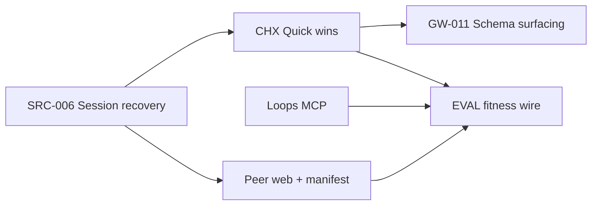

# Implementation Priorities Plan (from `.specs/` review)

> **Status**: Proposed (planning artifact, not an ADR)  
> **Created**: 2026-06-03  
> **Scope**: Highest-value designs in `.specs/` with sequenced implementation plans and explicit reasoning  
> **Method**: Read spec index, `IMPLEMENTATION-READY.md`, ADR-022 handoffs, and spot-check `src/` for what is already shipped vs. still draft-only.

---

## Executive summary

The `.specs/` folder mixes three kinds of work:

1. **Ship-ready specs** with validation scores and concrete file paths (OODA loops MCP, gateway schema surfacing).
2. **Strategic platforms** partially landed in code (Code Mode `thoughtbox_search` / `thoughtbox_execute`, LangSmith evaluation stack, MCP peer notebooks Part 1).
3. **Research / deferred suites** (Letta DGM fleet, full Canonical IR/TBX-C1, continual-improvement ULC, smolvm isolation) that should not block near-term delivery.

This plan recommends **six initiatives** in priority order. Each is chosen for a combination of: user-visible pain removed, token/cost leverage, unblocks other specs, and fit with what already exists in the repo.

**What we deliberately deprioritize** (with reasoning at the end): full SPEC-CORE-002 Phases 1–5 (Canonical IR + TBX-C1 + isolate execution) before pragmatic Code Mode alignment; smolvm peer runtime before web inspection; Tier B governance megaprojects before closing loops on Tier A.

---

## How specs were scored

| Criterion | Weight | Question |
|-----------|--------|----------|
| **Pain / risk** | High | Does inaction cause data loss, unsafe concurrency, or false agent claims? |
| **Leverage** | High | Does it reduce tokens, unlock parallel agents, or close an eval loop? |
| **Readiness** | Medium | Is there a 90+ validation doc, file-level targets, or merged pilot code? |
| **Dependencies** | Medium | Can it ship without new execution planes or HDD cycles? |
| **Alignment** | Medium | Matches `AGENTS.md` dual backend (Supabase + filesystem) and GitHub Flow? |

---

## Priority 1 — Session continuity: MCP root recovery (SPEC-SRC-006)

### Specs

- [SPEC-SRC-006-session-recovery-via-mcp-root.md](./SPEC-SRC-006-session-recovery-via-mcp-root.md)

### Problem (verified gap)

`load_context` still **requires** `sessionId` in `src/init/operations.ts`. Catalog text in `server-factory.ts` advertises `list_roots` / `bind_root`, but those operations are **not** present in `INIT_OPERATIONS` — agents cannot reliably resume after MCP client session timeouts (~15 minutes), which caused documented thought loss (67 thoughts, 2026-01-17 incident in the spec).

### Proposed plan

| Step | Work | Reasoning |
|------|------|-----------|
| 1 | Add `mcpRootUri` (and optional `mcpRootName`) to session metadata in storage interfaces + Supabase migration | Stable key across agent compaction; matches MCP `roots` contract |
| 2 | Implement `bind_root` / `list_roots` on init toolhost: persist root → project scope, stamp sessions on `start_new` | Reuses existing “project scope” errors in `storage.ts`; completes advertised catalog |
| 3 | Extend `load_context`: if `sessionId` omitted, resolve **most recent** session for bound root (tie-break: `updatedAt`) | Directly fixes the failure mode without requiring agent memory |
| 4 | On MCP session connect: auto-bind single root when unambiguous | Reduces ceremony for Claude Code’s usual single-workspace case |
| 5 | Tests: timeout simulation, two roots, explicit `sessionId` override still works | Prevents regression on explicit resume |

### HDD / process

- **Small HDD slice** if Supabase column + RLS touch production schema; otherwise implement as `fix/session-mcp-root-recovery` with spec update in same commit per `AGENTS.md`.

### Success criteria

- Agent calls `load_context` with no `sessionId` after reconnect and continues the same thought session without orphan rows.
- `list_sessions` can filter by bound root.

### Why this is #1

Highest **severity**: lost reasoning artifacts. Low surface area (init + metadata), no new runtime plane, and it unblocks every long-running harness spec (CHX, SUM, branch workers) that assumes sessions survive MCP churn.

---

## Priority 2 — Cognitive harness quick wins (SPEC-CHX-001, buckets A + B partial)

### Specs

- [SPEC-CHX-001-cognitive-harness-improvements.md](./SPEC-CHX-001-cognitive-harness-improvements.md)
- Detail shards: [cognitive-harness-improvements/](./cognitive-harness-improvements/) (especially `01`, `02`, `03`, `VALIDATORS.md`)

### Problem (verified gap)

Friction is **documented and measured** (e.g. ~17.5k tokens of boilerplate over 146 thoughts). Server auto-numbering exists (`thought-handler.ts`) but examples/SDK still train agents to pass `thoughtNumber`. Mid-session recall operations (`session_get_thought`, `session_recent_thoughts`, `session_search_within`) are **spec-only** — no handlers in `src/sessions/`.

### Proposed plan (three PRs)

**PR A — Ergonomics (≈1 day, spec says 1–4 h each)**

| Item | Change | Reasoning |
|------|--------|-----------|
| #1 Auto-numbering surface | Fix `sdk-types.ts`, `thought/operations.ts` example, `thoughtbox-onboard` skill | Behavior already correct; removes duplicate-key incidents |
| #2 `tb.t()` / `tb.end()` | Expand in `execute-tool.ts` only | ~20 lines; no storage schema; immediate token savings on Code Mode path |
| #6 Cipher toggle | Config/session flag to omit cipher in responses when not needed | Cuts return payload size without changing persistence |

**PR B — Recall primitives (≈2–3 days)**

Implement the three session operations with validators from `VALIDATORS.md`:

- `session_get_thought` — O(1) filter on existing `getThoughts`; out-of-bounds → `null`, never throw.
- `session_recent_thoughts` — last N, **oldest→newest** within slice (spec-mandated ordering).
- `session_search_within` — full-text on one session, **newest→oldest** (opposite order intentional).

Expose via Code Mode `tb.session.*` and legacy session toolhost for non–Code Mode clients.

**PR C — Defer to follow-up**

- #4 subagent attach, #11 structured returns, #5 hook suppression, #7–#10 audit/knowledge — higher design surface; do after recall proves value.

### Success criteria

- New integration tests pass `V3.1`–`V3.3` from `VALIDATORS.md`.
- Onboarding example works without `thoughtNumber` on first thought.

### Why this is #2

Best **ROI per hour** in the entire spec tree: no new infrastructure, compounding token savings on every reasoning session, and directly supports the product thesis (“reasoning server, not memory server”) by making structure cheaper to write.

---

## Priority 3 — Gateway token discipline (SPEC-GW-011)

### Spec

- [SPEC-GW-011-gateway-schema-surfacing.md](./SPEC-GW-011-gateway-schema-surfacing.md)
- ADR: `ADR-011-gateway-schema-surfacing` (referenced in spec)

### Problem (verified gap)

No `sessionSchemasSeen` (or equivalent) in `src/` — gateway still embeds full operation JSON schema on **every** successful call. Spec quantifies ~5k chars × 10 thoughts ≈ 50k wasted chars per session.

`thoughtbox_operations` is mentioned in `server-architecture-content.ts` but **not registered** as an MCP tool in grep of `src/`.

### Proposed plan

| Step | Work | Reasoning |
|------|------|-----------|
| 1 | Add per-`mcpSessionId` `Set<operation>` on gateway handler; embed schema block only on first success per operation | Preserves ADR-002 “self-describing first encounter” |
| 2 | Clear set in existing `cleanupSession(mcpSessionId)` | Avoids memory leak across long-lived server |
| 3 | Register `thoughtbox_operations` at “always available” stage with `list` / `get` / `search` aggregating seven catalogs listed in spec | Agents discover schemas without paying execute tax |
| 4 | Tests: second identical op has no schema block; `get` returns same schema as first embed | Regression guard |

### Success criteria

- 10-thought session reduces embedded schema bytes by ~90% vs. today.
- `thoughtbox_operations` `list` returns all modules in one call.

### Why this is #3

Pairs with CHX (#2): CHX reduces **request** ceremony; GW-011 reduces **response** waste. Both improve hosted agent economics without waiting for Canonical IR. Effort is bounded (4–6 h in spec).

---

## Priority 4 — OODA loops MCP + codebase learning (loops suite, IMPLEMENTATION-READY)

### Specs

- [IMPLEMENTATION-READY.md](./IMPLEMENTATION-READY.md) (92/100)
- [loops-mcp-composition-system.md](./loops-mcp-composition-system.md) (and implementation-details / validation reports referenced there)
- [README.md](./README.md) philosophy: `.claude/thoughtbox/` as learning substrate

### Problem (verified gap)

`embed-loops` script and `src/resources/loops-content.ts` are **not** present (`Glob` finds zero `embed-loops*` files). Loop analytics (REQ-7) specified but not wired.

### Proposed plan (three phases from IMPLEMENTATION-READY)

| Phase | Deliverable | Reasoning |
|-------|-------------|-----------|
| **1** | `scripts/embed-loops.ts` + build hook; resource templates; 50KB warn / 100KB fail | Matches existing `embed-templates` pattern; fast MCP reads |
| **2** | Prompt registration for hot workflows; variable substitution; REQ-6 errors | Tier-1 token path (3–5K) vs. naive 25–50K composition |
| **3** | `.claude/thoughtbox/loop-usage.jsonl` atomic append; aggregation on startup + every 1000 entries; `hot-loops.json` | Closes learning loop in repo, not server memory — aligns with README |

### Success criteria

- `resources/read` on `thoughtbox://loops/...` returns embedded content without filesystem I/O in production container.
- Concurrent append test (10 agents) produces valid JSONL (spec’s resolved gap).

### Why this is #4

Fully **validated** spec suite — lowest planning risk. Slightly after #1–#3 because loops help **quality of process**, not **survival of session data** or **per-thought cost**. Still high value for agent-native workflow discovery and DGM fitness inputs later.

---

## Priority 5 — MCP peer notebooks: inspection + manifest lifecycle (ADR-022 Parts 2–3)

### Specs

- [mcp-peer-notebooks/README.md](./mcp-peer-notebooks/README.md)
- [mcp-peer-notebooks/NEXT-IMPLEMENTATION-HANDOFF.md](./mcp-peer-notebooks/NEXT-IMPLEMENTATION-HANDOFF.md)
- [mcp-peer-notebooks/SPEC-CONTROL-PLANE.md](./mcp-peer-notebooks/SPEC-CONTROL-PLANE.md)
- Delivery guard: `.claude/skills/peer-notebook-delivery-guard/SKILL.md`

### Current state (verified)

Part 1 **merged**: `thoughtbox_peer_notebook`, Supabase tables, `SupabasePeerNotebookRepository`, mock runtime as **contract fixture only**. **No** `apps/web/.../peers/` routes (`Glob` empty).

### Proposed plan

**Phase A — Web app inspection (`thoughtbox-2ot`) before new runtime providers**

| Step | Work | Reasoning |
|------|------|-----------|
| 1 | `apps/web/src/app/w/[workspaceSlug]/peers/` registry + detail | Makes durable rows **visible**; prevents mock substitution drift |
| 2 | Invocation list/detail + trace timeline (denied outbound highlighted) | Proves broker invariants in product UI per ADR-022 |
| 3 | Artifact preview from Supabase Storage `peer-artifacts` | Completes pilot success: “denied call visible in web app” |

**Phase B — Manifest lifecycle (`thoughtbox-g5t`)**

- Compile `peer.manifest.json` from notebook → draft manifest → approve → activate → retire.
- Enforce active `manifest_hash` on invoke; notebook edits cannot silently change capabilities.

**Phase C — Defer**

- `local-process` provider (`thoughtbox-s7f`) for dev-only parity.
- smolvm / production isolation (`thoughtbox-vdw`) until Phases A–B acceptance tests pass.

### HDD / process

- Mandatory **peer-notebook-delivery-guard** on every unit; mocks must be listed and narrowed, not silently “good enough.”

### Success criteria

- Unlisted outbound tool call → `denied` trace event → visible on invocation detail in web app (pilot definition in README).

### Why this is #5

Strategic **differentiator** (brokered notebook fleet) with Part 1 already paid for. Ordering **web inspection before smolvm** avoids building an execution plane nobody can debug. Manifest lifecycle is the governance hinge — without it, peers are static fixtures.

---

## Priority 6 — Close the evaluation loop (SPEC-EVAL-001) + operational gates

### Spec

- [SPEC-EVAL-001-unified-evaluation-system.md](./SPEC-EVAL-001-unified-evaluation-system.md)
- [evaluation/thoughtbox-eval-strategy.md](./evaluation/thoughtbox-eval-strategy.md)

### Current state (verified)

`src/evaluation/` implements trace listener, datasets, experiment runner, online monitor (module header: Phase 4). DGM fitness and `.eval/baselines.json` still described as **zero/sample_size 0** in the spec — wiring may be incomplete.

### Proposed plan

| Step | Work | Reasoning |
|------|------|-----------|
| 1 | **Operationalize Layer 1**: document `LANGSMITH_API_KEY` in deploy; verify `initEvaluation()` attaches in production server boot | Fire-and-forget; no behavior change when disabled |
| 2 | **Wire fitness back**: connect `dgmFitnessEvaluator` outputs to archive update path (or explicit nightly job) | Spec’s core gap — scores stuck at 0.0 |
| 3 | **Regression gate**: one CI job runs `ExperimentRunner` on a **small** frozen dataset when API key present; skip gracefully otherwise | Closes “Observation does not affect observed” with optional enforcement |
| 4 | **Defer** full ALMA meta-learning until datasets exist | Avoid building Layer 5 monitoring before Layer 2–3 have examples |

### Success criteria

- After a benchmark run, at least one DGM archive entry shows non-zero fitness tied to a LangSmith run ID.
- Observatory/dashboard can link to LangSmith run (optional URL in metadata).

### Why this is #6

Evaluation is **foundational for autonomous improvement** (continual-improvement suite) but **depends on stable sessions (#1)** and **representative workloads** (loops #4, harness #2). Partial code exists — finish the backfill rather than greenfield.

---

## Secondary initiatives (queue after the six)

| Initiative | Spec(s) | Reasoning to queue |
|------------|---------|-------------------|
| **Parallel branch workers** | [SPEC-BRANCH-WORKERS.md](./SPEC-BRANCH-WORKERS.md) | High value for branching, but needs `branches` table + edge function + HMAC — ship after session recovery and recall primitives reduce merge pain |
| **Code Mode hosted alignment** | [code-mode/target-state.md](./code-mode/target-state.md), [SPEC-CORE-002](./SPEC-CORE-002-code-mode-thoughtbox.md) Phases 1–5 | `thoughtbox_search` / `execute` exist; next step is **remove progressive-disclosure gating** and expose full tool surface — **not** full Canonical IR yet (target-state doc is explicit) |
| **Auditability in web app** | [auditability/SPEC-AUD-001](./auditability/SPEC-AUD-001-timeline-structured-decisions.md) et al. | Translate “Observatory” cards to `apps/web` thought timeline — product value, but depends on `thoughtType` already in WS payloads |
| **Subagent summarize modes** | [SPEC-SUM-001](./SPEC-SUM-001-subagent-summarize-modes.md) | Improves handoffs; pairs with CHX #4 later |
| **Workflow resources tool** | [SPEC-WRK-001](./SPEC-WRK-001-workflow-resources-tool.md) | Overlaps loops MCP Tier-1 prompts — implement after loops Phase 2 |
| **Srcbook observatory channel** | SPEC-SRC-001–005 | Large product surface; P0 in inventory but separate from MCP core; schedule after peer web inspection pattern exists |
| **Tier A governance** | [agent-governance-substrate/STARTER-TIER-A.md](./agent-governance-substrate/STARTER-TIER-A.md) | Cheap protections (branch protection, PR claim-check); parallel **human/platform** track, not agent-feature work |
| **Continual improvement ULC** | [old-specs/continual-improvement/](./old-specs/continual-improvement/) | Meta-orchestration; premature until #6 feeds real scores |
| **Hub hierarchical roles** | [SPEC-HUB-002](./SPEC-HUB-002-hierarchical-agent-roles.md) | High complexity; needs stable hub + eval signals |
| **Automated changelog** | [SPEC-CHG-001](./SPEC-CHG-001-automated-changelog-system.md) | Conventional commits already required; automate after CI stable |

---

## Explicitly not recommended near-term

| Spec / direction | Why defer |
|------------------|-----------|
| **SPEC-CORE-002 Phases 4–5** (isolate `execute`, full TBX-C1 ledger) | Security and migration cost; [code-mode/target-state.md](./code-mode/target-state.md) says reuse handlers first |
| **smolvm peer runtime** (ADR-022 Part 5) | Cloud Run is control plane; KVM plane is separate HDD — pilot proves broker with mock/local |
| **Letta DGM SPEC-DGM-*** | Different product boundary; large fleet |
| **Full agent-governance seven-layer rollout** | Risk of process accretion; STARTER-TIER-A says “don’t add new protocols until closing loops” |
| **Rewriting `AGENTS.md` from scratch** | STARTER-TIER-A A4: prune in place |

---

## Suggested execution map

**Parallel tracks**

- **Track A (agent reliability)**: P1 → P2 → P3 → P4  
- **Track B (platform)**: P5 (web + manifest) with peer-notebook-delivery-guard  
- **Track C (measurement)**: P6 once P1 stable and P4 provides workloads  
- **Track D (repo hygiene)**: Tier A governance items — independent, mostly non-code

---

## Branch / PR mapping (GitHub Flow)

| Initiative | Suggested branch prefix | Spec updates in same commit |
|------------|-------------------------|-----------------------------|
| P1 | `fix/session-mcp-root-recovery` | SPEC-SRC-006 |
| P2a | `feat/chx-ergonomics` | SPEC-CHX-001 + cognitive-harness shards touched |
| P2b | `feat/session-recall-primitives` | SPEC-CHX-001 §#3 |
| P3 | `feat/gateway-schema-surfacing` | SPEC-GW-011 |
| P4 | `feat/loops-mcp-embedding` | loops suite + README status table |
| P5a | `feat/peer-notebook-web-inspection` | mcp-peer-notebooks handoff |
| P5b | `feat/peer-manifest-lifecycle` | SPEC-CONTROL-PLANE |
| P6 | `feat/eval-fitness-backfill` | SPEC-EVAL-001 |

---

## Open questions for product owner

1. **Observatory vs web app**: Auditability specs still say “Observatory UI”; confirm all new inspection surfaces target `apps/web` only (peer README already makes this call).
2. **Progressive disclosure**: Is staged tool unlocking officially deprecated on hosted? If yes, update WRK-001 and init docs when implementing target-state alignment.
3. **Tracker**: Linear issues referenced in peer handoff (`thoughtbox-g5t`, etc.) — confirm still canonical before spawning agents.

---

## References reviewed

- `.specs/README.md`, `IMPLEMENTATION-READY.md`, `inventory.md`
- Top-level `SPEC-*` files and `mcp-peer-notebooks/`, `cognitive-harness-improvements/`, `code-mode/`, `evaluation/`, `auditability/`, `agent-governance-substrate/`
- Code spot-check: `src/code-mode/`, `src/evaluation/`, `src/init/operations.ts`, `src/peer-notebook/` (per README), absence of `embed-loops`, `sessionSchemasSeen`, `mcpRootUri`, web `peers/` routes

---

**Next action**: Accept or reorder priorities, then open Track A with P1 (`fix/session-mcp-root-recovery`) as the first implementation unit.
