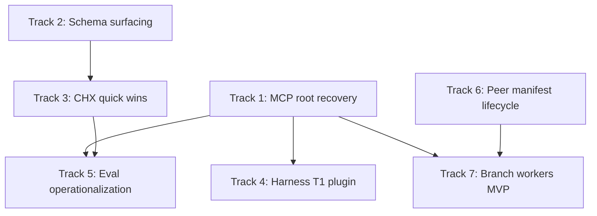

# Implementation Priority Plan

> **Created**: 2026-06-03  
> **Scope**: Review of `.specs/` (171 files) with recommended implementation order  
> **Method**: Value × readiness × leverage on the agent reasoning loop

## How priorities were chosen

Each candidate was scored on four axes:

| Axis | Question |
|------|----------|
| **Pain** | Does lack of this cause lost work, bad decisions, or trust failures? |
| **Leverage** | Does shipping this unlock or amplify other specs? |
| **Readiness** | Is the spec decision-complete, with clear files and acceptance criteria? |
| **Fit** | Does it align with what is already in the repo (Code Mode, Supabase, web app)? |

Specs marked **research-only** (e.g. `agent-governance-substrate/`) were excluded from implementation tracks unless the user explicitly reopens them through HDD.

Specs for **Letta/DGM** (`letta-specific/`) were deprioritized: valuable for a different product surface, not the hosted Thoughtbox MCP + web app spine.

---

## Landscape snapshot

### Already substantial in code (do not re-plan from zero)

| Area | Evidence | Spec status |
|------|----------|-------------|
| **Code Mode** (`thoughtbox_search` + `thoughtbox_execute`) | `src/code-mode/*`, tests | `SPEC-CORE-002`, `code-mode/target-state.md` — alignment mostly done; progressive disclosure removed |
| **LangSmith evaluation stack** | `src/evaluation/*`, `initEvaluation()` in `src/index.ts` | `SPEC-EVAL-001` — Layers 1–5 implemented; **operational gap** is datasets + env + DGM feed |
| **Structured session UI** | `apps/web/src/components/session-area/thought-card.tsx`, view-models | `auditability/SPEC-AUD-001` — **largely satisfied in web app**; legacy Observatory HTML may still lag |
| **Peer notebook control plane (Part 1)** | Merged per `mcp-peer-notebooks/NEXT-IMPLEMENTATION-HANDOFF.md` | ADR-022 unit 1/5 complete |

### Spec-ready but not implemented (highest opportunity)

| Spec | Priority in spec | Gap |
|------|------------------|-----|
| `SPEC-SRC-006` | P0 | No `mcpRootUri` in persistence |
| `SPEC-GW-011` | High | No first-call-only schema dedup; `thoughtbox_operations` referenced in docs/tests but not registered in `src/` |
| `SPEC-CHX-001` | High | Quick wins (#1–#3) untouched; no `tb.t`, no mid-session recall ops |
| `harness-optimization/SPEC-HARNESS-T1` | Tier 1 | Plugin hooks / interleaved-thinking prompt not updated |
| `harness-optimization/SPEC-HARNESS-T2` | Tier 2 | Defaults + auto-resume overlap with SRC-006 / CHX |

### Stale or inconsistent (treat carefully)

| Item | Issue |
|------|--------|
| **OODA Loops MCP** | `IMPLEMENTATION-READY.md` and `CHANGELOG.md` claim `embed-loops.ts` and loop resources; **those files are not present** in the current tree. Either restore from history or re-implement from the spec narrative in `README.md` / `IMPLEMENTATION-READY.md`. |
| **`loops-mcp-*.md`** | Referenced by README but **missing** from `.specs/` — only summary docs remain. |
| **`SPEC-WRK-001`** | Assumes Stage 2 progressive disclosure; **hosted server exposes all tools at connect** — spec needs revision before build. |

---

## Recommended implementation tracks

### Track 1 — Session recovery via MCP root (SPEC-SRC-006)

**What**: Persist `mcpRootUri` on session create; make `load_context` recover the latest session for the current MCP root when `sessionId` is omitted.

**Why this is #1**

- Directly addresses a **documented data-loss incident** (67 thoughts orphaned).
- Small, bounded change: persistence types, storage filter, init handler.
- No dependencies; improves every long reasoning run immediately.
- Complements `SPEC-HARNESS-T2` auto-resume — same user story, server-side truth.

**Reasoning for scope**

- **In**: `mcpRootUri` on metadata, `listSessions({ mcpRootUri })`, optional `load_context`, capture root on `start_new`.
- **Out**: UI for session picker, cross-root migration tools (defer until recovery works).

**Phases**

1. Schema + storage filter + migration/backfill strategy for existing sessions (nullable `mcpRootUri`).
2. Init handler: omit `sessionId` → `findSessionForRoot`.
3. Integration test: two MCP sessions, same root, second call resumes first session.
4. Update onboarding skill to prefer `load_context` without ID after compaction.

**Success**: Agent reconnecting after ~15m MCP timeout continues the same thoughtbox session without remembering UUIDs.

**Branch**: `cursor/fix-session-recovery-mcp-root-4cb5`

---

### Track 2 — Gateway schema surfacing completion (SPEC-GW-011)

**What**

1. **First-call-only** operation schema embedding in the gateway/observability handler (stops ~50k chars/session repeat).
2. Register **`thoughtbox_operations`** tool (`list` / `get` / `search`) aggregating existing operation catalogs.

**Why this is #2**

- Pure **token economics** with measured waste (~5k JSON per `thought` call).
- Spec is tight (4–6h estimate); maps to `src/observatory/gateway-handler.ts` and existing `*/operations.ts` modules.
- Unblocks agents on Code Mode who discover via search but still need schemas without invoking heavy ops.

**Reasoning for choices**

- Implement **R1 (dedup)** before **R2 (tool)** — dedup gives instant savings to all clients; tool fixes discoverability for Code Mode-only paths.
- Keep resource templates (spec says out of scope to remove) for MCP clients that use `resources/read`.
- Wire `cleanupSession` to clear `sessionSchemasSeen` — prevents unbounded memory and wrong dedup across sessions.

**Phases**

1. `sessionSchemasSeen: Map<sessionId, Set<operationName>>` in gateway handler.
2. Unit tests: first response has schema block; second does not; cleanup resets.
3. `thoughtbox_operations` tool in `server-factory.ts` Stage 0.
4. Align `.agents/skills/test-suite` — tests already expect this tool.

**Success**: 10-thought session returns schema once per operation, not ten times; `thoughtbox_operations { operation: "get", args: { name: "thought" } }` works on `/mcp`.

**Branch**: `cursor/feat-gateway-schema-surfacing-4cb5`

---

### Track 3 — Cognitive harness quick wins (SPEC-CHX-001, buckets A + B)

**What** (four PR-sized slices, ordered)

| Slice | Item | Effort (spec) |
|-------|------|----------------|
| A1 | #1 Auto-numbering docs/examples (SDK comment, remove `thoughtNumber: 1` from canonical example, onboard skill) | ~1h |
| A2 | #2 `tb.t()` / `tb.end()` shorthand in Code Mode | 3–4h |
| B1 | #3 `session_get_thought`, `session_recent_thoughts`, `session_search_within` | ~6–8h |
| A3 | #6 Cipher mode toggle (optional — after A1–B1) | spec §#6 |

**Why this is #3**

- Grounded in a **real 146-thought session** — not hypothetical UX.
- **A1 + A2** are lowest risk, highest frequency (every thought).
- **B1** fixes a structural gap: agents cannot cheaply recall thought N in the *current* session without loading the full blob.
- Defers heavier items (#4 subagent attach, #10 KG shortcut, #5 hook suppression) until the write path is cheaper.

**Reasoning for deferring bucket C/D**

- **#4 subagent.attach** needs protocol design + Task tool integration — high value but not quick.
- **#5 hook suppression** touches plugin hooks — ship after server recall exists so agents rely on Thoughtbox, not Claude Tasks.
- **#7–#8 audit framing** needs product decision on research vs ops sessions.

**Success**: New session uses `tb.t("...")` without `thoughtNumber`; agent calls `session_recent_thoughts` with `n: 5` under 500 tokens round-trip.

**Branches**: one branch per slice (`cursor/chx-auto-numbering-4cb5`, etc.)

---

### Track 4 — Harness optimization Tier 1 (SPEC-HARNESS-T1)

**What**

1. SessionStart **Thoughtbox primer** in plugin `session_start.sh` (gated: top-level agent + Thoughtbox in `.mcp.json`).
2. Rewrite **interleaved-thinking** prompt to OODA loop (fix stale `mcp__thoughtbox__thoughtbox` references → `thoughtbox_execute`).
3. PostToolUse **session ID tracker** for tooling continuity.

**Why this matters**

- Moves interleaved thinking from **opt-in prompt** to **default rhythm** — product thesis: Think → Act → Think.
- Plugin-only; no server deploy required for primer + prompt.
- Pairs with Track 1 (server knows which session) and Track 3 A1 (agents stop over-tracking numbers).

**Reasoning**

- Do **after Track 1** so PostToolUse tracker and `load_context` recovery tell a consistent story.
- Primer capped at ~55 words per spec — avoids context bloat that triggered #5 in CHX.

**Branch**: `cursor/feat-harness-t1-primer-4cb5` (plugin repo path: `plugins/thoughtbox-claude-code/`)

---

### Track 5 — Evaluation closed loop operationalization (SPEC-EVAL-001 + `evaluation/thoughtbox-eval-strategy.md`)

**What** (not greenfield — wire what exists)

1. Document + script **LANGSMITH_API_KEY** setup for staging/prod.
2. Seed **six datasets** from eval strategy (`thoughtbox_core_outcomes`, `thoughtbox_reasoning_patterns`, etc.) via `DatasetManager`.
3. Run one **baseline experiment**: model-only vs Thoughtbox-full vs one ablation.
4. Connect **DGM fitness**: replace 0.0 fitness stubs with evaluator output from `dgmFitnessEvaluator` on experiment completion.

**Why this is top-tier strategically but #5 in sequence**

- Code exists (`trace-listener`, `experiment-runner`, `online-monitor`); value is **proving causal lift**, not writing modules.
- Depends on stable agent behavior (Tracks 1–3) so experiments are reproducible.
- Informs every future architectural bet (branch workers, memory, hub).

**Reasoning**

- Follow **eval strategy §1** (four-way comparison) literally — avoids "one big benchmark" that hides affordance-specific wins.
- Label examples with `should_use_thoughtbox`, `should_branch`, etc. — precision/recall per affordance beats one scalar score.
- Keep fire-and-forget tracing — never block MCP on LangSmith.

**Success**: One experiment URL in LangSmith comparing conditions; at least one DGM archive entry with non-zero fitness from real scores.

**Branch**: `cursor/feat-eval-datasets-baseline-4cb5`

---

### Track 6 — MCP peer notebooks: manifest lifecycle (ADR-022 Part 2)

**What**: Per `mcp-peer-notebooks/NEXT-IMPLEMENTATION-HANDOFF.md` — compile manifests from notebook sources, draft/approve/activate/retire, enforce active hash at invoke.

**Why included in top tier**

- Explicit **next committed unit** after merged Part 1; breaking the sequence wastes durable control-plane work.
- **Governance invariant**: notebook edits must not silently change active capabilities — required before production runtime (Part 3–4).

**Reasoning for position #6**

- Larger than Tracks 1–3; needs Supabase migrations + peer-notebook-delivery-guard skill.
- **Do not** parallel with Track 2 unless separate owners — both touch MCP surface area.

**Out of scope for this track**: web inspection UI (`thoughtbox-2ot`), `local-process`, smolvm — per handoff.

**Branch**: `cursor/feat-peer-manifest-lifecycle-4cb5`

---

### Track 7 — Parallel branch workers (SPEC-BRANCH-WORKERS)

**What**: Stateless `tb-branch` Supabase Edge Function + main MCP `branch_spawn` / `branch_merge` / `branch_list` / `branch_get`; Postgres `branches` table; HMAC worker URLs.

**Why high value but later**

- Unlocks Thoughtbox’s **core differentiator** (parallel exploration) safely — today `ThoughtHandler` singleton races on concurrent branches.
- Requires Supabase edge deploy, auth signing, and migration discipline — infra-heavy.

**Reasoning**

- Ship **after Track 1** — branch workers assume durable session/branch IDs agents can return to.
- Ship **before** full Srcbook Observatory stack — branch exploration benefits all domains, not only notebooks.
- Consider a **thin MVP**: spawn + write + list only; defer merge synthesis polish.

**Branch**: `cursor/feat-branch-workers-mvp-4cb5`

---

## Secondary tracks (after top 7)

| Spec / area | Value | Why deferred |
|-------------|-------|--------------|
| **Srcbook Observatory** (`SPEC-SRC-001`–`005`) | High for notebook product | Large vertical (WebSocket channel, preview lifecycle, AI cells); depends on notebook execution substrate stabilizing |
| **OODA Loops MCP** | High for codebase learning | Spec body missing; implementation absent despite CHANGELOG — needs archaeology or rewrite |
| **SPEC-SUM-001** subagent summarize modes | Medium | Useful for handoffs; no data-loss risk |
| **SPEC-OBS-001** MCP sidecar metrics | Medium | Ops/diagnostic; doesn’t improve agent reasoning |
| **SPEC-RLM-001** recursive REPL | Medium–high | Researchy; isolate security review before MVP |
| **Auditability AUD-002–005** | Medium | AUD-001 largely done in web; remaining specs are filters, blast radius, fault attribution |
| **Code Mode Canonical IR / TBX-C1** (`SPEC-CORE-002` layers B–D) | High long-term | Explicitly deferred in `code-mode/target-state.md` — transport alignment first |
| **Agent governance substrate** | Strategic | Research-only; requires HDD + user approval |
| **GCP/terraform specs** | Ops | Stabilization, not product loop |

---

## Suggested sequencing (dependency-aware)

**Parallelization safe pairs**

- Track 2 (server) ∥ Track 4 (plugin) — different repos/paths.
- Track 3 A1/A2 (docs + SDK) ∥ Track 1 — no conflict if branches separate.

**Avoid parallelizing**

- Track 6 ∥ major MCP handler refactors (Track 2/3 B1) — merge conflict risk in `server-factory.ts`.

---

## Per-track HDD / delivery notes

| Track | HDD? | Skill / guard |
|-------|------|----------------|
| 1, 2, 3 | Light ADR optional | `implement` + TDD profile |
| 6 | **Required** | `peer-notebook-delivery-guard`, ADR-022 |
| 7 | **Required** | New staging ADR for edge auth + branch table |
| 5 | Spec update only if dataset schema changes | `eval` skill |
| 4 | Docs + plugin version bump | Plugin release process |

---

## What we explicitly did not prioritize

1. **Re-implementing Code Mode from SPEC-CORE-002** — already shipped; future work is IR/TBX-C1, not another gateway migration.
2. **SPEC-WRK-001 workflows tool** until spec is rewritten for full-surface (no Stage 2 gating).
3. **Legacy Observatory HTML audit cards** unless product still ships `src/observatory` UI — web app `ThoughtCard` is the product surface.
4. **Letta DGM archive automation** — separate initiative under `letta-specific/`.

---

## Immediate next actions (if starting this week)

1. **Track 1** — open PR for `mcpRootUri` + auto `load_context` (smallest blast radius, highest reliability win).
2. **Track 2 R1** — first-call-only schema dedup (single-file change + tests).
3. **Track 3 A1** — documentation-only PR for auto-numbering (can merge in hours).
4. File tracker items for **loops MCP spec restoration** and **SPEC-WRK-001 revision** — blocked on doc hygiene, not code.

---

## References (primary specs)

- `SPEC-SRC-006-session-recovery-via-mcp-root.md`
- `SPEC-GW-011-gateway-schema-surfacing.md`
- `SPEC-CHX-001-cognitive-harness-improvements.md`
- `harness-optimization/SPEC-HARNESS-T1.md`, `SPEC-HARNESS-T2.md`
- `SPEC-EVAL-001-unified-evaluation-system.md`, `evaluation/thoughtbox-eval-strategy.md`
- `mcp-peer-notebooks/NEXT-IMPLEMENTATION-HANDOFF.md`, `mcp-peer-notebooks/SPEC-CONTROL-PLANE.md`
- `SPEC-BRANCH-WORKERS.md`
- `code-mode/target-state.md` (alignment baseline)
- `inventory.md` (Srcbook + OBS inventory)
