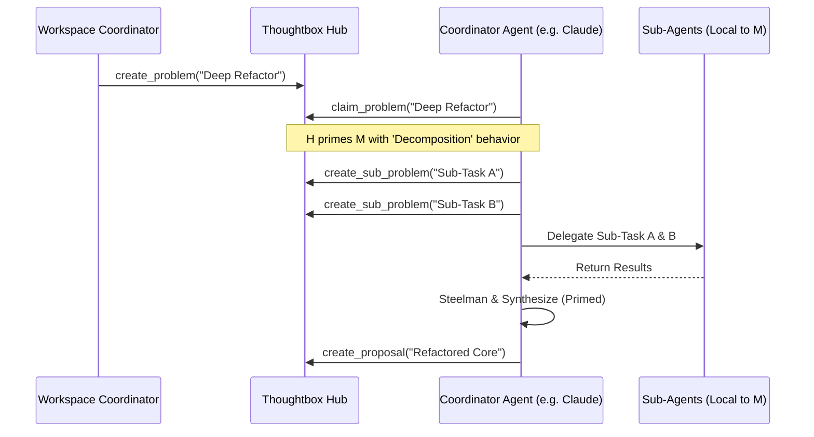

# SPEC-HUB-002: Hierarchical Agent Roles and Behavioral Mental Models

**Status**: DRAFT
**Created**: 2026-02-07
**Priority**: SHOULD
**Complexity**: High

---

## Overview

Transform Thoughtbox mental models from passive documentation into active behavioral constraints through a hierarchical role system. This specification introduces specialized **Agent Profiles** (specifically the **Coordinator** pattern) that allow agents with sub-agent capabilities to orchestrate distributed teams via the Thoughtbox Hub.

## Philosophy

**Behavioral Expertise over Information Retrieval**

Agents shouldn't just *know* about mental models; they should *inhabit* them. By binding mental models to agent profiles, we move the cognitive load of process adherence from the agent's memory to the infrastructure's scaffolding.

**Fractal Coordination**

Hierarchical teams shouldn't require a new protocol. By leveraging the existing `Problem` and `Sub-Problem` hierarchy, a **Coordinator** agent in a workspace acts as a recursive bridge, coordinating its own local sub-team while appearing as a single specialized contributor to the main workspace.

---

## Problem Statement

Currently:
- Mental models are static Markdown prompts that agents must manually retrieve.
- Agents are generic `coordinator` or `contributor` roles with no behavioral specialization.
- Multi-agent coordination is "flat" at the hub level, making it difficult for agents with native sub-agent capabilities (e.g., Claude Code, Antigravity) to lead specialized local teams.

**Goal**: A system that:
- Injects mental model instructions directly into the `thought` tool reasoning loop.
- Allows agents to register with specialized **Profiles** (e.g., COORDINATOR, ARCHITECT, DEBUGGER).
- Enables the "Coordinator" pattern where a contributor orchestrates sub-problems.

---

## Requirements

### REQ-1: Agent Profiles (MUST)

Extend the agent registration protocol to support optional **Profiles**.
- Profiles map to sets of Mental Models (e.g., `ARCHITECT` = `decomposition` + `trade-off-matrix`).
- Profile definitions must be extensible.

### REQ-2: Behavioral Integration (MUST)

Integrate profiles with the `thought` tool.
- **Context Injection**: When an agent with a profile calls the `thought` tool, the hub should prepend the profile's instructions to the `thought` input before it reaches the reasoning engine.
- **Guide Inlining**: If `includeGuide: true` is requested, the guide should be specialized for the assigned profile.
- **Validation**: Enable optional validation via the `critique` loop to ensure thoughts follow the assigned model's process steps.

### REQ-3: The Coordinator Pattern (MUST)

Implement the `COORDINATOR` profile specialized for hierarchical coordination.
- **Capabilities**: Instructed to prioritize `decomposition` and `pre-mortem`.
- **Workflow**: The Coordinator claims a high-level `Problem`, creates `Sub-Problems`, and assigns them to sub-agents (internal to the Coordinator's client).
- **Consensus**: The Coordinator is responsible for steelmanning its sub-agents' work before submitting a `Proposal` to the main workspace.

### REQ-4: Protocol Extensions (SHOULD)

Update the Hub MCP tools to support profile assignment:
- **Registration**: `register(name: string, profile?: string)` - The server validates the profile against the registry.
- **Identity**: `whoami()` returns the current agent's `profile` and its active mental models.
- **Discovery**: `get_profile_prompt(profile: string)` - Returns the full system instructions for a profile, useful for clients that want to manage their own local prompting.
- **Tool Descriptions**: Update `list_models` and `get_model` to include profile metadata.

---

## Design: Hierarchical Agent Teams

### Profile Registry

A centralized registry in `src/hub/profiles.ts` defines the mappings:

| Profile | Primary Mental Models | Primary Goal |
|---------|-----------------------|--------------|
| **COORDINATOR** | `decomposition`, `pre-mortem`, `five-whys` | Delegation and team lead coordination |
| **ARCHITECT** | `decomposition`, `trade-off-matrix`, `abstraction-laddering` | Structural design and constraint management |
| **DEBUGGER** | `five-whys`, `rubber-duck`, `assumption-surfacing` | Root cause analysis and logic verification |
| **SECURITY** | `adversarial-thinking`, `pre-mortem` | Risk analysis and vulnerability detection |

### Execution Flow (Coordinator Pattern)

1. **Registration**: An agent client with sub-agent capabilities registers as `Beta (Profile: COORDINATOR)`.
2. **Problem Intake**: The Workspace Coordinator creates a problem: "Implement Distributed Session Tracking."
3. **Claiming**: Beta claims the problem.
4. **Decomposition**: Prime by its `COORDINATOR` profile, Beta uses the `thought` tool to decompose the task.
5. **Sub-Problem Creation**: Beta calls `create_sub_problem` for "Firestore Adapter" and "In-Memory LRU Cache."
6. **Local Execution**: Beta's sub-agents work on these sub-problems.
7. **Synthesis**: Beta reviews sub-agent output using `steelmanning` (primed behavior).
8. **Proposal**: Beta submits a single comprehensive `Proposal` to the workspace.

### Hierarchical Orchestration Flow

### Phase 1: Core Definitions (Hub Layer)
- Modify `AgentIdentity` in `hub-types.ts`.
- Create `profiles.ts` registry.
- Update `register` tool to accept profile.

### Phase 2: Cognitive Scaffolding (Mental Models Layer)
- Implement `get_profile_prompt` in `mental-models/operations.ts`.
- Refactor mental model contents to be more "instruction-ready" for LLM system prompts.

### Phase 3: Behavioral Integration (Thought Layer)
- Update `ThoughtHandler` to optionally accept profile-based priming.
- Integrate profile prompts into the `SamplingHandler` context for critique.

---

## Success Criteria

- [ ] Agents can register with a `profile` successfully.
- [ ] `whoami` correctly reports the profile and active mental models.
- [ ] The `thought` tool response includes confirmation of behavioral priming when a profile is active.
- [ ] A "Coordinator" agent can successfully orchestrate a sub-problem hierarchy as documented in the Hub.
- [ ] Zero breaking changes to existing "flat" hub operations.
