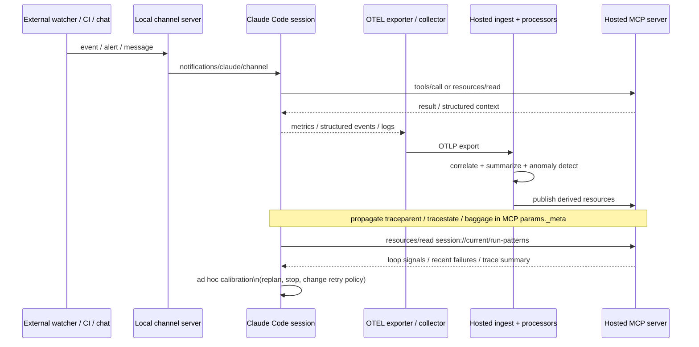

I’d lock it into three planes: MCP for query/action, OTEL for metrics and structured events/logs, and Channels for live push into the already-open local session. That matches the documented behavior that an MCP host can connect to one or more servers by creating one client per server; Claude Code can export metrics and structured events/logs via OpenTelemetry; and channels are local MCP servers on the same machine as Claude Code, started over stdio, that can be one-way or two-way and push alerts, webhooks, or chat messages into a running session.  

OTEL has draft semantic conventions for GenAI and MCP. The emerging MCP semconv guidance suggests propagating trace context in params._meta, though these conventions are still evolving. That is the cleanest way to correlate the hosted resource view with the agent’s live run.  

Component view

┌──────────────────────────────────────────────────────────── Hosted side ────────────────────────────────────────────────────────────┐
│                                                                                                                                     │
│   ┌─────────────────────┐      ┌──────────────────────────┐      ┌────────────────────────────┐      ┌─────────────────────────┐  │
│   │ OTLP / event ingest │ ───▶ │ Deterministic processors│ ───▶ │ Context / trace store      │ ◀───▶ │ Hosted MCP server      │  │
│   │ collector / API     │      │ redact / correlate /    │      │ sessions / spans /         │      │ resources / tools /    │  │
│   │                     │      │ summarize / detect loops│      │ summaries / anomalies       │      │ prompts / URIs         │  │
│   └─────────────────────┘      └──────────────────────────┘      └────────────────────────────┘      └─────────────────────────┘  │
│             ▲                                                                                                      ▲              │
│             │ OTLP                                                                                                 │ MCP          │
│             │                                                                                                      │              │
└─────────────┼──────────────────────────────────────────────────────────────────────────────────────────────────────┼──────────────┘
              │                                                                                                      │
              │                                                                                                      │
┌─────────────┼────────────────────────────────────────────── User machine ──────────────────────────────────────────┼──────────────┐
│             │                                                                                                      │              │
│   ┌──────────────────────────────────────── Claude Code session ────────────────────────────────────────┐           │              │
│   │  model runtime + MCP host                                                                          │───────────┘              │
│   │  - uses hosted tools/resources                                                                     │                          │
│   │  - can read derived self-observation                                                               │                          │
│   │  - can do ad hoc calibration on its own run patterns                                               │                          │
│   └─────────────────────────────────────────────────────────────────────────────────────────────────────┘                          │
│                  ▲                                   ▲                                      ▲                                     │
│                  │ MCP                               │ stdio MCP +                          │ OTEL                                │
│                  │                                   │ notifications/claude/channel         │                                     │
│   ┌───────────────────────────┐       ┌──────────────────────────────────────┐   ┌──────────────────────────┐                    │
│   │ Optional local MCP        │       │ Local channel server(s)              │   │ OTEL exporter /         │                    │
│   │ servers                   │       │ - webhook receiver                   │   │ local collector         │                    │
│   │ LSP / FS / shell / etc.   │       │ - chat bridge                        │   │                         │                    │
│   └───────────────────────────┘       │ - poll remote queue / event API      │   └──────────────────────────┘                    │
│                                       │ - optional reply tool / approval path │                                                  │
│                                       └──────────────────────────────────────┘                                                  │
└────────────────────────────────────────────────────────────────────────────────────────────────────────────────────────────────────┘
                    ▲                                              ▲
                    │                                              │
                    │ events / alerts / chat / deploy state        │
                    │                                              │
        ┌──────────────────────────────┐              ┌────────────────────────────────────┐
        │ External systems             │              │ Hosted deployment watcher / notifier│
        │ CI / deploy / monitoring /   │─────────────▶│ optional source of high-priority   │
        │ issue tracker / chat         │              │ events                             │
        └──────────────────────────────┘              └────────────────────────────────────┘

Runtime flow

URI namespace sketch

session://current/summary
session://current/run-patterns
session://current/recent-failures
session://current/tool-trace-summary
session://current/latency-hotspots

trace://<trace_id>/summary
trace://<trace_id>/span-window?last=25
trace://<trace_id>/mcp-exchanges
trace://<trace_id>/tool-calls
trace://<trace_id>/causal-chain

workspace://active/diagnostics
workspace://active/recent-mutations
workspace://active/index-state

deploy://<env>/status
deploy://<env>/latest-events
deploy://<env>/incident/<id>

channel://<source>/latest
channel://<source>/unread
channel://deploy/last-alert

calibration://current/observations
calibration://current/recommended-guardrails
calibration://current/stop-conditions

Correlation envelope

{
  "_meta": {
    "traceparent": "00-<trace-id>-<span-id>-01",
    "tracestate": "<vendor-state>",
    "baggage": "session.id=s_123,run.id=r_456,workspace.id=w_789,deployment=prod"
  }
}

The most important architectural distinction is this:
	•	Channels are the interrupt path into the live local session.
	•	OTEL → ingest → processors → store is the durable memory path.
	•	Hosted MCP resources are the model-facing reflection surface.

That split lines up well with the product behavior: standard MCP servers are queried during a task and do not push into the session; Remote Control lets a human drive the local session; and channels fill the gap by pushing events from non-Claude sources into the already-running local session. Channel events only arrive while the session is open, so anything you want to persist or re-read later belongs in the OTEL-derived store and then back out through MCP resources.  

For the hosted-service case specifically, the cleanest channel bridge is usually local channel plugin with outbound polling/streaming to the hosted watcher, unless you intentionally expose a webhook receiver. The Claude Code channels docs show both local polling-style bridges for chat platforms and a webhook-receiver pattern for forwarding POSTs into the session.  

One compact way to name the whole thing is:

live agent plane   = MCP + channels
memory plane       = OTEL + processors + context store
reflection plane   = hosted MCP resources over derived self-observation

The next clean refinement would be turning this into a C4 diagram or a concrete MCP resource schema.