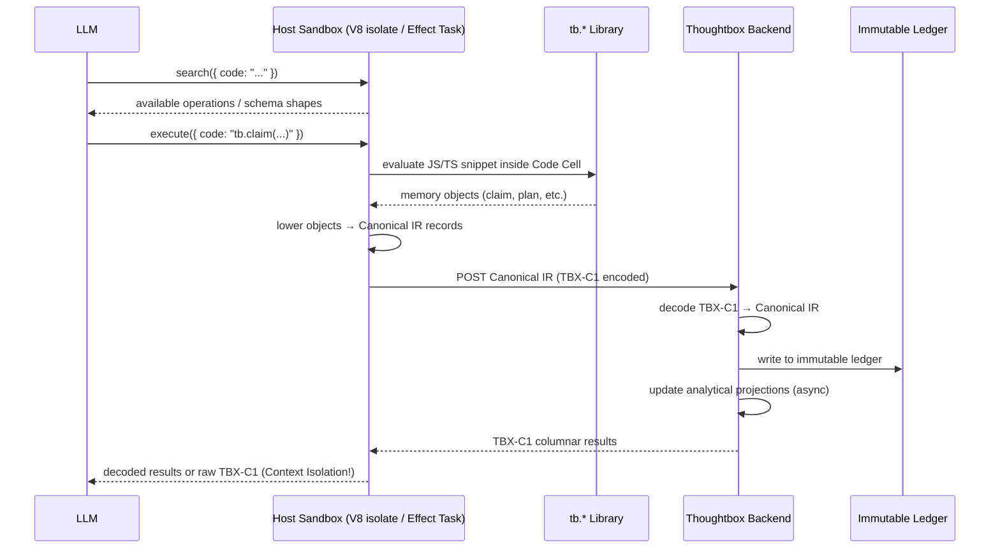

> **Status**: Draft
> **Created**: 2026-03-13
> **Branch**: `feat/code-mode-mvp` (Drafted in `feature/rlm-sampling`)
> **Depends on**: [agentic-runbooks.md](https://github.com/Kastalien-Research/thoughtbox/blob/main/.specs/agentic-runbooks.md)

# SPEC-CORE-002: Code Mode Thoughtbox

## Scope

This specification defines the migration of Thoughtbox from a massive multi-tool JSON schema API toward a Code Mode architecture (inspired by Cloudflare's "Code Mode MCP" concept which can "give agents an entire API in 1,000 tokens").

This design unifies a formal Canonical IR, a compact transport codec (`TBX-C1`), and an ergonomic JS/TS authoring layer, radically reducing context window usage for the LLM while improving reasoning precision and downstream indexability. By leveraging the execution model of Agentic Runbooks, Thoughtbox becomes a true Recursive Language Model (RLM) style REPL.

## 1. Problem Statement

Thoughtbox currently exposes its semantic operations and reasoning abstractions via heavy MCP JSON Schema tool definitions. As the reasoning abstractions (claims, revisions, parallel branches, etc.) and hub tools grow, the context window cost to load the API definition and serialize large payloads back-and-forth balloons.

Furthermore, the "Thoughtbox cipher" (a compact textual encoding of reasoning) is currently used as the primary source of truth, rather than an optional transport serialization. This makes retrieval and structured querying fragile.

We need a structured REPL environment—as described in the Recursive Language Model paper—where the AI agent can iteratively evaluate complex reasoning steps, branch contexts, and query knowledge without polluting its own context window with raw JSON or thousands of tokens of intermediate states.

## 2. Layered Architecture

The core insight of the Code Mode transition is to explicitly separate model authoring ergonomics, canonical semantic storage, and wire compression.

The new architecture consists of four layers:

### Layer A: Authoring API (The Code Mode Sandbox / REPL)
The model interacts with Thoughtbox by writing simple JavaScript/TypeScript snippets, executed server-side. It does not generate raw JSON payloads or manual cipher strings. This layer functions as the RLM-style structured REPL.

*   **Surface:** A tiny set of MCP tools, such as `search({ code: "..." })` and `execute({ code: "..." })`.
*   **Execution Engine:** Leveraging the `agentic-runbooks` execution model, snippets are executed as code cells within an Effect Workflow. This provides a durable, asynchronous task execution environment (using MCP Tasks) that safely coordinates computation and allows the agent to pause for external inputs (decision points via `DurableDeferred`).
*   **Helpers:** Inside `execute()`, a typed `tb` library provides builders injected dynamically into the isolate global scope:
    *   `tb.claim(text, { supports: [...] })`
    *   `tb.plan(...)`
    *   `tb.question(...)`
    *   `tb.evidence(...)`
    *   `tb.observation(...)`
    *   `tb.decision(...)`
    *   `tb.revision(...)`

    *Note: The remaining IR kinds (`tool_call`, `tool_result`, `hub_event`, `checkpoint`) are implicitly emitted by the host execution environment, not directly authored by the LLM.*

#### Security & Isolation Constraints
Because Phase 5 requires executing LLM-generated JS/TS server-side, the isolate boundary must be strictly constrained:
*   **API Isolation:** Host APIs like `fs`, `net`, `child_process`, and environment variables (`process.env`) are fully restricted. The isolate only receives the explicit `tb` library. Other MCP tools cannot be invoked from within the script unless explicitly proxied.
*   **Resource Limits:** Every `execute` call runs within a strict CPU and memory budget (e.g., 50ms execution time, minimal memory allowance) to prevent Denial of Service (DoS) attacks via infinite loops or huge allocations.
*   **Injection Protection:** The `tb` library is injected dynamically into the isolate global scope but does not share memory with the Node/Deno host, preventing prototype pollution or sandbox escapes that could exfiltrate host secrets.

### Layer B: Canonical Thoughtbox IR
The canonical representation of all records. This is what is stored on disk and indexed. The executed REPL snippets in Layer A emit this IR.

*   **Properties:** Lossless, explicit schema, normalized relation graphs, stable IDs, rich provenance.
*   **Records:** `claim`, `evidence`, `question`, `plan`, `observation`, `decision`, `revision`, `tool_call`, `tool_result`, `hub_event`, `checkpoint`.
*   **Structure:** A unified envelope containing `id`, `kind`, `ts`, `session`, `branch`, `agent`, `refs`, `body` (carrying `text` and optional `cipher`), `confidence`, `source`, and `attrs`.

### Layer C: `TBX-C1` Wire Codec
A compact JSON-compatible transport format used below the authoring layer. It compresses the Canonical IR for efficient edge/backend transport and returning large datasets to the model context. This allows Thoughtbox to respond to complex REPL queries with highly condensed summaries, achieving the context isolation central to the RLM paper.

*   **Mechanisms:**
    *   Short keys (`k` for kind, `i` for id, `x` for text).
    *   Session-local dictionary blocks to replace repeated strings.
    *   Columnar lists (`cols` + `rows`) for query results.
    *   Explicit reference arrays (`r`).

### Layer D: Projections
Read-optimized representations generated asynchronously from the Canonical IR.

*   **Use Cases:** Graph nodes/edges tables, lexical indexes, embedding search, session replay logs.

## 3. Detailed Data Models

### 3.1 Canonical IR Envelope

Every record emitted from the edge sandbox to the core must map strictly to this envelope:

```typescript
type Relation = { k: string; to: string };

type CanonicalIRAttrs =
  | { kind: "claim"; relations: Relation[] }
  | { kind: "plan"; steps: string[] }
  | { kind: "evidence"; sourceUrl?: string }
  | { kind: "question"; answeredBy?: string[] }
  | { kind: "observation"; context?: string }
  | { kind: "decision"; alternativesConsidered?: string[] }
  | { kind: "revision"; replacesId: string }
  | { kind: "tool_call"; toolName: string; args: Record<string, unknown> }
  | { kind: "tool_result"; callId: string; status: "ok" | "error" }
  | { kind: "hub_event"; eventType: string }
  | { kind: "checkpoint"; stateHash: string };

interface CanonicalIR<A extends CanonicalIRAttrs = CanonicalIRAttrs> {
  id: string;              // e.g., "th:17"
  kind: A["kind"];         // Constrained to match attrs.kind
  ts: string;              // ISO-8601 timestamp
  session: string;
  branch: string;
  agent: string;
  refs: string[];          // Lightweight indexed summary of references for fast traversal
  confidence?: number;

  body: {
    text: string;          // Primary human-readable payload
    cipher?: string;       // Optional reasoning notation (derived or passed through)
    labels?: string[];
    metrics?: Record<string, number>;
  };

  source: {                // Provenance metadata
    surface?: string;
    operation?: string;
    transport?: string;
    model?: string;
  };

  attrs: A;                // Type-specific schema-enforced fields
}
```

*Note on `refs` vs `attrs.relations`:* `refs` (or `r` in the TBX-C1 codec) is an intentional, redundant array containing all linked canonical IDs for fast graph traversal and indexing. `attrs.relations` holds the rich semantic edge data (e.g., relation type). When they diverge, `attrs.relations` is the authoritative semantic source, and `refs` should be re-derived.

### 3.2 TBX-C1 Encoding

When serialized for wire transport (especially back to the model context), the Canonical IR is compressed:

```json
{
  "v": "tbx-c1",
  "d": {
    "k": { "cl": "claim" },
    "rel": { "sup": "supports" }
  },
  "m": [
    {
      "k": "cl",
      "i": "th:17",
      "r": ["th:12"],
      "x": "API latency rose because of query regression",
      "a": {
        "relations": [{ "t": "sup", "to": "th:12" }]
      }
    }
  ]
}
```

**Key TBX-C1 Rules:**
*   **Dictionary Expansion:** Must be deterministic; decoders must rehydrate canonical strings. The `"t"` key inside `a.relations` explicitly uses the `d.rel` dictionary, while the record-level `"k"` key uses the `d.k` dictionary.
*   **Columnar Results:** Large lists (like session logs) must use `cols` and `rows` arrays.
*   **Error Structuring:** Standardized error payloads inside `a.status = "error"`.
*   **Fallback:** Must support plain JSON fallback mode if compression is disabled.

## 4. Execution Flow (The RLM REPL Loop)

1. **Discovery:** The LLM uses `search({ code: "..." })` to query available Thoughtbox operations, schema shapes, or context boundaries.
2. **Authoring (The `Read` phase):** The LLM calls `execute({ code: "..." })`, writing JS/TS using the injected `tb` helper library.
3. **Execution & Lowering (The `Eval` phase):**
   - The host evaluates the script within a secure V8 isolate cell.
   - If execution takes a long time, it is tracked as an async MCP Task (following the `agentic-runbooks` workflow).
   - The script generates memory objects representing operations or thoughts.
   - The host transparently *lowers* these objects into Canonical IR records.
4. **Transport:** The host optionally encodes the IR records into the `TBX-C1` codec and forwards them to the Thoughtbox persistence backend over HTTP/WebSocket.
5. **Persistence:** The backend decodes `TBX-C1` back to Canonical IR, writes to the immutable ledger, and updates analytical projections.
6. **Response (The `Print` phase):** The backend returns compact `TBX-C1` results (e.g., columnar query data), which the host decodes or passes directly to the LLM. Only the summarized, highly compressed results return to the model, achieving the context isolation central to RLM.

## 5. Rollout Strategy

To safely migrate Thoughtbox to Code Mode, the implementation must proceed in layers:

1. **Phase 1: Vocabulary & Schema.** Freeze the `Canonical IR` TypeScript interfaces and the allowed relations vocabulary (`supports`, `contradicts`, `revises`, etc.).
2. **Phase 2: Transport Codec.** Implement the `TBX-C1` encoder/decoder logic with comprehensive round-trip tests.
3. **Phase 3: Authoring Ergonomics.** Develop the JS/TS `tb.*` helper library.
4. **Phase 4: Core Wiring.** Implement dual-write/shadow emission from existing Thoughtbox HTTP flows into the new Canonical IR storage.
5. **Phase 5: Edge Layer (The REPL).** Wire the final `execute` and `search` MCP tools to the V8 isolate/sandbox (leveraging the Effect Workflow execution engine built for notebooks) running the `tb` library, and expose to LLMs.


