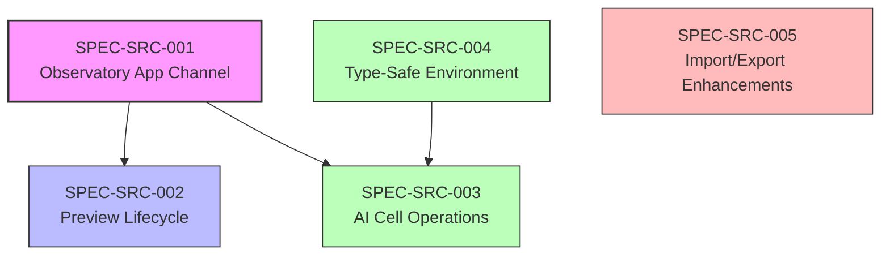

# Thoughtbox Specs - Inventory

> **Created**: 2026-01-17
> **Updated**: 2026-01-19
> **Status**: Drafting

## Spec Suites

- **SPEC-SRC-***: Srcbook integration features
- **SPEC-OBS-***: Observability infrastructure

## Overview

This spec suite brings Srcbook-compatible features to Thoughtbox, focusing on:
- **Observatory app preview channel** - Live preview lifecycle for web apps/servers spawned from notebooks
- AI-assisted cell operations (generate, edit, fix-diagnostics)
- Type-safe environment/secrets handling (env.d.ts generation)
- Enhanced import/export capabilities (URL import, example notebooks)

**Key Insight**: The WebSocket value is in observing running artifacts (web apps, servers) that notebooks produce, not in streaming cell execution output. Observatory integration follows Srcbook's app builder patterns.

## Dependency Graph

## Spec Inventory

| ID | Title | Priority | Dependencies | Status |
|----|-------|----------|--------------|--------|
| SPEC-SRC-001 | Observatory App Channel | P0 (Foundation) | None | Draft |
| SPEC-SRC-002 | Preview Lifecycle Management | P0 (Core) | SRC-001 | Draft |
| SPEC-SRC-003 | AI Cell Operations | P1 (Enhancement) | SRC-001 | Draft |
| SPEC-SRC-004 | Type-Safe Environment | P1 (Enhancement) | None | Draft |
| SPEC-SRC-005 | Import/Export Enhancements | P2 (Polish) | None | Draft |

## Implementation Order

1. **Phase 1 - Observatory Foundation** (SRC-001, SRC-002)
   - Establish app preview WebSocket channel in Observatory
   - Define event schemas aligned with Srcbook's app channel
   - Implement preview lifecycle (booting → running → stopped)
   - Process management for vite/npm processes

2. **Phase 2 - Intelligence Layer** (SRC-003, SRC-004)
   - AI cell operations (generate, edit, fix-diagnostics)
   - env.d.ts generation from secrets for type-safe cells
   - TypeScript server integration for diagnostics

3. **Phase 3 - Import/Export Polish** (SRC-005)
   - URL import for .src.md notebooks
   - Curated example notebook templates
   - Export enhancements

## Alignment with User Priorities

| User Priority | Spec Coverage |
|--------------|---------------|
| 1. Observatory app preview channel | SRC-001, SRC-002 |
| 2. AI cell-generate / fix-diagnostics | SRC-003 |
| 3. Env.d.ts + secrets → type-safe cells | SRC-004 |
| 4. Import/export .src.md + examples | SRC-005 (format already compatible) |

## Source Material

Key files from srcbook/packages/api:
- `server/channels/app.mts` - App preview channel (preview:start/stop, deps:install)
- `apps/processes.mts` - Process management (npm:install, vite:server)
- `ai/generate.mts` - AI generation functions
- `ai/plan-parser.mts` - XML plan parsing for AI responses
- `server/ws.mts` - WebSocket server patterns

## Quality Metrics

- All specs follow SMART criteria
- Cross-references validated
- Zod schemas for all event payloads
- Test scenarios documented per spec

---

## Observability Specs (SPEC-OBS-*)

### Overview

Infrastructure for monitoring and observing thoughtbox in production.

### Spec Inventory

| ID | Title | Priority | Dependencies | Status |
|----|-------|----------|--------------|--------|
| SPEC-OBS-001 | MCP Sidecar Observability Integration | P1 (Enhancement) | None | Draft |
| SPEC-OBS-001-addendum | Observability Gateway Tool | P1 (Enhancement) | OBS-001 | Draft |

### SPEC-OBS-001: MCP Sidecar Observability Integration

**Goal**: Integrate [mcp-sidecar-observability](https://github.com/waldzellai/waldzell-mcp/tree/main/mcp-sidecar-observability) as a transparent proxy to add MCP protocol-level metrics (requests, tools, resources, latency, errors).

**Deliverables**:
- Updated `docker-compose.yml` with sidecar + Prometheus + Grafana
- OTEL collector config with Prometheus exporter
- Pre-configured Grafana dashboard
- Alerting rules for thoughtbox

**Branch**: `feat/mcp-sidecar-observability`

**Implementation Target**: Claude Code Web
