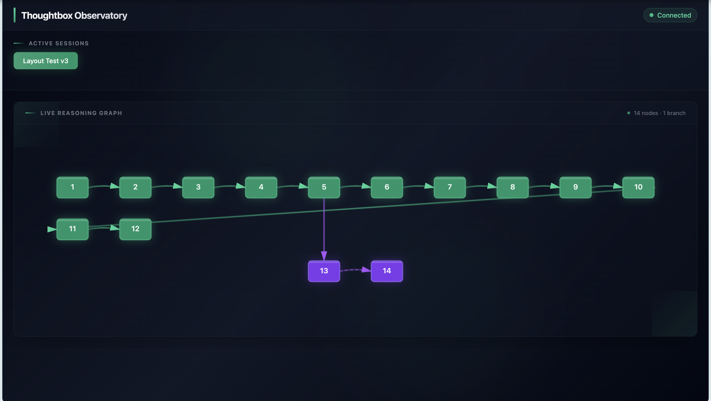

# Thoughtbox

**Multi-agent collaborative reasoning that's auditable.** Thoughtbox is a Docker-based MCP server where AI agents coordinate through shared workspaces — claiming problems, proposing solutions, reviewing each other's work, and reaching consensus. Every step is recorded as a structured thought in a persistent reasoning ledger that can be visualized, exported, and analyzed.

**Local-First:** Runs entirely on your machine. All data stays at `~/.thoughtbox/` — nothing leaves your network.


*Observatory UI showing a reasoning session with 14 thoughts and a branch exploration (purple nodes 13-14) forking from thought 5.*

## Code Mode

Thoughtbox exposes exactly **two MCP tools** using the Code Mode pattern:

- **`thoughtbox_search`** — Write JavaScript to query the operation/prompt/resource catalog. The LLM has full programmatic filtering power over the catalog.
- **`thoughtbox_execute`** — Write JavaScript using the `tb` SDK to chain operations. Access thoughts, sessions, knowledge, notebooks, hub, observability, and protocol tools through a unified namespace.

**Workflow:** search to discover available operations, then execute code against them. Use `console.log()` for debugging — output is captured in response logs.

This replaces per-operation tool registration with a two-tool surface that scales without context window bloat.

## Multi-Agent Collaboration

The Hub is the coordination layer. Agents register with role-specific profiles, join shared workspaces, and work through a structured problem-solving workflow — all via `thoughtbox_execute`.

**The workflow:** register → create workspace → create problem → claim → work → propose solution → peer review → merge → consensus

**Workspace primitives:**

- **Problem** — A unit of work with dependencies, sub-problems, and status tracking (open → in-progress → resolved → closed)
- **Proposal** — A proposed solution with a source branch reference and review workflow
- **Consensus** — A decision marker tied to a thought reference for traceability
- **Channel** — A message stream scoped to a problem for discussion

**Agent Profiles:** `MANAGER`, `ARCHITECT`, `DEBUGGER`, `SECURITY`, `RESEARCHER`, `REVIEWER` — each provides domain-specific mental models and behavioral priming.

**28 operations** across identity, workspace management, problems, proposals, consensus, channels, and status reporting.

## Auditable Reasoning

Every thought is a node in a graph — numbered, timestamped, linked to its predecessors, and persisted across sessions. This creates an auditable trail of how conclusions were reached.

Agents can think forward, plan backward, branch into parallel explorations, revise earlier conclusions, and request autonomous critique via MCP sampling. Each pattern is a first-class operation:

| Pattern | Description | Use Case |
|---------|-------------|----------|
| **Forward** | Sequential 1→2→3→N progression | Exploration, discovery, open-ended analysis |
| **Backward** | Start at goal (N), work back to start (1) | Planning, system design, working from known goals |
| **Branching** | Fork into parallel explorations (A, B, C...) | Comparing alternatives, A/B scenarios |
| **Revision** | Update earlier thoughts with new information | Error correction, refined understanding |
| **Critique** | Autonomous LLM review via MCP sampling | Self-checking, quality gates |

Each thought carries a semantic `thoughtType` (`reasoning`, `decision_frame`, `action_report`, `belief_snapshot`, `assumption_update`, `context_snapshot`, `progress`) that classifies *what kind* of thought it is, orthogonal to the process pattern used.

See the **[Patterns Cookbook](src/resources/docs/thoughtbox-patterns-cookbook.md)** for comprehensive examples.

## Real-Time Observability

The **Observatory** is a built-in web UI at `http://localhost:1729` for watching reasoning unfold live.

- **Live Graph** — thoughts appear as nodes in real-time via WebSocket
- **Branch Navigation** — branches collapse into clickable stubs; drill in and back out
- **Detail Panel** — click any node to view full thought content
- **Multi-Session** — switch between active reasoning sessions
- **Deep Analysis** — analyze sessions for reasoning patterns, cognitive load, and decision points

The full observability stack includes OpenTelemetry tracing, Prometheus metrics, and Grafana dashboards.

## Knowledge & Reasoning Tools

**Knowledge Graph** — Persistent memory across sessions. Capture insights, concepts, workflows, and decisions as typed entities with typed relations (`BUILDS_ON`, `CONTRADICTS`, `SUPERSEDES`, etc.) and visibility controls (`public`, `agent-private`, `team-private`).

**Notebooks** — Interactive literate programming combining documentation with executable JavaScript/TypeScript in isolated environments.

## Client Compatibility

> Thoughtbox is currently optimized for **Claude Code**. We are actively working on supporting additional MCP clients. Due to variation in capability support across the MCP ecosystem — server features (prompts, resources, tools), client features (roots, sampling, elicitation), and behaviors like `listChanged` notifications — we implement custom adaptations for many clients.

If you're using a client other than Claude Code and encounter issues, please [open an issue](https://github.com/Kastalien-Research/thoughtbox/issues) describing your client and the problem.

## Installation

Thoughtbox runs as a Docker-based MCP server. It requires Docker and Docker Compose.

### Quick Start

```bash
git clone https://github.com/Kastalien-Research/thoughtbox.git
cd thoughtbox
docker compose up --build
```

This starts Thoughtbox and the full observability stack. The MCP server listens on port `1731` and the Observatory UI is available at `http://localhost:1729`.

### MCP Client Configuration

Since Thoughtbox uses HTTP transport, configure your MCP client to connect via URL.

#### Claude Code

Add to your `~/.claude/settings.json` or project `.claude/settings.json`:

```json
{
  "mcpServers": {
    "thoughtbox": {
      "url": "http://localhost:1731/mcp"
    }
  }
}
```

To connect through the observability sidecar (adds OpenTelemetry tracing):

```json
{
  "mcpServers": {
    "thoughtbox": {
      "url": "http://localhost:4000/mcp"
    }
  }
}
```

#### Cline / VS Code

Add to your MCP settings or `.vscode/mcp.json`:

```json
{
  "servers": {
    "thoughtbox": {
      "url": "http://localhost:1731/mcp"
    }
  }
}
```

## Usage Examples

### Forward Thinking — Problem Analysis

```text
Thought 1: "Users report slow checkout. Let's analyze..."
Thought 2: "Data shows 45s average, target is 10s..."
Thought 3: "Root causes: 3 API calls, no caching..."
Thought 4: "Options: Redis cache, query optimization, parallel calls..."
Thought 5: "Recommendation: Implement Redis cache for product data"
```

### Backward Thinking — System Design

```text
Thought 8: [GOAL] "System handles 10k req/s with <100ms latency"
Thought 7: "Before that: monitoring and alerting operational"
Thought 6: "Before that: resilience patterns implemented"
Thought 5: "Before that: caching layer with invalidation"
...
Thought 1: [START] "Current state: 1k req/s, 500ms latency"
```

### Branching — Comparing Alternatives

```text
Thought 4: "Need to choose database architecture..."

Branch A (thought 5): branchId="sql-path"
  "PostgreSQL: ACID compliance, mature tooling, relational integrity"

Branch B (thought 5): branchId="nosql-path"
  "MongoDB: Flexible schema, horizontal scaling, document model"

Thought 6: [SYNTHESIS] "Use PostgreSQL for transactions, MongoDB for analytics"
```

## Environment Variables

| Variable | Description | Default |
|----------|-------------|---------|
| `DISABLE_THOUGHT_LOGGING` | Suppress thought logging to stderr | `false` |
| `THOUGHTBOX_DATA_DIR` | Base directory for persistent storage | `~/.thoughtbox` |
| `THOUGHTBOX_PROJECT` | Project scope for session isolation | `_default` |
| `THOUGHTBOX_TRANSPORT` | Transport type (`stdio` or `http`) | `http` |
| `THOUGHTBOX_STORAGE` | Storage backend (`fs`, `memory`, or `supabase`) | `fs` |
| `THOUGHTBOX_OBSERVATORY_ENABLED` | Enable Observatory web UI | `false` |
| `THOUGHTBOX_OBSERVATORY_PORT` | Observatory UI port | `1729` |
| `THOUGHTBOX_OBSERVATORY_CORS` | CORS origins for Observatory (comma-separated) | (none) |
| `THOUGHTBOX_AGENT_ID` | Pre-assigned Hub agent ID | (none) |
| `THOUGHTBOX_AGENT_NAME` | Pre-assigned Hub agent name | (none) |
| `THOUGHTBOX_EVENTS_ENABLED` | Enable event emission | `false` |
| `THOUGHTBOX_EVENTS_DEST` | Event destination | `stderr` |
| `SUPABASE_URL` | Supabase project URL (required for `supabase` storage) | (none) |
| `SUPABASE_SERVICE_ROLE_KEY` | Supabase service role key (required for `supabase` storage) | (none) |
| `PORT` | HTTP server port | `1731` |
| `HOST` | HTTP server bind address | `0.0.0.0` |
| `NODE_ENV` | Node environment | (none) |
| `PROMETHEUS_URL` | Prometheus endpoint (Docker) | `http://prometheus:9090` |
| `GRAFANA_URL` | Grafana endpoint (Docker) | `http://grafana:3000` |

## Development

For local development (requires Node.js 22+):

```bash
pnpm install
pnpm build
pnpm dev      # Development with hot reload
```

### Testing

```bash
npx vitest run              # Unit tests
pnpm test                   # Full suite (build + vitest)
pnpm test:agentic           # Agentic tests — full suite (build + run)
pnpm test:agentic:tool      # Agentic tests — tool-level only
pnpm test:agentic:quick     # Agentic tests — quick (no build)
pnpm test:behavioral        # Behavioral contract tests
```

### Docker Compose

`docker compose up --build` starts the full stack:

| Service | Port | Description |
|---------|------|-------------|
| **thoughtbox** | 1731 (MCP), 1729 (Observatory) | Core MCP server + Observatory UI |
| **mcp-sidecar** | 4000 | Observability proxy with OpenTelemetry |
| **otel-collector** | 4318 (HTTP), 8889 (metrics) | OpenTelemetry Collector |
| **prometheus** | 9090 | Metrics storage + alerting |
| **grafana** | 3001 | Dashboards and visualization |

Persistent data is stored in named volumes: `thoughtbox-data`, `prometheus-data`, `grafana-data`.

## Architecture

```text
src/
├── index.ts                # Entry point (Streamable HTTP transport)
├── server-factory.ts       # MCP server factory with tool registration
├── thought-handler.ts      # Core thought recording logic
├── types.ts                # Shared type definitions
├── database.types.ts       # Supabase generated types
├── code-mode/              # Code Mode tool surface
│   ├── search-tool.ts      # thoughtbox_search — catalog query via JS
│   ├── execute-tool.ts     # thoughtbox_execute — operation chaining via tb SDK
│   ├── search-index.ts     # Frozen catalog of operations/prompts/resources
│   └── sdk-types.ts        # TypeScript definitions for the tb SDK
├── thought/                # Thought operations and tool definitions
├── init/                   # Init workflow and state management
│   ├── tool-handler.ts     # Init tool operations
│   └── state-manager.ts    # Session state persistence
├── sessions/               # Session management
├── sampling/               # Autonomous critique via MCP sampling
│   └── handler.ts          # SamplingHandler for LLM critique requests
├── persistence/            # Storage layer
│   ├── storage.ts          # InMemoryStorage with LinkedThoughtStore
│   ├── filesystem-storage.ts  # FileSystemStorage with atomic writes
│   └── supabase-storage.ts # SupabaseStorage for deployed/cloud usage
├── observatory/            # Real-time visualization
│   ├── ui/                 # Self-contained HTML/CSS/JS
│   └── ws-server.ts        # WebSocket server for live updates
├── hub/                    # Multi-agent collaboration
│   ├── identity.ts         # Agent registration
│   ├── workspace.ts        # Workspace management
│   ├── problems.ts         # Problem tracking with dependencies
│   ├── proposals.ts        # Solution proposals with reviews
│   ├── consensus.ts        # Decision recording
│   ├── channels.ts         # Problem-scoped messaging
│   ├── hub-handler.ts      # Hub operation dispatcher
│   └── operations.ts       # 28-operation catalog
├── channel/                # Hub event channels and SSE streaming
├── multi-agent/            # Agent attribution, content hashing, conflict detection
├── protocol/               # Ulysses and Theseus protocol tools
├── knowledge/              # Knowledge graph memory
├── auth/                   # API key authentication
├── audit/                  # Audit manifest generation
├── evaluation/             # LangSmith evaluation and online monitoring
├── notebook/               # Literate programming engine
├── events/                 # Event emission system
├── observability/          # Prometheus/Grafana integration
├── prompts/                # MCP prompt definitions
├── references/             # Anchor parsing and resolution
├── revision/               # Revision indexing
├── operations-tool/        # Operations tool handler
└── resources/              # Documentation and patterns cookbook
```

### Storage

Thoughtbox supports three storage backends:

- **InMemoryStorage**: Volatile storage for testing, uses `LinkedThoughtStore` for O(1) thought lookups
- **FileSystemStorage**: Persistent storage with atomic writes and project isolation (default)
- **SupabaseStorage**: Cloud-native storage backed by Supabase Postgres for deployed instances

Data is stored at `~/.thoughtbox/` by default (FileSystemStorage):
```text
~/.thoughtbox/
├── config.json           # Global configuration
└── projects/
    └── {project}/
        └── sessions/
            └── {date}/
                └── {session-id}/
                    ├── manifest.json
                    └── {thought-number}.json
```

## Contributing

We welcome contributions! See [CONTRIBUTING.md](CONTRIBUTING.md) for:

- Development setup
- Commit conventions (optimized for `thick_read` code comprehension)
- Testing with vitest and agentic scripts
- Pull request process

## License

MIT License — free to use, modify, and distribute.
