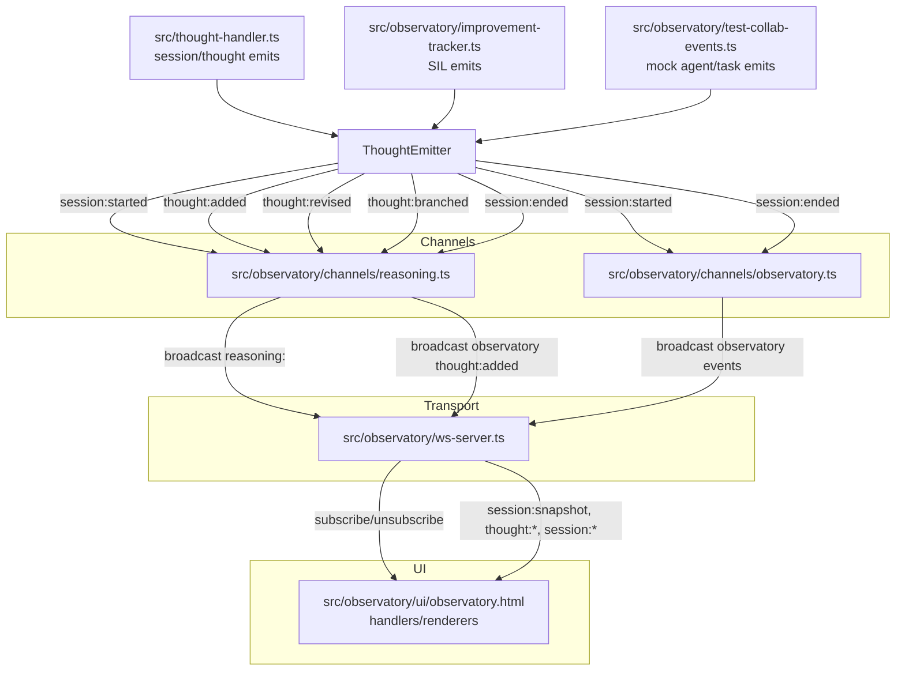

# Observatory Event Map

This map traces every UI-facing event from its origin to the UI handler.

## Flow Diagram

## Event Paths

- `session:started`
  - Origin: `src/thought-handler.ts` (`thoughtEmitter.emitSessionStarted`)
  - Channel: `observatory` broadcasts `session:started`; `reasoning` stores session
  - UI: `observatory:session:started` → auto-subscribe to `reasoning:<sessionId>` when no active session; updates session tabs.

- `session:snapshot`
  - Origin: `reasoning` channel `onJoin`
  - Payload: `{ session, thoughts, branches }` (branches currently sent as record)
  - UI: `reasoning:<id>:session:snapshot` → clears state, loads thoughts/branches, renders graph.

- `thought:added`
  - Origin: `src/thought-handler.ts` (`emitThoughtAdded`)
  - Channel: `reasoning:<sessionId>` broadcast + dual broadcast to `observatory`
  - UI:
    - `observatory:thought:added` → if no active session, auto-select and subscribe; if active, pre-render first thought.
    - `reasoning:<id>:thought:added` → append node, arrival order, agent attribution, render graph.

- `thought:revised`
  - Origin: `emitThoughtRevised` in `src/thought-handler.ts`
  - Channel: `reasoning:<sessionId>`
  - UI: `reasoning:<id>:thought:revised` handler not present; current UI only handles `thought:added` and `thought:branched` (revisions ignored).

- `thought:branched`
  - Origin: `emitThoughtBranched` in `src/thought-handler.ts`
  - Channel: `reasoning:<sessionId>`
  - UI: registers branch, adds node, renders branch stub.

- `session:ended`
  - Origin: `emitSessionEnded` in `src/thought-handler.ts`
  - Channel: `observatory` and `reasoning:<sessionId>`
  - UI: logs end; no state mutation yet (session remains listed).

- Agent/task events
  - Origin: `src/observatory/test-collab-events.ts` and potential future emitters.
  - Channel: **no channel wiring**; emitter events are never broadcast, but UI listens for `agent:*` and `task:*`.

- Improvement events
  - Origin: `src/observatory/improvement-tracker.ts`
  - Channel: **no channel wiring**; not visible in UI.

## Message Contract Highlights

- Format: `[topic, event, payload]` via `WebSocketServer.broadcast()`.
- Topics: `observatory`, `reasoning:<sessionId>`.
- Payload validation: Channel-specific zod schemas (e.g., `ThoughtAddedPayloadSchema`).
- Snapshot: `SessionSnapshotPayloadSchema` uses `branches` as `record<string, Branch>`, while UI expects an array (see issues doc).
