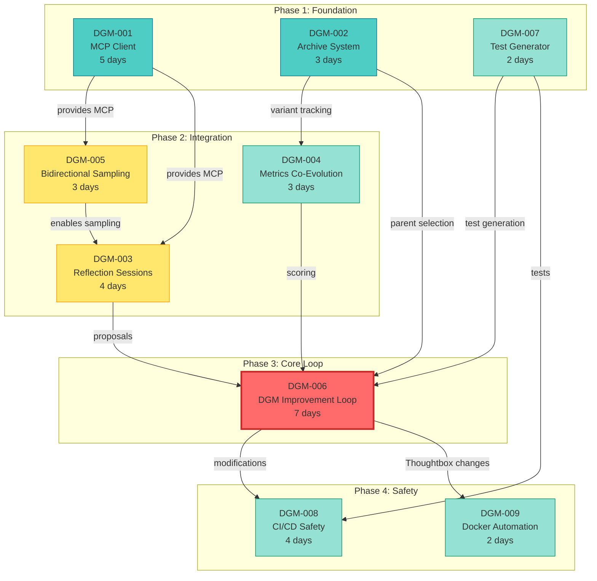

# DGM Integration Specification Dependencies

**Version**: 1.0  
**Generated**: 2026-01-15

## Visual Dependency Graph



---

## Detailed Dependency Matrix

| Spec | Depends On | Blocks | Can Parallel With |
|------|------------|--------|-------------------|
| **DGM-001** | - | DGM-005, DGM-003 | DGM-002, DGM-007 |
| **DGM-002** | - | DGM-004, DGM-006 | DGM-001, DGM-007 |
| **DGM-007** | - | DGM-006, DGM-008 | DGM-001, DGM-002 |
| **DGM-005** | DGM-001 | DGM-003 | DGM-002, DGM-004, DGM-007 |
| **DGM-003** | DGM-001, DGM-005 | DGM-006 | DGM-002, DGM-004, DGM-007 |
| **DGM-004** | DGM-002 | DGM-006 | DGM-001, DGM-003, DGM-005, DGM-007 |
| **DGM-006** | DGM-002, DGM-003, DGM-004, DGM-007 | DGM-008, DGM-009 | - |
| **DGM-008** | DGM-006, DGM-007 | - | DGM-009 |
| **DGM-009** | DGM-006 | - | DGM-008 |

---

## Critical Path Analysis

### Path 1 (Longest)
```
DGM-001 (5d) → DGM-005 (3d) → DGM-003 (4d) → DGM-006 (7d) → DGM-008 (4d)
Total: 23 days
```

### Path 2
```
DGM-002 (3d) → DGM-004 (3d) → DGM-006 (7d) → DGM-009 (2d)
Total: 15 days
```

### Path 3
```
DGM-007 (2d) → DGM-006 (7d) → DGM-008 (4d)
Total: 13 days
```

**Critical Path**: Path 1 (23 days)  
**With Integration Buffer**: 25 days  
**With Parallelization**: ~20 days (run Phase 1 specs in parallel)

---

## Implementation Waves

### Wave 1: Foundations (Can Parallelize)
**Duration**: 5 days (if parallel) or 10 days (if sequential)

```
Day 1-5:
  Thread A: DGM-001 (MCP Client)
  Thread B: DGM-002 (Archive)
  Thread C: DGM-007 (Test Gen) [can start day 3]

Integration: 1 day
  - Test MCP client with Thoughtbox
  - Validate archive operations
  - Verify test generator works
```

### Wave 2: Communication (Partially Parallel)
**Duration**: 7 days

```
Day 6-8: DGM-005 (Sampling)
  - Depends on DGM-001
  - Blocks DGM-003

Day 6-8: DGM-004 (Metrics)
  - Depends on DGM-002
  - Parallel with DGM-005

Day 9-12: DGM-003 (Reflection)
  - Depends on DGM-001, DGM-005
  - Can't parallelize (waiting for sampling)

Integration: 1 day
  - Test reflection → sampling
  - Validate metrics collection
```

### Wave 3: Core Loop (Sequential)
**Duration**: 7 days

```
Day 13-19: DGM-006 (Improvement Loop)
  - Depends on everything before
  - No parallelization possible
  - Most complex spec

Integration: 1 day
  - Test full DGM iteration
  - Validate all integrations
```

### Wave 4: Safety (Can Parallelize)
**Duration**: 4 days

```
Day 20-23: DGM-008 (CI/CD)
  Thread A: GitHub Actions workflows
  Thread B: DGM-009 (Docker automation)

Integration: 1 day
  - Test CI/CD with real modifications
  - Validate Docker rebuild in CI
```

**Total**: 24 days (with parallelization) + buffer = **~6 weeks**

---

## Dependency Rationale

### Why DGM-001 Before DGM-003?
Reflection sessions need to connect to Thoughtbox via MCP client to:
- Fetch session traces
- Call session.analyze
- Create new session for meta-analysis

### Why DGM-005 Before DGM-003?
Reflection meta-analysis uses Thoughtbox, which may request sampling back to Letta for critique (dogfooding the capability).

### Why DGM-007 Before DGM-006?
DGM loop requires test generation for every modification. Test generator must be working before attempting improvements.

### Why Everything Before DGM-006?
DGM loop orchestrates all components:
- Archive for variant tracking
- Reflection for proposals
- Metrics for scoring
- Test generation for validation
- MCP client for Thoughtbox communication

---

## Parallel Execution Strategy

### Phase 1 Parallelization
```typescript
// Can implement simultaneously
await Promise.all([
  implementSpec('DGM-001'), // 5 days, 1 developer
  implementSpec('DGM-002'), // 3 days, 1 developer
  implementSpec('DGM-007')  // 2 days, 1 developer (start day 4)
]);

// Integration testing (1 day, all developers)
await integratePhase1();
```

**Benefit**: 5 days instead of 10 days (50% time savings)

### Phase 4 Parallelization
```typescript
await Promise.all([
  implementSpec('DGM-008'), // 4 days
  implementSpec('DGM-009')  // 2 days (finishes early)
]);
```

**Benefit**: 4 days instead of 6 days (33% time savings)

---

## Risk-Dependency Matrix

### High-Risk Dependencies

| Dependent | Dependency | Risk | Mitigation |
|-----------|------------|------|------------|
| DGM-003 | DGM-005 | Sampling complexity may delay reflection | Prototype DGM-005 early |
| DGM-006 | DGM-004 | Metrics instability affects acceptance | Start with fixed metrics |
| DGM-006 | DGM-007 | Poor test quality blocks acceptance | Manual test review option |

### Medium-Risk Dependencies

| Dependent | Dependency | Risk | Mitigation |
|-----------|------------|------|------------|
| DGM-005 | DGM-001 | MCP client bugs affect sampling | Thorough DGM-001 testing |
| DGM-004 | DGM-002 | Archive issues affect metrics | Independent metric calculation |

---

## Blocker Analysis

### What Could Block Implementation?

**Blocker 1**: Letta Cloud API unavailable
- **Affects**: DGM-004 (metrics storage)
- **Severity**: LOW (can use local-only)
- **Workaround**: Implement local-first, add cloud later

**Blocker 2**: MCP sampling proves too complex
- **Affects**: DGM-005, DGM-003
- **Severity**: MEDIUM
- **Workaround**: Launch without sampling, add in v2

**Blocker 3**: Test generator produces poor tests
- **Affects**: DGM-006, DGM-008
- **Severity**: MEDIUM
- **Workaround**: Manual test review/editing, refine skill

**Current Status**: 🟢 **No Critical Blockers**

---

## Change Impact Analysis

### If We Remove DGM-005 (Sampling)

**Impact**:
- DGM-003 loses meta-reasoning capability (can't request critique)
- Thoughtbox can't leverage Letta agent for synthesis
- Still functional, but less powerful

**Decision**: Keep (high value feature)

### If We Simplify DGM-004 (Fixed Metrics)

**Impact**:
- Metrics don't evolve
- May become less relevant over time
- Still functional, easier to implement

**Decision**: Implement fixed metrics first, add evolution later (phased approach)

### If We Skip DGM-008 (CI/CD)

**Impact**:
- Safety relies only on local validation
- Higher risk of bad merges
- No post-merge monitoring

**Decision**: Keep (critical for safety)

---

## Conclusion

**Dependency structure is sound**: Acyclic, logical, well-justified

**Critical path identified**: 23-25 days (realistic)

**Parallelization opportunities**: 2 phases can parallelize (33-50% time savings)

**No blocking dependencies**: All dependencies resolvable

**Risk level**: Acceptable (mitigations identified for all high-risk items)

---

**Status**: ✅ **Dependency analysis complete, ready to proceed**
