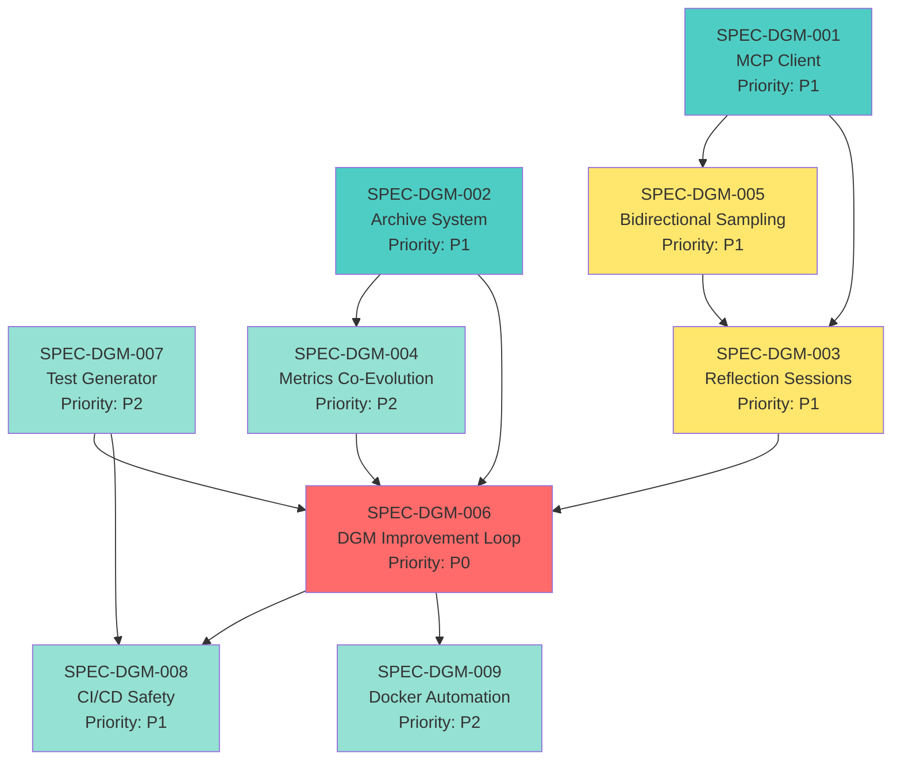

# DGM Integration Specification Inventory

**Version**: 1.0  
**Generated**: 2026-01-15  
**Total Specs**: 9  
**Status**: Complete

## Overview

This specification suite documents the end-state architecture for implementing a Darwin Gödel Machine (DGM) self-improvement system within Letta Code + Thoughtbox. The system enables autonomous capability discovery and implementation through reflection-driven evolution.

## Specification List

| ID | Title | Priority | Complexity | Dependencies | Status |
|----|-------|----------|------------|--------------|--------|
| [SPEC-DGM-001](./SPEC-DGM-001-mcp-client-local-mode.md) | Direct MCP Client for Letta Code | P1 | High | None | Draft |
| [SPEC-DGM-002](./SPEC-DGM-002-dgm-archive-system.md) | Git-Based DGM Archive Management | P1 | Medium | None | Draft |
| [SPEC-DGM-007](./SPEC-DGM-007-test-generator-skill.md) | Automated Test Generation Skill | P2 | Medium | None | Draft |
| [SPEC-DGM-005](./SPEC-DGM-005-bidirectional-sampling.md) | MCP Bidirectional Sampling Protocol | P1 | High | DGM-001 | Draft |
| [SPEC-DGM-003](./SPEC-DGM-003-reflection-session-system.md) | Reflection Session Framework | P1 | Medium | DGM-001, DGM-005 | Draft |
| [SPEC-DGM-004](./SPEC-DGM-004-metrics-co-evolution.md) | Co-Evolving Performance Metrics | P2 | High | DGM-002 | Draft |
| [SPEC-DGM-006](./SPEC-DGM-006-dgm-improvement-loop.md) | DGM Self-Improvement Loop | P0 | Very High | DGM-002, DGM-003, DGM-004, DGM-007 | Draft |
| [SPEC-DGM-008](./SPEC-DGM-008-cicd-safety-mechanisms.md) | CI/CD Safety Mechanisms | P1 | Medium | DGM-006, DGM-007 | Draft |
| [SPEC-DGM-009](./SPEC-DGM-009-docker-automation.md) | Thoughtbox Docker Rebuild Automation | P2 | Low | DGM-006 | Draft |

---

## Dependency Graph

**Legend**:
- 🔴 Red (P0): Core system logic - implement first
- 🔵 Blue (P1): Critical foundation - early implementation
- 🟡 Yellow (P1): Important integration - mid implementation
- 🟢 Green (P2): Supporting features - later implementation

---

## Implementation Sequence

### Phase 1: Foundation (Week 1-2)
**Goal**: Core infrastructure for MCP and archive

1. **SPEC-DGM-001** (MCP Client) [5 days]
   - Transport layer (STDIO, HTTP)
   - Basic protocol primitives (tools, resources)
   - Connection management
   
2. **SPEC-DGM-002** (Archive System) [3 days]
   - Git-based archive structure
   - Parent selection algorithm
   - Archive operations (add, load, list)

3. **SPEC-DGM-007** (Test Generator) [2 days]
   - Create Letta skill
   - Support TypeScript test generation
   - Basic behavioral test support

**Milestone**: Can connect to Thoughtbox locally, archive system operational

---

### Phase 2: Integration (Week 3-4)
**Goal**: Enable bidirectional communication and reflection

4. **SPEC-DGM-005** (Bidirectional Sampling) [3 days]
   - Sampling request handler
   - Human-in-the-loop approval
   - Integration with Thoughtbox

5. **SPEC-DGM-003** (Reflection Sessions) [4 days]
   - Trigger system (manual, scheduled)
   - Data gathering from multiple sources
   - Thoughtbox session integration
   - Opportunity presentation

6. **SPEC-DGM-004** (Metrics Co-Evolution) [3 days]
   - Initial metric set
   - Composite scoring
   - Local + cloud storage

**Milestone**: Can run reflection sessions, Thoughtbox can request sampling

---

### Phase 3: DGM Loop (Week 5-6)
**Goal**: Complete self-improvement loop

7. **SPEC-DGM-006** (DGM Loop) [7 days]
   - Proposal implementation
   - Test generation integration
   - Validation phase
   - Acceptance/rejection logic
   - Main iteration loop

**Milestone**: Agent can self-modify and improve

---

### Phase 4: Safety & Automation (Week 7-8)
**Goal**: Production-ready safety mechanisms

8. **SPEC-DGM-008** (CI/CD Safety) [4 days]
   - GitHub Actions workflows
   - Regression detection
   - Security scanning
   - Post-merge monitoring

9. **SPEC-DGM-009** (Docker Automation) [2 days]
   - Rebuild automation
   - Zero-downtime updates
   - Health validation
   - Rollback on failures

**Milestone**: Full system operational with safety guarantees

---

## Scope Summary

### In Scope

✅ **Core Capabilities**:
- Direct MCP client in Letta Code
- Git-based variant archive
- Reflection sessions with Thoughtbox
- Automated test generation
- DGM improvement loop
- Safety via CI/CD

✅ **Integration Points**:
- Letta Code ↔ Thoughtbox (MCP protocol)
- Thoughtbox ↔ Letta Agent (sampling)
- Agent ↔ Reflection (meta-reasoning)
- DGM ↔ Git (version control)

✅ **Safety Mechanisms**:
- Multi-layer validation
- Project-scope restriction
- Human approval gates
- Automated rollback
- Full audit trail

### Out of Scope (Future Work)

❌ **Not Included**:
- Foundation model training/fine-tuning
- Multi-user collaboration on DGM
- Distributed DGM across multiple machines
- DGM for domains beyond coding (vision, audio, etc.)
- Auto-reweighting of metrics (manual for now)
- Advanced parent selection (only basic algorithm)

---

## Key Decisions Made

### Architectural Decisions

1. **Archive**: Git-tracked (enables multi-machine sync)
2. **Metrics**: Hybrid local + cloud storage
3. **Test Generation**: Dedicated Letta skill (prerequisite)
4. **Reflection**: Full Thoughtbox session (not just tool calls)
5. **Transport**: Thoughtbox via Docker exposing streamable HTTP
6. **Safety**: CI/CD layer (not in-app validation)

### Design Principles

1. **Project Scope Only**: No system-wide modifications allowed
2. **Git as Single Source of Truth**: All state in Git
3. **Fail Safe**: Validation failures block acceptance
4. **Human Optional**: Can run fully autonomous or with approval gates
5. **Observable**: Every step logged and traceable
6. **Recoverable**: Can rollback any change

---

## Risk Analysis

### High Risks

| Risk | Mitigation | Owner |
|------|------------|-------|
| Agent modifies code breaking both systems | Multi-layer validation, rollback mechanism | DGM-008 |
| Infinite modification loops | Timeout enforcement, iteration limits | DGM-006 |
| Performance degradation not detected | Comprehensive metrics, regression tests | DGM-004 |
| Docker rebuild failures | Health checks, automatic rollback | DGM-009 |
| Git conflicts from concurrent modifications | Single-threaded DGM loop, conflict resolution | DGM-002 |

### Medium Risks

| Risk | Mitigation | Owner |
|------|------------|-------|
| Metrics don't reflect real improvement | Co-evolution, human validation | DGM-004 |
| Test generation produces poor tests | Skill refinement, manual review option | DGM-007 |
| Sampling creates infinite recursion | Depth limits, timeout | DGM-005 |
| Archive grows unbounded | Retirement strategy, pruning old variants | DGM-002 |

### Low Risks

| Risk | Mitigation | Owner |
|------|------------|-------|
| MCP connection instability | Reconnection logic, health monitoring | DGM-001 |
| Build time too long | Caching, optimization | DGM-009 |
| User confusion about variants | Clear UI, documentation | DGM-002 |

---

## Acceptance Criteria (Full Suite)

### Must Have (P0/P1)
- [ ] All 9 specs completed
- [ ] MCP client connects to Thoughtbox
- [ ] Reflection sessions work
- [ ] DGM loop completes one iteration successfully
- [ ] Tests generated automatically
- [ ] CI/CD validates modifications
- [ ] Archive tracks variants correctly
- [ ] Docker rebuilds work

### Should Have (P2)
- [ ] Metrics co-evolution functional
- [ ] Zero-downtime updates
- [ ] Performance monitoring
- [ ] Archive visualization

### Could Have (Future)
- [ ] Multi-machine archive sync tested
- [ ] Advanced parent selection algorithms
- [ ] Metric auto-reweighting
- [ ] Dashboard for DGM statistics

---

## Estimated Effort

| Phase | Duration | LOC Estimate | Files Created |
|-------|----------|--------------|---------------|
| Phase 1 | 10 days | ~2000 LOC | 15 files |
| Phase 2 | 10 days | ~1500 LOC | 12 files |
| Phase 3 | 7 days | ~1000 LOC | 8 files |
| Phase 4 | 6 days | ~500 LOC | 6 files + workflows |
| **Total** | **33 days** | **~5000 LOC** | **41 files** |

**Note**: Estimate assumes single developer working full-time. Actual may vary based on:
- Unforeseen integration issues
- Test generation skill complexity
- Docker optimization needs
- CI/CD workflow debugging

---

## Next Steps

1. **Review**: Stakeholder review of all 9 specs
2. **Refine**: Address feedback and update specs
3. **Prioritize**: Confirm implementation sequence
4. **Implement**: Begin Phase 1 with SPEC-DGM-001
5. **Iterate**: Implement phases sequentially, testing integration at each phase boundary

---

## Implementation Readiness

### Prerequisites

✅ **Ready**:
- Thoughtbox codebase exists and stable
- Letta Code codebase exists and stable
- MCP documentation available
- DGM paper provides algorithm
- Git infrastructure in place
- CI/CD platform available (GitHub Actions)

⚠️ **Needs Setup**:
- Letta Cloud metrics API (if available)
- Docker registry (for image storage)
- Test fixtures and benchmarks

❌ **Blockers**:
- None identified

**Overall Readiness**: 🟢 **Ready to Implement**

---

## Success Metrics

How we'll know the implementation succeeded:

1. **Functional Success**:
   - Agent completes at least 1 full DGM iteration
   - New capability accepted into archive
   - Capability demonstrably improves performance

2. **Safety Success**:
   - No regressions to existing functionality
   - All modifications confined to project scope
   - Rollback works when needed

3. **UX Success**:
   - Reflection session intuitive and fast (<5 min)
   - Archive visualization clear
   - Error messages actionable

4. **Performance Success**:
   - Composite metric score increases over iterations
   - Agent becomes measurably better at self-improvement
   - System overhead <10% of task execution time

---

**Ready to implement?** → Start with [SPEC-DGM-001: MCP Client](./SPEC-DGM-001-mcp-client-local-mode.md)
