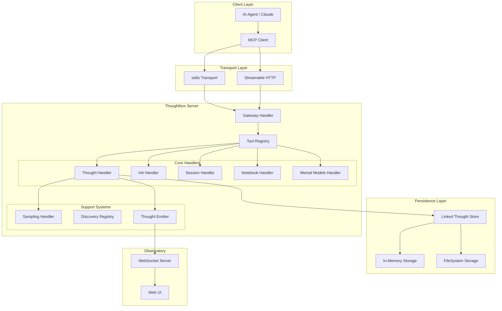
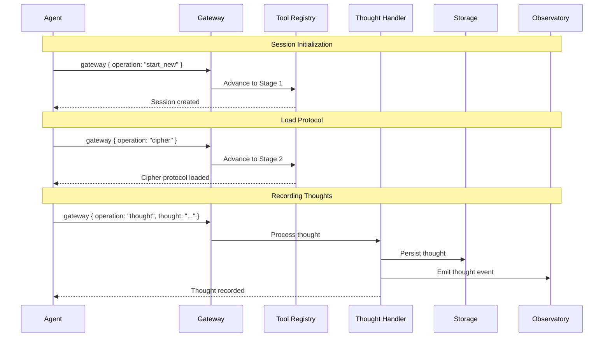
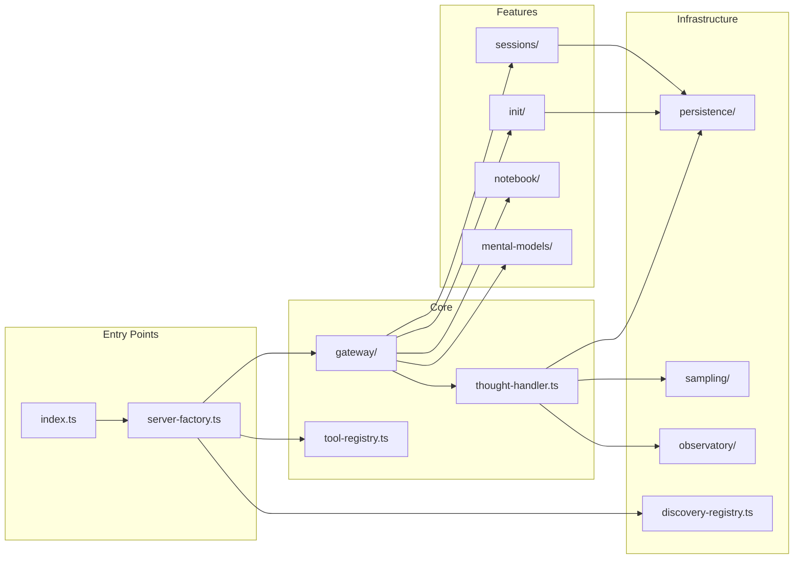
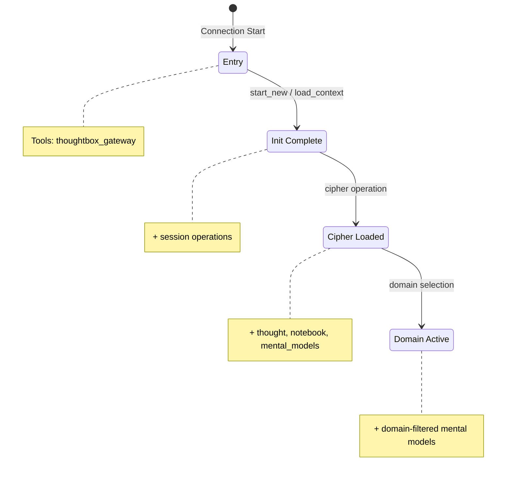
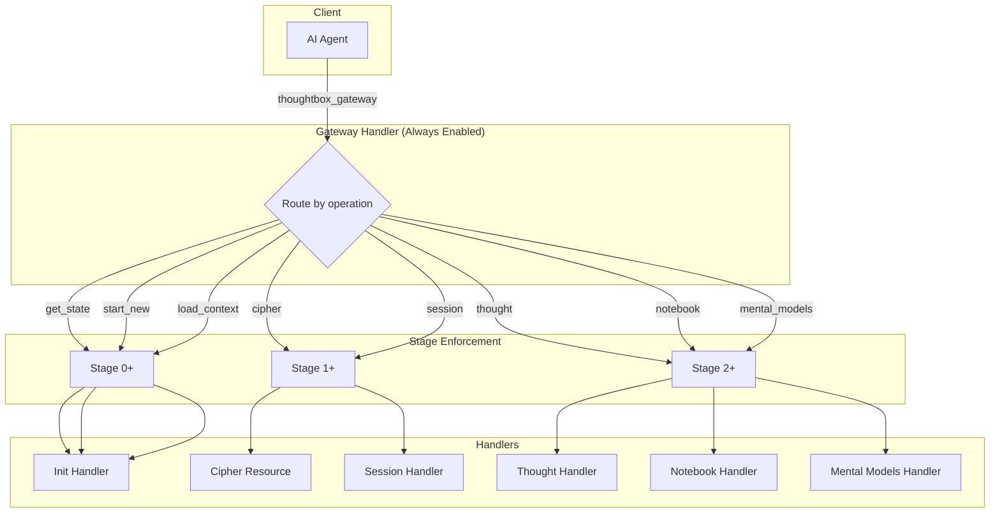
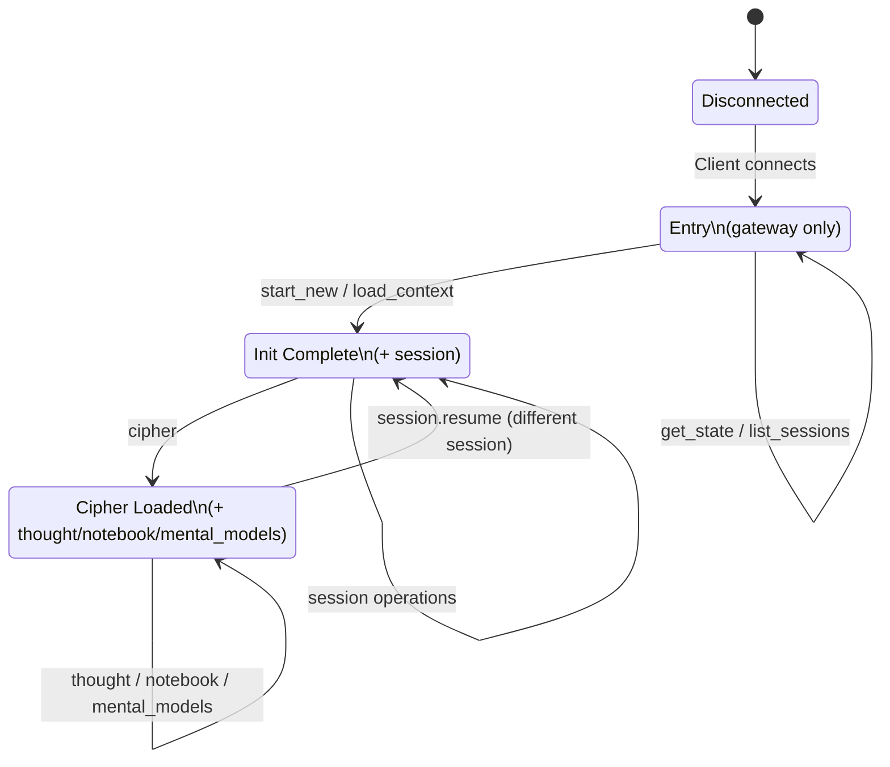
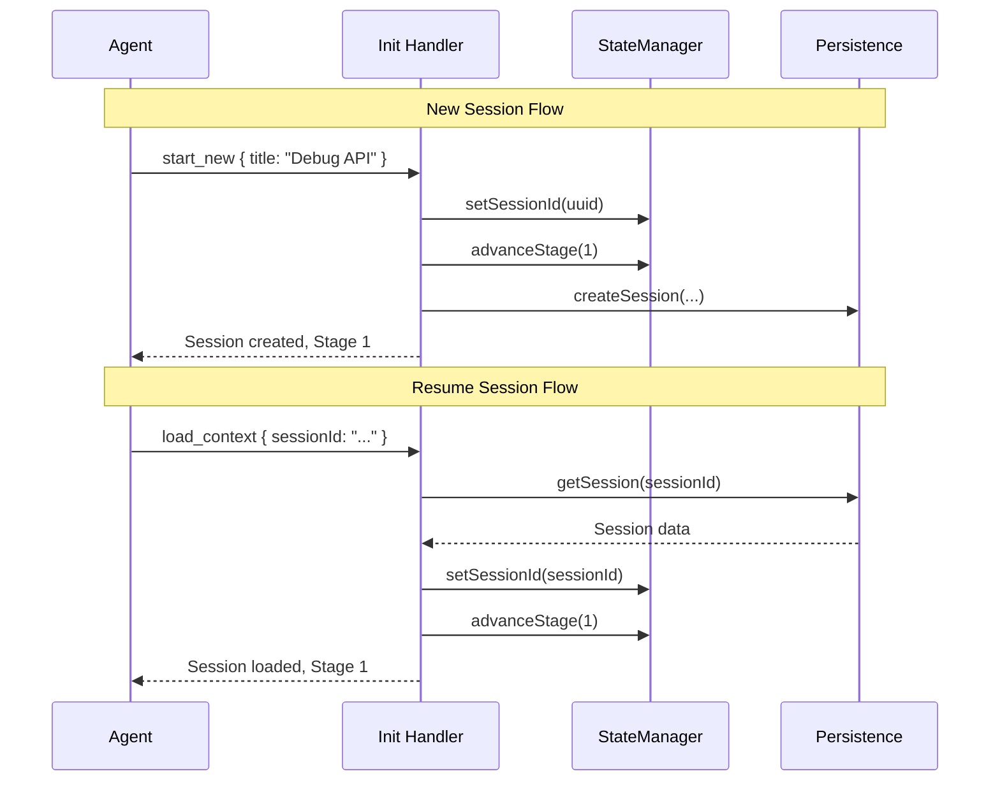
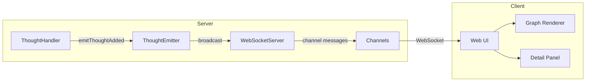
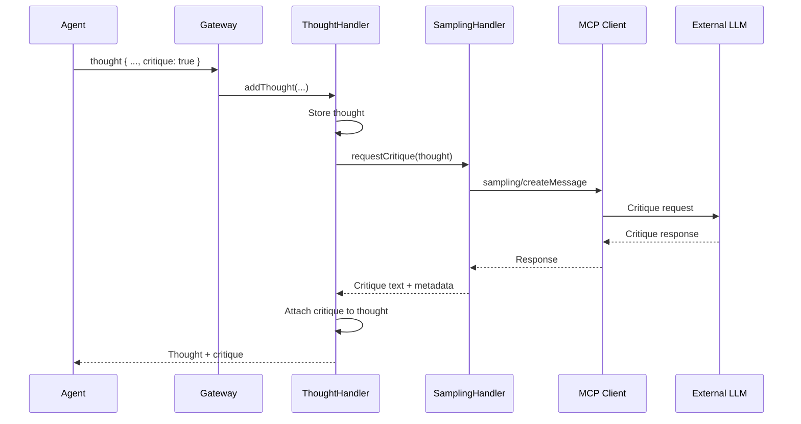

# Thoughtbox Server Architecture

> **Version:** 1.2.2
> **Last Updated:** 2026-01-20
> **Purpose:** Comprehensive architectural documentation and data design specifications

---

## Table of Contents

1. [System Overview](#system-overview)
2. [High-Level Architecture](#high-level-architecture)
3. [Data Models](#data-models)
4. [Progressive Disclosure System](#progressive-disclosure-system)
5. [Gateway Architecture](#gateway-architecture)
6. [Cipher Protocol](#cipher-protocol)
7. [Tool Interfaces](#tool-interfaces)
8. [Storage Architecture](#storage-architecture)
9. [Session Management](#session-management)
10. [Observatory (Real-Time Visualization)](#observatory)
11. [Sampling Handler (Autonomous Critique)](#sampling-handler)
12. [Configuration Reference](#configuration-reference)

---

## System Overview

Thoughtbox is an MCP (Model Context Protocol) server providing infrastructure for structured reasoning. It functions as a "reasoning ledger" for AI agents, enabling:

- **Thought Chain Management**: Track reasoning across multiple thoughts with revisions and branches
- **Progressive Disclosure**: Stage-based tool availability for guided agent onboarding
- **Formal Protocol**: Cipher notation for deterministic server-side parsing
- **Real-Time Visualization**: Observatory WebSocket server for live reasoning graphs
- **Autonomous Critique**: MCP sampling API integration for LLM-based critique loops



---

## High-Level Architecture

### Component Interaction Flow



### Module Dependency Graph



---

## Data Models

This section provides the complete data model specifications. Types are organized by subsystem.

### Table of Contents (Data Models)

- [Core Types](#core-types) - ThoughtData, Session, ThoughtNode
- [Configuration Types](#configuration-types) - Config, TimePartitionGranularity
- [Input Parameter Types](#input-parameter-types) - CreateSessionParams, SessionFilter, ThoughtInput, ExportOptions
- [Export & Integrity Types](#export--integrity-types) - SessionExport, SessionManifest, IntegrityValidationResult
- [Knowledge Zone Types](#knowledge-zone-types) - KnowledgePattern, ScratchpadNote
- [Session Analysis Types](#session-analysis-types) - SessionAnalysis, ExtractedLearning
- [Notebook Types](#notebook-types) - Notebook, Cell variants
- [Mental Models Types](#mental-models-types) - MentalModelDefinition, response types
- [Observatory Types](#observatory-types) - Event payloads, WebSocket schemas
- [Error Types](#error-types) - Error codes and payloads

---

### Core Types

#### ThoughtData Schema

```yaml
# ThoughtData - Core reasoning unit
ThoughtData:
  type: object
  required:
    - thought
    - thoughtNumber
    - totalThoughts
    - nextThoughtNeeded
    - timestamp
  properties:
    thought:
      type: string
      description: The reasoning content
      example: "The API latency increased because of database regression"

    thoughtNumber:
      type: integer
      minimum: 1
      description: Position in the reasoning chain

    totalThoughts:
      type: integer
      minimum: 1
      description: Estimated total thoughts for this reasoning

    nextThoughtNeeded:
      type: boolean
      description: Whether reasoning should continue

    isRevision:
      type: boolean
      default: false
      description: Whether this thought revises a prior thought

    revisesThought:
      type: integer
      nullable: true
      description: Which thought number this revises

    branchFromThought:
      type: integer
      nullable: true
      description: Fork point for alternative exploration

    branchId:
      type: string
      nullable: true
      pattern: "^[a-z0-9-]+$"
      description: Branch identifier (lowercase alphanumeric with hyphens)

    needsMoreThoughts:
      type: boolean
      default: false
      description: Signal that more thoughts are needed

    includeGuide:
      type: boolean
      default: false
      description: Include patterns guide in response

    timestamp:
      type: string
      format: date-time
      description: ISO 8601 timestamp (auto-added)

    critique:
      type: object
      nullable: true
      description: Autonomous LLM critique
      properties:
        text:
          type: string
          description: Critique content
        model:
          type: string
          description: Model that provided critique
        timestamp:
          type: string
          format: date-time
```

### Session Schema

```yaml
# Session - Container for thought chains
Session:
  type: object
  required:
    - id
    - title
    - tags
    - thoughtCount
    - branchCount
    - createdAt
    - updatedAt
    - lastAccessedAt
  properties:
    id:
      type: string
      format: uuid
      description: Unique session identifier

    title:
      type: string
      maxLength: 200
      description: Human-readable session title

    description:
      type: string
      nullable: true
      description: Optional session description

    tags:
      type: array
      items:
        type: string
      description: Categorization tags

    thoughtCount:
      type: integer
      minimum: 0
      description: Number of thoughts in session

    branchCount:
      type: integer
      minimum: 0
      description: Number of branches in session

    partitionPath:
      type: string
      nullable: true
      description: Time partition path (monthly/weekly/daily)
      examples:
        - "2025-12"
        - "2025-W50"
        - "2025-12-07"

    createdAt:
      type: string
      format: date-time

    updatedAt:
      type: string
      format: date-time

    lastAccessedAt:
      type: string
      format: date-time
```

### Thought Node Schema (Linked Store)

```yaml
# ThoughtNode - Graph representation for O(1) operations
ThoughtNode:
  type: object
  required:
    - id
    - data
  properties:
    id:
      type: string
      pattern: "^[a-f0-9-]+:[0-9]+$"
      description: Format "{sessionId}:{thoughtNumber}"
      example: "a1b2c3d4-e5f6-7890-abcd-ef1234567890:42"

    data:
      $ref: "#/ThoughtData"
      description: Original thought data

    prev:
      type: string
      nullable: true
      description: Previous thought node ID

    next:
      type: array
      items:
        type: string
      description: Next thought node IDs (supports trees)

    revisesNode:
      type: string
      nullable: true
      description: Node ID this thought revises

    branchOrigin:
      type: string
      nullable: true
      description: Node ID this branch originated from

    branchId:
      type: string
      nullable: true
      description: Branch identifier
```

### Notebook Cell Schema

```yaml
# NotebookCell - Literate programming unit
NotebookCell:
  type: object
  required:
    - id
    - type
    - content
  properties:
    id:
      type: string
      format: uuid

    type:
      type: string
      enum:
        - title
        - markdown
        - code
      description: |
        - title: Markdown heading
        - markdown: Documentation text
        - code: Executable JavaScript/TypeScript

    content:
      type: string
      description: Cell content

    output:
      type: string
      nullable: true
      description: Execution output (code cells only)

    error:
      type: string
      nullable: true
      description: Execution error (code cells only)

    executedAt:
      type: string
      format: date-time
      nullable: true
```

---

### Configuration Types

#### Config Schema

```yaml
# Config - Server configuration (persisted)
Config:
  type: object
  required:
    - installId
    - dataDir
    - disableThoughtLogging
    - sessionPartitionGranularity
    - createdAt
  properties:
    installId:
      type: string
      format: uuid
      description: Unique installation identifier

    dataDir:
      type: string
      description: Base directory for persistent data
      example: "~/.thoughtbox"

    disableThoughtLogging:
      type: boolean
      default: false
      description: Suppress stderr output

    sessionPartitionGranularity:
      $ref: "#/TimePartitionGranularity"
      default: "monthly"
      description: How sessions are organized in filesystem

    createdAt:
      type: string
      format: date-time
```

#### TimePartitionGranularity

```yaml
# TimePartitionGranularity - Session directory organization
TimePartitionGranularity:
  type: string
  enum:
    - monthly   # sessions/2025-12/{uuid}/
    - weekly    # sessions/2025-W50/{uuid}/
    - daily     # sessions/2025-12-07/{uuid}/
    - none      # sessions/{uuid}/ (legacy)
  default: monthly
```

---

### Input Parameter Types

#### CreateSessionParams

```yaml
# CreateSessionParams - Parameters for creating a new session
CreateSessionParams:
  type: object
  required:
    - title
  properties:
    title:
      type: string
      maxLength: 200
      description: Human-readable session title

    description:
      type: string
      nullable: true
      description: Optional detailed description

    tags:
      type: array
      items:
        type: string
      default: []
      description: Categorization tags
```

#### SessionFilter

```yaml
# SessionFilter - Filter options for listing sessions
SessionFilter:
  type: object
  properties:
    tags:
      type: array
      items:
        type: string
      description: Filter by tags (AND logic)

    search:
      type: string
      description: Full-text search in title/description

    limit:
      type: integer
      minimum: 1
      maximum: 100
      default: 20
      description: Maximum results to return

    offset:
      type: integer
      minimum: 0
      default: 0
      description: Pagination offset

    sortBy:
      type: string
      enum:
        - createdAt
        - updatedAt
        - title
      default: updatedAt

    sortOrder:
      type: string
      enum:
        - asc
        - desc
      default: desc
```

#### ThoughtInput

```yaml
# ThoughtInput - Extended thought with session metadata (for auto-create)
ThoughtInput:
  allOf:
    - $ref: "#/ThoughtData"
    - type: object
      properties:
        sessionTitle:
          type: string
          description: Title for auto-created session (first thought only)

        sessionTags:
          type: array
          items:
            type: string
          description: Tags for auto-created session
```

#### ExportOptions

```yaml
# ExportOptions - Options for exporting a session
ExportOptions:
  type: object
  required:
    - sessionId
  properties:
    sessionId:
      type: string
      format: uuid

    destination:
      type: string
      nullable: true
      description: Custom export directory (default ~/.thoughtbox/exports/)
```

---

### Export & Integrity Types

#### SessionExport

```yaml
# SessionExport - Export format for linked reasoning sessions (v1.0)
SessionExport:
  type: object
  required:
    - version
    - session
    - nodes
    - exportedAt
  properties:
    version:
      type: string
      const: "1.0"
      description: Schema version

    session:
      $ref: "#/Session"
      description: Session metadata

    nodes:
      type: array
      items:
        $ref: "#/ThoughtNode"
      description: All thought nodes with linked structure

    exportedAt:
      type: string
      format: date-time
      description: ISO 8601 timestamp of export
```

#### SessionManifest

```yaml
# SessionManifest - Stored in session directory for filesystem storage
SessionManifest:
  type: object
  required:
    - id
    - version
    - thoughtFiles
    - branchFiles
    - metadata
  properties:
    id:
      type: string
      format: uuid

    version:
      type: string
      description: Schema version
      example: "1.0.0"

    thoughtFiles:
      type: array
      items:
        type: string
      description: Ordered thought file names
      example: ["001.json", "002.json", "003.json"]

    branchFiles:
      type: object
      additionalProperties:
        type: array
        items:
          type: string
      description: Branch ID to thought files mapping
      example:
        alt-approach: ["001.json", "002.json"]
        edge-case: ["001.json"]

    metadata:
      type: object
      required:
        - title
        - tags
        - createdAt
        - updatedAt
      properties:
        title:
          type: string
        description:
          type: string
          nullable: true
        tags:
          type: array
          items:
            type: string
        createdAt:
          type: string
          format: date-time
        updatedAt:
          type: string
          format: date-time
```

#### IntegrityValidationResult

```yaml
# IntegrityValidationResult - Result of filesystem integrity check
IntegrityValidationResult:
  type: object
  required:
    - valid
    - sessionExists
    - manifestExists
    - manifestValid
    - missingThoughtFiles
    - missingBranchFiles
    - errors
  properties:
    valid:
      type: boolean
      description: Overall validity (all checks passed)

    sessionExists:
      type: boolean
      description: Session directory exists

    manifestExists:
      type: boolean
      description: manifest.json file exists

    manifestValid:
      type: boolean
      description: Manifest parses correctly

    missingThoughtFiles:
      type: array
      items:
        type: string
      description: Thought files referenced in manifest but missing

    missingBranchFiles:
      type: object
      additionalProperties:
        type: array
        items:
          type: string
      description: Branch ID to missing files mapping

    errors:
      type: array
      items:
        type: string
      description: Human-readable error messages
```

---

### Knowledge Zone Types

The Knowledge Zone ("The Garden") stores patterns extracted from successful reasoning sessions.

#### KnowledgePattern

```yaml
# KnowledgePattern - Extracted reasoning pattern
KnowledgePattern:
  type: object
  required:
    - id
    - title
    - description
    - tags
    - content
    - createdAt
    - updatedAt
  properties:
    id:
      type: string
      pattern: "^[a-z0-9-]+$"
      description: URL-safe slug identifier
      example: "debugging-race-conditions"

    title:
      type: string
      description: Human-readable title

    description:
      type: string
      description: Brief pattern description

    tags:
      type: array
      items:
        type: string
      description: Categorization tags

    content:
      type: string
      description: Full pattern content (Markdown)

    derivedFromSessions:
      type: array
      items:
        type: string
        format: uuid
      description: Session IDs this pattern was extracted from

    createdBy:
      type: string
      nullable: true
      description: Agent ID that created this pattern

    createdAt:
      type: string
      format: date-time

    updatedAt:
      type: string
      format: date-time
```

#### CreatePatternParams

```yaml
# CreatePatternParams - Parameters for creating a knowledge pattern
CreatePatternParams:
  type: object
  required:
    - title
    - description
    - content
  properties:
    title:
      type: string
    description:
      type: string
    tags:
      type: array
      items:
        type: string
      default: []
    content:
      type: string
    derivedFromSessions:
      type: array
      items:
        type: string
    createdBy:
      type: string
```

#### PatternFilter

```yaml
# PatternFilter - Filter options for listing patterns
PatternFilter:
  type: object
  properties:
    tags:
      type: array
      items:
        type: string

    search:
      type: string
      description: Full-text search

    limit:
      type: integer
      default: 20

    offset:
      type: integer
      default: 0

    sortBy:
      type: string
      enum: [createdAt, updatedAt, title]
      default: updatedAt

    sortOrder:
      type: string
      enum: [asc, desc]
      default: desc
```

#### ScratchpadNote

```yaml
# ScratchpadNote - Temporary collaborative work note
ScratchpadNote:
  type: object
  required:
    - id
    - title
    - content
    - createdAt
    - updatedAt
  properties:
    id:
      type: string
      pattern: "^[a-z0-9-]+$"
      description: Topic slug identifier

    title:
      type: string

    content:
      type: string
      description: Note content (Markdown)

    createdAt:
      type: string
      format: date-time

    updatedAt:
      type: string
      format: date-time
```

---

### Session Analysis Types

These types support the `session.analyze` and `session.extract_learnings` operations.

#### SessionAnalysis

```yaml
# SessionAnalysis - Objective metrics for a reasoning session
SessionAnalysis:
  type: object
  required:
    - sessionId
    - metadata
    - structure
    - quality
  properties:
    sessionId:
      type: string
      format: uuid

    metadata:
      type: object
      required:
        - title
        - thoughtCount
        - branchCount
        - revisionCount
        - duration
        - createdAt
        - lastUpdatedAt
      properties:
        title:
          type: string
        tags:
          type: array
          items:
            type: string
          nullable: true
        thoughtCount:
          type: integer
          minimum: 0
        branchCount:
          type: integer
          minimum: 0
        revisionCount:
          type: integer
          minimum: 0
        duration:
          type: integer
          description: Milliseconds from first to last thought
        createdAt:
          type: string
          format: date-time
        lastUpdatedAt:
          type: string
          format: date-time

    structure:
      type: object
      required:
        - linearityScore
        - revisionRate
        - maxDepth
        - thoughtDensity
      properties:
        linearityScore:
          type: number
          minimum: 0
          maximum: 1
          description: Higher = more linear reasoning (fewer branches/revisions)
        revisionRate:
          type: number
          minimum: 0
          maximum: 1
          description: Revisions / total thoughts
        maxDepth:
          type: integer
          minimum: 0
          description: Count of distinct branch IDs
        thoughtDensity:
          type: number
          description: Thoughts per minute

    quality:
      type: object
      required:
        - critiqueRequests
        - hasConvergence
        - isComplete
      properties:
        critiqueRequests:
          type: integer
          minimum: 0
          description: Thoughts with critique enabled
        hasConvergence:
          type: boolean
          description: Main chain continues after branches
        isComplete:
          type: boolean
          description: Final thought has nextThoughtNeeded=false
```

#### ExtractedLearning

```yaml
# ExtractedLearning - Pattern extracted from session for DGM evolution
ExtractedLearning:
  type: object
  required:
    - type
    - content
    - targetPath
    - metadata
  properties:
    type:
      type: string
      enum:
        - pattern       # Successful approach worth reusing
        - anti-pattern  # Approach that failed/should be avoided
        - signal        # Indicator for future detection
      description: Classification of the extracted learning

    content:
      type: string
      description: Markdown or JSON content

    targetPath:
      type: string
      description: Suggested file path for DGM evolution
      example: "patterns/debugging/race-condition-detection.md"

    metadata:
      type: object
      required:
        - sourceSession
        - sourceThoughts
        - extractedAt
      properties:
        sourceSession:
          type: string
          format: uuid
          description: Session ID this was extracted from

        sourceThoughts:
          type: array
          items:
            type: integer
          description: Thought numbers involved in this learning

        extractedAt:
          type: string
          format: date-time

        behaviorCharacteristics:
          type: object
          description: Optional scoring for pattern quality
          properties:
            specificity:
              type: integer
              minimum: 1
              maximum: 10
              description: How specific vs general (1=very general, 10=very specific)
            applicability:
              type: integer
              minimum: 1
              maximum: 10
              description: How broadly applicable
            complexity:
              type: integer
              minimum: 1
              maximum: 10
              description: How complex to implement
            maturity:
              type: integer
              minimum: 1
              maximum: 10
              description: How proven/tested
```

---

### Notebook Types

The notebook system uses Zod schemas for runtime validation. Cell types are discriminated unions.

#### Notebook

```yaml
# Notebook - Literate programming document
Notebook:
  type: object
  required:
    - id
    - cells
    - language
    - createdAt
    - updatedAt
  properties:
    id:
      type: string

    cells:
      type: array
      items:
        $ref: "#/Cell"

    language:
      type: string
      enum: [javascript, typescript]
      description: Default language for code cells

    tsconfig.json:
      type: string
      nullable: true
      description: Custom TypeScript config (JSON string)

    createdAt:
      type: integer
      description: Unix timestamp (ms)

    updatedAt:
      type: integer
      description: Unix timestamp (ms)
```

#### Cell (Discriminated Union)

```yaml
# Cell - Union of all cell types, discriminated by 'type' field
Cell:
  oneOf:
    - $ref: "#/TitleCell"
    - $ref: "#/MarkdownCell"
    - $ref: "#/PackageJsonCell"
    - $ref: "#/CodeCell"
  discriminator:
    propertyName: type
```

#### TitleCell

```yaml
TitleCell:
  type: object
  required:
    - id
    - type
    - text
  properties:
    id:
      type: string
    type:
      const: "title"
    text:
      type: string
      description: Heading text
```

#### MarkdownCell

```yaml
MarkdownCell:
  type: object
  required:
    - id
    - type
    - text
  properties:
    id:
      type: string
    type:
      const: "markdown"
    text:
      type: string
      description: Markdown content
```

#### PackageJsonCell

```yaml
PackageJsonCell:
  type: object
  required:
    - id
    - type
    - source
    - filename
    - status
  properties:
    id:
      type: string
    type:
      const: "package.json"
    source:
      type: string
      description: JSON content
    filename:
      const: "package.json"
    status:
      $ref: "#/CellStatus"
    output:
      type: string
      nullable: true
    error:
      type: string
      nullable: true
```

#### CodeCell

```yaml
CodeCell:
  type: object
  required:
    - id
    - type
    - language
    - filename
    - source
    - status
  properties:
    id:
      type: string
    type:
      const: "code"
    language:
      type: string
      enum: [javascript, typescript]
    filename:
      type: string
      description: Virtual filename for execution
    source:
      type: string
      description: Code content
    status:
      $ref: "#/CellStatus"
    output:
      type: string
      nullable: true
      description: Execution stdout
    error:
      type: string
      nullable: true
      description: Execution error message
```

#### CellStatus

```yaml
CellStatus:
  type: string
  enum:
    - idle       # Not yet executed
    - running    # Currently executing
    - completed  # Executed successfully
    - failed     # Execution error
```

---

### Mental Models Types

#### MentalModelDefinition

```yaml
# MentalModelDefinition - Full model specification
MentalModelDefinition:
  type: object
  required:
    - name
    - title
    - description
    - tags
    - content
  properties:
    name:
      type: string
      pattern: "^[a-z-]+$"
      description: Kebab-case identifier
      example: "five-whys"

    title:
      type: string
      description: Human-readable title
      example: "Five Whys"

    description:
      type: string
      description: Brief description for listings

    tags:
      type: array
      items:
        type: string
      description: Categorization tags

    content:
      type: string
      description: Full prompt content (Markdown)
```

#### TagDefinition

```yaml
# TagDefinition - Category metadata
TagDefinition:
  type: object
  required:
    - name
    - description
  properties:
    name:
      type: string
      example: "decision-making"

    description:
      type: string
      description: When to use models with this tag
```

#### GetModelResponse

```yaml
# GetModelResponse - Response from get_model operation
GetModelResponse:
  type: object
  required:
    - name
    - title
    - tags
    - content
  properties:
    name:
      type: string
    title:
      type: string
    tags:
      type: array
      items:
        type: string
    content:
      type: string
```

#### ListModelsResponse

```yaml
# ListModelsResponse - Response from list_models operation
ListModelsResponse:
  type: object
  required:
    - models
    - count
  properties:
    models:
      type: array
      items:
        type: object
        properties:
          name:
            type: string
          title:
            type: string
          description:
            type: string
          tags:
            type: array
            items:
              type: string
    count:
      type: integer
    filter:
      type: string
      nullable: true
      description: Applied tag filter (if any)
```

#### ListTagsResponse

```yaml
# ListTagsResponse - Response from list_tags operation
ListTagsResponse:
  type: object
  required:
    - tags
    - count
  properties:
    tags:
      type: array
      items:
        $ref: "#/TagDefinition"
    count:
      type: integer
```

---

### Observatory Types

Observatory uses Zod schemas for WebSocket message validation.

#### SessionSnapshot

```yaml
# SessionSnapshotPayload - Full state sent on subscription
SessionSnapshotPayload:
  type: object
  required:
    - session
    - thoughts
    - branches
  properties:
    session:
      $ref: "#/ObservatorySession"

    thoughts:
      type: array
      items:
        $ref: "#/ObservatoryThought"

    branches:
      type: object
      additionalProperties:
        $ref: "#/ObservatoryBranch"
```

#### ObservatorySession

```yaml
# ObservatorySession - Session as seen by Observatory
ObservatorySession:
  type: object
  required:
    - id
    - createdAt
    - status
  properties:
    id:
      type: string
    title:
      type: string
      nullable: true
    tags:
      type: array
      items:
        type: string
      default: []
    createdAt:
      type: string
      format: date-time
    completedAt:
      type: string
      format: date-time
      nullable: true
    status:
      type: string
      enum: [active, completed, abandoned]
```

#### ObservatoryThought

```yaml
# ObservatoryThought - Thought as seen by Observatory
ObservatoryThought:
  type: object
  required:
    - id
    - thoughtNumber
    - totalThoughts
    - thought
    - nextThoughtNeeded
    - timestamp
  properties:
    id:
      type: string
    thoughtNumber:
      type: integer
      minimum: 1
    totalThoughts:
      type: integer
      minimum: 1
    thought:
      type: string
    nextThoughtNeeded:
      type: boolean
    timestamp:
      type: string
      format: date-time
    isRevision:
      type: boolean
    revisesThought:
      type: integer
    branchId:
      type: string
    branchFromThought:
      type: integer
```

#### ObservatoryBranch

```yaml
# ObservatoryBranch - Branch as seen by Observatory
ObservatoryBranch:
  type: object
  required:
    - id
    - fromThoughtNumber
    - thoughts
  properties:
    id:
      type: string
    name:
      type: string
      nullable: true
    fromThoughtNumber:
      type: integer
    thoughts:
      type: array
      items:
        $ref: "#/ObservatoryThought"
```

#### ThoughtAddedPayload

```yaml
# ThoughtAddedPayload - Event when thought is added
ThoughtAddedPayload:
  type: object
  required:
    - thought
    - parentId
  properties:
    thought:
      $ref: "#/ObservatoryThought"
    parentId:
      type: string
      nullable: true
      description: Parent thought ID (null for first thought)
```

#### ThoughtRevisedPayload

```yaml
# ThoughtRevisedPayload - Event when thought is revised
ThoughtRevisedPayload:
  type: object
  required:
    - thought
    - parentId
    - originalThoughtNumber
  properties:
    thought:
      $ref: "#/ObservatoryThought"
    parentId:
      type: string
      nullable: true
    originalThoughtNumber:
      type: integer
      description: Which thought was revised
```

#### ThoughtBranchedPayload

```yaml
# ThoughtBranchedPayload - Event when branch is created
ThoughtBranchedPayload:
  type: object
  required:
    - thought
    - parentId
    - branchId
    - fromThoughtNumber
  properties:
    thought:
      $ref: "#/ObservatoryThought"
    parentId:
      type: string
      nullable: true
    branchId:
      type: string
    fromThoughtNumber:
      type: integer
      description: Main chain thought this branches from
```

#### SessionStartedPayload

```yaml
# SessionStartedPayload - Event when session starts
SessionStartedPayload:
  type: object
  required:
    - session
  properties:
    session:
      $ref: "#/ObservatorySession"
```

#### SessionEndedPayload

```yaml
# SessionEndedPayload - Event when session ends
SessionEndedPayload:
  type: object
  required:
    - sessionId
    - finalThoughtCount
  properties:
    sessionId:
      type: string
    finalThoughtCount:
      type: integer
```

---

### Error Types

#### ErrorPayload

```yaml
# ErrorPayload - Standard error response
ErrorPayload:
  type: object
  required:
    - code
    - message
  properties:
    code:
      type: string
      enum:
        - SESSION_NOT_FOUND
        - THOUGHT_NOT_FOUND
        - INVALID_OPERATION
        - STAGE_REQUIREMENT_NOT_MET
        - INTERNAL_ERROR
        - INVALID_PAYLOAD
        - STORAGE_ERROR
        - SAMPLING_NOT_SUPPORTED

    message:
      type: string
      description: Human-readable error message

    details:
      type: object
      nullable: true
      description: Additional error context
```

#### Error Codes Reference

| Code | HTTP-like | Description |
|------|-----------|-------------|
| `SESSION_NOT_FOUND` | 404 | Session ID does not exist |
| `THOUGHT_NOT_FOUND` | 404 | Thought number does not exist in session |
| `INVALID_OPERATION` | 400 | Unknown or malformed operation |
| `STAGE_REQUIREMENT_NOT_MET` | 403 | Operation requires higher stage |
| `INTERNAL_ERROR` | 500 | Unexpected server error |
| `INVALID_PAYLOAD` | 400 | Request payload validation failed |
| `STORAGE_ERROR` | 500 | Filesystem or storage backend error |
| `SAMPLING_NOT_SUPPORTED` | 501 | MCP client doesn't support sampling API |

#### MCP Error Codes

```yaml
# Standard JSON-RPC error codes used by MCP
MCPErrorCodes:
  METHOD_NOT_FOUND:
    code: -32601
    description: Client doesn't support the requested method
    example: "sampling/createMessage not supported"

  INVALID_PARAMS:
    code: -32602
    description: Invalid method parameters

  INTERNAL_ERROR:
    code: -32603
    description: Internal JSON-RPC error
```

---

## Progressive Disclosure System

The Tool Registry manages 4 stages of tool availability:



### Stage Configuration

```yaml
stages:
  0:
    name: entry
    tools:
      - thoughtbox_gateway
    trigger: connection_start

  1:
    name: init_complete
    tools:
      - thoughtbox_gateway
      - session (via gateway)
    triggers:
      - operation: start_new
      - operation: load_context

  2:
    name: cipher_loaded
    tools:
      - thoughtbox_gateway
      - thought (via gateway)
      - notebook (via gateway)
      - mental_models (via gateway)
    trigger:
      operation: cipher

  3:
    name: domain_active
    tools:
      - all Stage 2 tools
      - domain-filtered mental models
    trigger:
      operation: navigate with domain
```

### Implementation Details

| Component | File | Purpose |
|-----------|------|---------|
| `ToolRegistry` | `src/tool-registry.ts` | Stage state machine |
| `STAGE_ORDER` | `src/tool-registry.ts` | Stage enum (0-3) |
| `advanceToStage()` | `src/tool-registry.ts` | Stage transitions |
| `getToolDescriptions()` | `src/tool-descriptions.ts` | Stage-specific descriptions |

---

## Gateway Architecture

The gateway is an always-on router that bypasses client tool list refresh limitations.



### Operation Routing Table

```yaml
gateway_routes:
  # Stage 0 operations (always available)
  get_state:
    handler: init
    minimum_stage: 0
    advances_to: null

  start_new:
    handler: init
    minimum_stage: 0
    advances_to: 1
    parameters:
      sessionTitle:
        type: string
        required: false
      domain:
        type: string
        required: false

  load_context:
    handler: init
    minimum_stage: 0
    advances_to: 1
    parameters:
      sessionId:
        type: string
        required: true

  list_sessions:
    handler: init
    minimum_stage: 0
    advances_to: null

  navigate:
    handler: init
    minimum_stage: 0
    advances_to: null

  list_roots:
    handler: init
    minimum_stage: 0
    advances_to: null
    description: "Query MCP roots from client (SPEC-011)"

  bind_root:
    handler: init
    minimum_stage: 0
    advances_to: null
    description: "Bind root directory as project scope"

  # Stage 1 operations
  cipher:
    handler: resource
    minimum_stage: 1
    advances_to: 2
    returns: "thoughtbox://cipher resource content"

  session:
    handler: sessions
    minimum_stage: 1
    advances_to: null
    sub_operations:
      - list
      - get
      - search
      - resume
      - export
      - analyze
      - extract_learnings

  # Stage 2 operations
  thought:
    handler: thought
    minimum_stage: 2
    advances_to: null
    parameters:
      thought:
        type: string
        required: true
      thoughtNumber:
        type: integer
        required: true
      totalThoughts:
        type: integer
        required: true
      nextThoughtNeeded:
        type: boolean
        required: true
      isRevision:
        type: boolean
        required: false
      revisesThought:
        type: integer
        required: false
      branchFromThought:
        type: integer
        required: false
      branchId:
        type: string
        required: false
      critique:
        type: boolean
        required: false

  notebook:
    handler: notebook
    minimum_stage: 2
    advances_to: null
    sub_operations:
      - create
      - add_cell
      - update_cell
      - run_cell
      - install_deps
      - export

  mental_models:
    handler: mental_models
    minimum_stage: 2
    advances_to: null
    sub_operations:
      - get_model
      - list_models
      - list_tags
```

---

## Cipher Protocol

The cipher is a formal protocol enabling deterministic server-side parsing without LLM inference.

### Step Type Markers

| Marker | Meaning | Example |
|--------|---------|---------|
| `H` | Hypothesis | `S12\|H\|API latency caused by db` |
| `E` | Evidence | `S13\|E\|S12\|Logs show 500ms queries` |
| `C` | Conclusion | `S14\|C\|S12,S13\|DB needs indexing` |
| `Q` | Question | `S15\|Q\|Why no index on user_id?` |
| `R` | Revision | `S16\|R\|^S12\|Actually network issue` |
| `P` | Plan | `S17\|P\|1. Add index 2. Test 3. Deploy` |
| `O` | Observation | `S18\|O\|CPU at 95% during peak` |
| `A` | Assumption | `S19\|A\|Assuming prod config` |
| `X` | Rejected | `S20\|X\|S12\|Hypothesis disproven` |

### Logical Operators

| Symbol | Meaning |
|--------|---------|
| `→` | implies / leads to |
| `←` | derived from / because of |
| `∴` | therefore |
| `∵` | because |
| `∧` | and |
| `∨` | or |
| `¬` | not |
| `⊕` | supports |
| `⊖` | contradicts |

### Reference Syntax

| Pattern | Meaning |
|---------|---------|
| `[SN]` | Reference to thought N |
| `^[SN]` | Revision of thought N |
| `S1,S2,S3` | Multiple references |

### Complete Thought Format

```
{thought_number}|{type}|{references}|{content}
```

### Example Reasoning Chain

```
S1|O|User reports slow page loads
S2|H|S1|Database queries causing latency
S3|E|S2|Query logs show 2s avg response
S4|H|S3|Missing index on users.email
S5|E|S4|EXPLAIN shows full table scan
S6|C|S4,S5|∴ Add index on users.email
S7|P|S6|1. Create migration 2. Apply to staging 3. Verify 4. Deploy
```

### Benefits

- **2-4x compression** vs natural language
- **LLM-parseable** without special training
- **Human-readable** for debugging
- **Deterministic parsing** on server side
- **Graph construction** from linear stream

---

## Tool Interfaces

### Gateway Tool

```yaml
tool:
  name: thoughtbox_gateway
  description: "Always-on router for all Thoughtbox operations"
  inputSchema:
    type: object
    required:
      - operation
    properties:
      operation:
        type: string
        enum:
          - get_state
          - start_new
          - load_context
          - list_sessions
          - navigate
          - list_roots
          - bind_root
          - cipher
          - session
          - thought
          - notebook
          - mental_models

      # Operation-specific parameters
      # (varies by operation, see gateway routes above)
```

### Thought Tool (via Gateway)

```yaml
tool:
  name: thought
  access: "gateway { operation: 'thought', ... }"
  description: "Record a reasoning step"
  inputSchema:
    type: object
    required:
      - thought
      - thoughtNumber
      - totalThoughts
      - nextThoughtNeeded
    properties:
      thought:
        type: string
        description: "Reasoning content (can use cipher notation)"
      thoughtNumber:
        type: integer
        minimum: 1
      totalThoughts:
        type: integer
        minimum: 1
      nextThoughtNeeded:
        type: boolean
      isRevision:
        type: boolean
      revisesThought:
        type: integer
      branchFromThought:
        type: integer
      branchId:
        type: string
        pattern: "^[a-z0-9-]+$"
      critique:
        type: boolean
        description: "Request autonomous LLM critique"
```

### Session Tool (via Gateway)

```yaml
tool:
  name: session
  access: "gateway { operation: 'session', subOperation: '...', ... }"
  description: "Session management operations"

  operations:
    list:
      description: "Browse sessions with filters"
      parameters:
        project:
          type: string
        task:
          type: string
        search:
          type: string
        limit:
          type: integer
          default: 20

    get:
      description: "Retrieve session with full metadata"
      parameters:
        sessionId:
          type: string
          required: true

    search:
      description: "Query sessions by content patterns"
      parameters:
        query:
          type: string
          required: true

    resume:
      description: "Load session and advance to Stage 1"
      parameters:
        sessionId:
          type: string
          required: true

    export:
      description: "Export session as JSON or Markdown"
      parameters:
        sessionId:
          type: string
          required: true
        format:
          type: string
          enum: [json, markdown]
          default: json

    analyze:
      description: "Session statistics"
      parameters:
        sessionId:
          type: string
          required: true
      returns:
        linearity: number
        density: number
        completion: number
        branchCount: number

    extract_learnings:
      description: "Derive patterns for knowledge base"
      parameters:
        sessionId:
          type: string
          required: true
```

### Notebook Tool (via Gateway)

```yaml
tool:
  name: notebook
  access: "gateway { operation: 'notebook', subOperation: '...', ... }"
  description: "Literate programming engine"

  operations:
    create:
      description: "Create new notebook"
      parameters:
        name:
          type: string
          required: true
        template:
          type: string
          enum: [blank, sequential-feynman]

    add_cell:
      description: "Add cell to notebook"
      parameters:
        notebookId:
          type: string
          required: true
        type:
          type: string
          enum: [title, markdown, code]
          required: true
        content:
          type: string
          required: true
        afterCellId:
          type: string

    update_cell:
      description: "Update existing cell"
      parameters:
        notebookId:
          type: string
          required: true
        cellId:
          type: string
          required: true
        content:
          type: string
          required: true

    run_cell:
      description: "Execute code cell"
      parameters:
        notebookId:
          type: string
          required: true
        cellId:
          type: string
          required: true
      returns:
        output: string
        error: string | null

    install_deps:
      description: "Install npm dependencies"
      parameters:
        notebookId:
          type: string
          required: true
        packages:
          type: array
          items:
            type: string

    export:
      description: "Export to .src.md format"
      parameters:
        notebookId:
          type: string
          required: true
```

### Mental Models Tool (via Gateway)

```yaml
tool:
  name: mental_models
  access: "gateway { operation: 'mental_models', subOperation: '...', ... }"
  description: "Structured reasoning frameworks"

  operations:
    get_model:
      description: "Get full prompt for model"
      parameters:
        modelId:
          type: string
          required: true
          enum:
            - rubber-duck
            - five-whys
            - pre-mortem
            - steelmanning
            - fermi-estimation
            - trade-off-matrix
            - decomposition
            - inversion
            - abstraction-laddering
            - constraint-relaxation
            - assumption-surfacing
            - adversarial-thinking
            - time-horizon-shifting
            - impact-effort-grid
            - opportunity-cost

    list_models:
      description: "Browse models with optional tag filter"
      parameters:
        tag:
          type: string
          enum:
            - debugging
            - planning
            - decision-making
            - risk-management
            - problem-solving
            - analysis

    list_tags:
      description: "Show available tags"
      returns:
        tags:
          type: array
          items:
            type: string
```

---

## Storage Architecture

### Storage Interface

```yaml
ThoughtboxStorage:
  interface: true
  description: "Abstract storage interface"

  methods:
    # Session operations
    createSession:
      parameters:
        session: Session
      returns: Promise<void>

    getSession:
      parameters:
        sessionId: string
      returns: Promise<Session | null>

    updateSession:
      parameters:
        sessionId: string
        updates: Partial<Session>
      returns: Promise<void>

    listSessions:
      parameters:
        filters: SessionFilters
      returns: Promise<Session[]>

    deleteSession:
      parameters:
        sessionId: string
      returns: Promise<void>

    # Thought operations
    addThought:
      parameters:
        sessionId: string
        thought: ThoughtData
      returns: Promise<void>

    getThoughts:
      parameters:
        sessionId: string
      returns: Promise<ThoughtData[]>

    getThought:
      parameters:
        sessionId: string
        thoughtNumber: number
      returns: Promise<ThoughtData | null>

    # Branch operations
    getBranches:
      parameters:
        sessionId: string
      returns: Promise<string[]>

    getBranchThoughts:
      parameters:
        sessionId: string
        branchId: string
      returns: Promise<ThoughtData[]>
```

### Implementation Comparison

```mermaid
graph TB
    subgraph "InMemoryStorage"
        IM_Sessions[Sessions Map]
        IM_Linked[LinkedThoughtStore]
        IM_Index[Session Index]
    end

    subgraph "FileSystemStorage"
        FS_Dir[~/.thoughtbox/projects/]
        FS_Manifest[manifest.json]
        FS_Thoughts[001.json, 002.json, ...]
        FS_Branches[{branchId}/]
    end

    subgraph "LinkedThoughtStore"
        Nodes[nodes: Map]
        SessionHead[sessionHead: Map]
        SessionTail[sessionTail: Map]
        SessionIndex[sessionIndex: Map]
        RevisedBy[revisedByIndex: Map]
        BranchChildren[branchChildrenIndex: Map]
    end
```

### Directory Structure

```
~/.thoughtbox/
├── config.json                       # Global configuration
└── projects/
    └── {project}/
        └── sessions/
            ├── 2025-12/              # Monthly partition
            │   └── {uuid}/
            │       ├── manifest.json # Session metadata
            │       ├── 001.json      # Thought 1
            │       ├── 002.json      # Thought 2
            │       └── {branchId}/   # Branch directory
            │           ├── 001.json
            │           └── 002.json
            ├── 2025-W50/             # Weekly partition
            │   └── ...
            └── 2025-12-07/           # Daily partition
                └── ...
```

### Manifest Schema

```yaml
SessionManifest:
  type: object
  properties:
    version:
      type: string
      const: "1.0"

    session:
      $ref: "#/Session"

    thoughtFiles:
      type: array
      items:
        type: string
      description: "Ordered list of thought file names"

    branches:
      type: object
      additionalProperties:
        type: array
        items:
          type: string
      description: "Branch ID -> thought files mapping"

    integrity:
      type: object
      properties:
        checksum:
          type: string
        lastValidated:
          type: string
          format: date-time
```

### Partition Configuration

```yaml
partition_strategies:
  monthly:
    format: "YYYY-MM"
    example: "2025-12"
    description: "Default - groups by month"

  weekly:
    format: "YYYY-[W]WW"
    example: "2025-W50"
    description: "ISO week numbers"

  daily:
    format: "YYYY-MM-DD"
    example: "2025-12-07"
    description: "One directory per day"

  none:
    format: ""
    example: "{uuid}/"
    description: "Legacy - flat structure"
```

---

## Session Management

### State Machine



### Session Lifecycle



### StateManager Interface

```yaml
StateManager:
  description: "Session state persistence"

  state:
    currentStage:
      type: integer
      minimum: 0
      maximum: 3

    sessionId:
      type: string
      nullable: true

    activeDomain:
      type: string
      nullable: true

    boundRoot:
      type: string
      nullable: true
      description: "MCP root directory binding"

    navigationContext:
      type: object
      properties:
        project:
          type: string
        task:
          type: string
        aspect:
          type: string

  methods:
    getState:
      returns: StateSnapshot

    advanceStage:
      parameters:
        stage: integer
      returns: void

    setSessionId:
      parameters:
        sessionId: string
      returns: void

    setActiveDomain:
      parameters:
        domain: string
      returns: void

    bindRoot:
      parameters:
        rootPath: string
      returns: void

    updateNavigation:
      parameters:
        context: NavigationContext
      returns: void
```

---

## Observatory

Real-time visualization system for reasoning graphs.

### Architecture



### Event Types

```yaml
ObservatoryEvents:
  ThoughtAdded:
    type: object
    properties:
      event:
        const: "thought:added"
      sessionId:
        type: string
      thought:
        $ref: "#/ThoughtData"
      nodeId:
        type: string

  ThoughtRevised:
    type: object
    properties:
      event:
        const: "thought:revised"
      sessionId:
        type: string
      thought:
        $ref: "#/ThoughtData"
      revisedNodeId:
        type: string
      newNodeId:
        type: string

  ThoughtBranched:
    type: object
    properties:
      event:
        const: "thought:branched"
      sessionId:
        type: string
      thought:
        $ref: "#/ThoughtData"
      branchId:
        type: string
      originNodeId:
        type: string
      newNodeId:
        type: string

  SessionStarted:
    type: object
    properties:
      event:
        const: "session:started"
      sessionId:
        type: string
      title:
        type: string
```

### WebSocket Protocol

```yaml
websocket:
  endpoint: "ws://localhost:1729"

  messages:
    # Client -> Server
    subscribe:
      type: object
      properties:
        action:
          const: "subscribe"
        channel:
          type: string
          enum: [reasoning, sessions]
        sessionId:
          type: string
          description: "Optional - filter to specific session"

    unsubscribe:
      type: object
      properties:
        action:
          const: "unsubscribe"
        channel:
          type: string

    # Server -> Client
    event:
      type: object
      properties:
        channel:
          type: string
        event:
          type: string
        data:
          type: object

    # Heartbeat
    ping:
      type: string
      const: "ping"

    pong:
      type: string
      const: "pong"
```

### UI Features

| Feature | Description |
|---------|-------------|
| Live Graph | Real-time reasoning visualization |
| Snake Layout | Compact left-to-right flow |
| Branch Rendering | Hierarchical branch display |
| Node Expansion | Click to explore thought details |
| Session Switching | Multi-session support |
| Detail Panel | Full thought inspection |

---

## Sampling Handler

Autonomous LLM critique via MCP sampling API.

### Flow Diagram



### Sampling Configuration

```yaml
sampling_config:
  model_preferences:
    hints:
      - name: "claude-sonnet-4-5-20250929"

    intelligence_priority: 0.9
    cost_priority: 0.3

  include_context: "thisServer"
  max_tokens: 1000

  system_prompt: |
    You are a critical thinking partner reviewing reasoning steps.
    Identify logical gaps, unstated assumptions, and alternative perspectives.
    Be concise but thorough.

error_handling:
  METHOD_NOT_FOUND:
    code: -32601
    meaning: "Client doesn't support sampling"
    action: "Graceful degradation - return thought without critique"

  other_errors:
    action: "Wrap with context and propagate"
```

---

## Configuration Reference

### Environment Variables

```yaml
environment_variables:
  # Transport
  THOUGHTBOX_TRANSPORT:
    default: "http"
    values: ["stdio", "http"]
    description: "MCP transport type"

  # Storage
  THOUGHTBOX_STORAGE:
    default: "fs"
    values: ["memory", "fs"]
    description: "Storage backend"

  THOUGHTBOX_DATA_DIR:
    default: "~/.thoughtbox"
    description: "Persistent data directory"

  THOUGHTBOX_PROJECT:
    default: "_default"
    description: "Project scope for isolation"

  # Server
  PORT:
    default: 1731
    description: "HTTP server port"

  HOST:
    default: "0.0.0.0"
    description: "HTTP bind address"

  DISABLE_THOUGHT_LOGGING:
    default: false
    description: "Suppress stderr output"

  # Observatory
  THOUGHTBOX_OBSERVATORY_ENABLED:
    default: false
    description: "Enable Observatory UI"

  THOUGHTBOX_OBSERVATORY_PORT:
    default: 1729
    description: "WebSocket port (taxicab number)"

  THOUGHTBOX_OBSERVATORY_CORS:
    default: "*"
    description: "CORS origins"

  THOUGHTBOX_OBSERVATORY_MAX_CONNECTIONS:
    default: 100
    description: "Maximum WebSocket connections"

  THOUGHTBOX_OBSERVATORY_HTTP_API:
    default: false
    description: "Enable HTTP API endpoints"
```

### Server Configuration Object

```yaml
ServerConfig:
  type: object
  properties:
    disableThoughtLogging:
      type: boolean
      default: false
      description: "Suppress stderr output"

    autoCreateSession:
      type: boolean
      default: true
      description: "Auto-create session on first thought"

    reasoningSessionId:
      type: string
      nullable: true
      description: "Pre-load specific session"
```

---

## Appendix: Mental Models Catalog

| Model ID | Name | Tags |
|----------|------|------|
| `rubber-duck` | Rubber Duck Debugging | debugging |
| `five-whys` | Five Whys | debugging, problem-solving |
| `pre-mortem` | Pre-Mortem Analysis | planning, risk-management |
| `steelmanning` | Steelmanning | decision-making |
| `fermi-estimation` | Fermi Estimation | planning, analysis |
| `trade-off-matrix` | Trade-off Matrix | decision-making |
| `decomposition` | Problem Decomposition | planning, problem-solving |
| `inversion` | Inversion | decision-making, risk-management |
| `abstraction-laddering` | Abstraction Laddering | problem-solving, analysis |
| `constraint-relaxation` | Constraint Relaxation | problem-solving |
| `assumption-surfacing` | Assumption Surfacing | analysis |
| `adversarial-thinking` | Adversarial Thinking | risk-management |
| `time-horizon-shifting` | Time Horizon Shifting | planning, decision-making |
| `impact-effort-grid` | Impact-Effort Grid | planning, decision-making |
| `opportunity-cost` | Opportunity Cost | decision-making |

---

## Appendix: Resources and Prompts

### Static Resources

| URI | Type | Description |
|-----|------|-------------|
| `thoughtbox://init` | Markdown | Session initialization guide |
| `thoughtbox://architecture` | Markdown | Server architecture docs |
| `thoughtbox://cipher` | Markdown | Protocol notation reference |
| `thoughtbox://patterns-cookbook` | Markdown | Reasoning pattern examples |
| `thoughtbox://session-analysis-guide` | Markdown | Analysis methodology |
| `thoughtbox://mental-models` | JSON | Mental models directory |
| `thoughtbox://mental-models/{tag}/{model}` | Markdown | Individual model content |

### Prompts

| Prompt | Purpose |
|--------|---------|
| `list_mcp_assets` | Overview of all capabilities |
| `interleaved-thinking` | Alternate reasoning with tool execution |
| `subagent-summarize` | RLM-style context isolation |
| `evolution-check` | A-Mem retroactive linking |

---

*This document is the source of truth for Thoughtbox server architecture and data design.*
