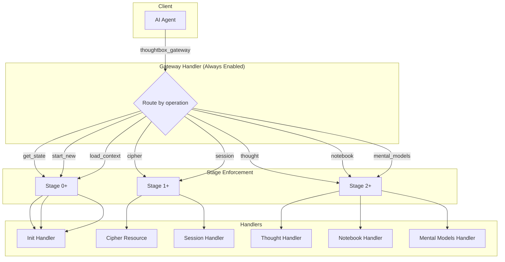

# Thoughtbox Tool Interfaces

> **Part of:** [Architecture Documentation](./ARCHITECTURE.md)
> **Last Updated:** 2026-01-20

Complete tool interface specifications including the gateway router, individual tools, and storage interface.

---

## Table of Contents

- [Gateway Architecture](#gateway-architecture)
- [Gateway Tool](#gateway-tool)
- [Thought Tool](#thought-tool)
- [Session Tool](#session-tool)
- [Notebook Tool](#notebook-tool)
- [Mental Models Tool](#mental-models-tool)
- [Storage Interface](#storage-interface)

---

## Gateway Architecture

The gateway is an always-on router that bypasses client tool list refresh limitations.



### Operation Routing Table

```yaml
gateway_routes:
  # Stage 0 operations (always available)
  get_state:
    handler: init
    minimum_stage: 0
    advances_to: null

  start_new:
    handler: init
    minimum_stage: 0
    advances_to: 1
    parameters:
      sessionTitle:
        type: string
        required: false
      domain:
        type: string
        required: false

  load_context:
    handler: init
    minimum_stage: 0
    advances_to: 1
    parameters:
      sessionId:
        type: string
        required: true

  list_sessions:
    handler: init
    minimum_stage: 0
    advances_to: null

  navigate:
    handler: init
    minimum_stage: 0
    advances_to: null

  list_roots:
    handler: init
    minimum_stage: 0
    advances_to: null
    description: "Query MCP roots from client (SPEC-011)"

  bind_root:
    handler: init
    minimum_stage: 0
    advances_to: null
    description: "Bind root directory as project scope"

  # Stage 1 operations
  cipher:
    handler: resource
    minimum_stage: 1
    advances_to: 2
    returns: "thoughtbox://cipher resource content"

  session:
    handler: sessions
    minimum_stage: 1
    advances_to: null
    sub_operations:
      - list
      - get
      - search
      - resume
      - export
      - analyze
      - extract_learnings

  # Stage 2 operations
  thought:
    handler: thought
    minimum_stage: 2
    advances_to: null
    parameters:
      thought:
        type: string
        required: true
      thoughtNumber:
        type: integer
        required: true
      totalThoughts:
        type: integer
        required: true
      nextThoughtNeeded:
        type: boolean
        required: true
      isRevision:
        type: boolean
        required: false
      revisesThought:
        type: integer
        required: false
      branchFromThought:
        type: integer
        required: false
      branchId:
        type: string
        required: false
      critique:
        type: boolean
        required: false

  notebook:
    handler: notebook
    minimum_stage: 2
    advances_to: null
    sub_operations:
      - create
      - add_cell
      - update_cell
      - run_cell
      - install_deps
      - export

  mental_models:
    handler: mental_models
    minimum_stage: 2
    advances_to: null
    sub_operations:
      - get_model
      - list_models
      - list_tags
```

---

## Gateway Tool

```yaml
tool:
  name: thoughtbox_gateway
  description: "Always-on router for all Thoughtbox operations"
  inputSchema:
    type: object
    required:
      - operation
    properties:
      operation:
        type: string
        enum:
          - get_state
          - start_new
          - load_context
          - list_sessions
          - navigate
          - list_roots
          - bind_root
          - cipher
          - session
          - thought
          - notebook
          - mental_models

      # Operation-specific parameters
      # (varies by operation, see gateway routes above)
```

---

## Thought Tool

```yaml
tool:
  name: thought
  access: "gateway { operation: 'thought', ... }"
  description: "Record a reasoning step"
  inputSchema:
    type: object
    required:
      - thought
      - thoughtNumber
      - totalThoughts
      - nextThoughtNeeded
    properties:
      thought:
        type: string
        description: "Reasoning content (can use cipher notation)"
      thoughtNumber:
        type: integer
        minimum: 1
      totalThoughts:
        type: integer
        minimum: 1
      nextThoughtNeeded:
        type: boolean
      isRevision:
        type: boolean
      revisesThought:
        type: integer
      branchFromThought:
        type: integer
      branchId:
        type: string
        pattern: "^[a-z0-9-]+$"
      critique:
        type: boolean
        description: "Request autonomous LLM critique"
```

---

## Session Tool

```yaml
tool:
  name: session
  access: "gateway { operation: 'session', subOperation: '...', ... }"
  description: "Session management operations"

  operations:
    list:
      description: "Browse sessions with filters"
      parameters:
        project:
          type: string
        task:
          type: string
        search:
          type: string
        limit:
          type: integer
          default: 20

    get:
      description: "Retrieve session with full metadata"
      parameters:
        sessionId:
          type: string
          required: true

    search:
      description: "Query sessions by content patterns"
      parameters:
        query:
          type: string
          required: true

    resume:
      description: "Load session and advance to Stage 1"
      parameters:
        sessionId:
          type: string
          required: true

    export:
      description: "Export session as JSON or Markdown"
      parameters:
        sessionId:
          type: string
          required: true
        format:
          type: string
          enum: [json, markdown]
          default: json

    analyze:
      description: "Session statistics"
      parameters:
        sessionId:
          type: string
          required: true
      returns:
        linearity: number
        density: number
        completion: number
        branchCount: number

    extract_learnings:
      description: "Derive patterns for knowledge base"
      parameters:
        sessionId:
          type: string
          required: true
```

---

## Notebook Tool

```yaml
tool:
  name: notebook
  access: "gateway { operation: 'notebook', subOperation: '...', ... }"
  description: "Literate programming engine"

  operations:
    create:
      description: "Create new notebook"
      parameters:
        name:
          type: string
          required: true
        template:
          type: string
          enum: [blank, sequential-feynman]

    add_cell:
      description: "Add cell to notebook"
      parameters:
        notebookId:
          type: string
          required: true
        type:
          type: string
          enum: [title, markdown, code]
          required: true
        content:
          type: string
          required: true
        afterCellId:
          type: string

    update_cell:
      description: "Update existing cell"
      parameters:
        notebookId:
          type: string
          required: true
        cellId:
          type: string
          required: true
        content:
          type: string
          required: true

    run_cell:
      description: "Execute code cell"
      parameters:
        notebookId:
          type: string
          required: true
        cellId:
          type: string
          required: true
      returns:
        output: string
        error: string | null

    install_deps:
      description: "Install npm dependencies"
      parameters:
        notebookId:
          type: string
          required: true
        packages:
          type: array
          items:
            type: string

    export:
      description: "Export to .src.md format"
      parameters:
        notebookId:
          type: string
          required: true
```

---

## Mental Models Tool

```yaml
tool:
  name: mental_models
  access: "gateway { operation: 'mental_models', subOperation: '...', ... }"
  description: "Structured reasoning frameworks"

  operations:
    get_model:
      description: "Get full prompt for model"
      parameters:
        modelId:
          type: string
          required: true
          enum:
            - rubber-duck
            - five-whys
            - pre-mortem
            - steelmanning
            - fermi-estimation
            - trade-off-matrix
            - decomposition
            - inversion
            - abstraction-laddering
            - constraint-relaxation
            - assumption-surfacing
            - adversarial-thinking
            - time-horizon-shifting
            - impact-effort-grid
            - opportunity-cost

    list_models:
      description: "Browse models with optional tag filter"
      parameters:
        tag:
          type: string
          enum:
            - debugging
            - planning
            - decision-making
            - risk-management
            - problem-solving
            - analysis

    list_tags:
      description: "Show available tags"
      returns:
        tags:
          type: array
          items:
            type: string
```

---

## Storage Interface

### ThoughtboxStorage

```yaml
ThoughtboxStorage:
  interface: true
  description: "Abstract storage interface"

  methods:
    # Session operations
    createSession:
      parameters:
        session: Session
      returns: Promise<void>

    getSession:
      parameters:
        sessionId: string
      returns: Promise<Session | null>

    updateSession:
      parameters:
        sessionId: string
        updates: Partial<Session>
      returns: Promise<void>

    listSessions:
      parameters:
        filters: SessionFilters
      returns: Promise<Session[]>

    deleteSession:
      parameters:
        sessionId: string
      returns: Promise<void>

    # Thought operations
    addThought:
      parameters:
        sessionId: string
        thought: ThoughtData
      returns: Promise<void>

    getThoughts:
      parameters:
        sessionId: string
      returns: Promise<ThoughtData[]>

    getThought:
      parameters:
        sessionId: string
        thoughtNumber: number
      returns: Promise<ThoughtData | null>

    # Branch operations
    getBranches:
      parameters:
        sessionId: string
      returns: Promise<string[]>

    getBranchThoughts:
      parameters:
        sessionId: string
        branchId: string
      returns: Promise<ThoughtData[]>
```

### Implementation Comparison

```mermaid
graph TB
    subgraph "InMemoryStorage"
        IM_Sessions[Sessions Map]
        IM_Linked[LinkedThoughtStore]
        IM_Index[Session Index]
    end

    subgraph "FileSystemStorage"
        FS_Dir[~/.thoughtbox/projects/]
        FS_Manifest[manifest.json]
        FS_Thoughts[001.json, 002.json, ...]
        FS_Branches[{branchId}/]
    end

    subgraph "LinkedThoughtStore"
        Nodes[nodes: Map]
        SessionHead[sessionHead: Map]
        SessionTail[sessionTail: Map]
        SessionIndex[sessionIndex: Map]
        RevisedBy[revisedByIndex: Map]
        BranchChildren[branchChildrenIndex: Map]
    end
```

### Directory Structure

```
~/.thoughtbox/
├── config.json                       # Global configuration
└── projects/
    └── {project}/
        └── sessions/
            ├── 2025-12/              # Monthly partition
            │   └── {uuid}/
            │       ├── manifest.json # Session metadata
            │       ├── 001.json      # Thought 1
            │       ├── 002.json      # Thought 2
            │       └── {branchId}/   # Branch directory
            │           ├── 001.json
            │           └── 002.json
            ├── 2025-W50/             # Weekly partition
            │   └── ...
            └── 2025-12-07/           # Daily partition
                └── ...
```

### Partition Strategies

```yaml
partition_strategies:
  monthly:
    format: "YYYY-MM"
    example: "2025-12"
    description: "Default - groups by month"

  weekly:
    format: "YYYY-[W]WW"
    example: "2025-W50"
    description: "ISO week numbers"

  daily:
    format: "YYYY-MM-DD"
    example: "2025-12-07"
    description: "One directory per day"

  none:
    format: ""
    example: "{uuid}/"
    description: "Legacy - flat structure"
```

---

*See also: [Architecture Overview](./ARCHITECTURE.md) | [Data Models](./DATA-MODELS.md) | [Configuration](./CONFIGURATION.md)*
