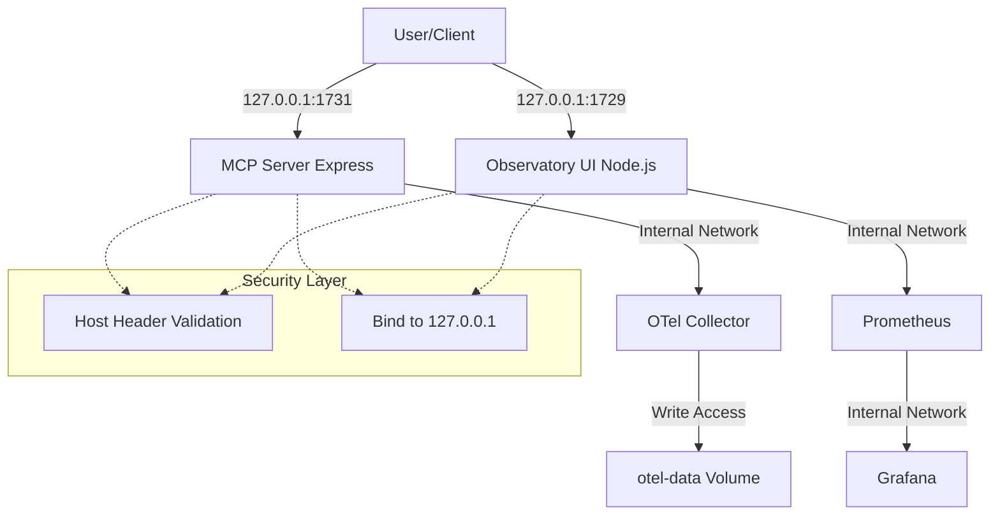

# Technical Specification: OTel Permission Fix and Security Improvements

## 1. OTel Permission Fix

### Problem
The OpenTelemetry Collector service (`otel-collector`) in `docker-compose.yml` encounters permission issues when attempting to write to the mounted volume `otel-data` (mapped to `/var/lib/otel`). This typically happens because the collector process runs as a non-root user (UID 10001 by default in the official image) which lacks write permissions to the host-mounted directory.

### Solution
Modify `docker-compose.yml` to run the `otel-collector` service as the root user. This ensures it has the necessary permissions to manage the data volume.

**Changes in `docker-compose.yml`:**
```yaml
  otel-collector:
    image: otel/opentelemetry-collector-contrib:0.113.0
    user: "0:0"  # Run as root to fix volume permission issues
    command: ["--config=/etc/otelcol/config.yaml"]
    volumes:
      - ./otel-collector/config-with-prometheus.yaml:/etc/otelcol/config.yaml:ro
      - otel-data:/var/lib/otel
    # ... rest of config
```

## 2. Security Improvements

### 2.1 Host Binding Changes
To reduce the attack surface, all services should bind to `127.0.0.1` (localhost) by default instead of `0.0.0.0` (all interfaces).

#### MCP Server (`src/index.ts`)
- Change the default host from `0.0.0.0` to `127.0.0.1`.
- Update `createMcpExpressApp` configuration.

#### Observatory Server (`src/observatory/server.ts`)
- Update `ObservatoryConfigSchema` in `src/observatory/config.ts` to include a `host` field defaulting to `127.0.0.1`.
- Update `httpServer.listen` to explicitly use the configured host.

### 2.2 Host Header Validation (DNS Rebinding Protection)
Implement a simple middleware to validate the `Host` header against an allowlist of expected hostnames (e.g., `localhost`, `127.0.0.1`). This prevents DNS rebinding attacks.

#### Implementation Plan
1. Create `src/security/host-validation.ts` with a reusable validation function.
2. Add the middleware to the Express app in `src/index.ts`.
3. Add a manual check in the `handleHttpRequest` function in `src/observatory/server.ts`.

**Example Validation Logic:**
```typescript
export function isHostAllowed(host: string | undefined, allowedHosts: string[]): boolean {
  if (!host) return false;
  const hostname = host.split(':')[0];
  return allowedHosts.includes(hostname);
}
```

### 2.3 Docker Compose Port Mappings
Update `docker-compose.yml` to bind exposed ports to `127.0.0.1` on the host side.

**Changes in `docker-compose.yml`:**
- `thoughtbox`:
  - `127.0.0.1:1729:1729`
  - `127.0.0.1:1731:1731`
- `mcp-sidecar`:
  - `127.0.0.1:4000:4000`
- `otel-collector`:
  - `127.0.0.1:4318:4318`
  - `127.0.0.1:8889:8889`
- `prometheus`:
  - `127.0.0.1:9090:9090`
- `grafana`:
  - `127.0.0.1:3001:3000`

## 3. Summary of Affected Files
- `docker-compose.yml`
- `src/index.ts`
- `src/observatory/config.ts`
- `src/observatory/server.ts`
- `src/security/host-validation.ts` (New file)

## 4. Architecture Diagram


