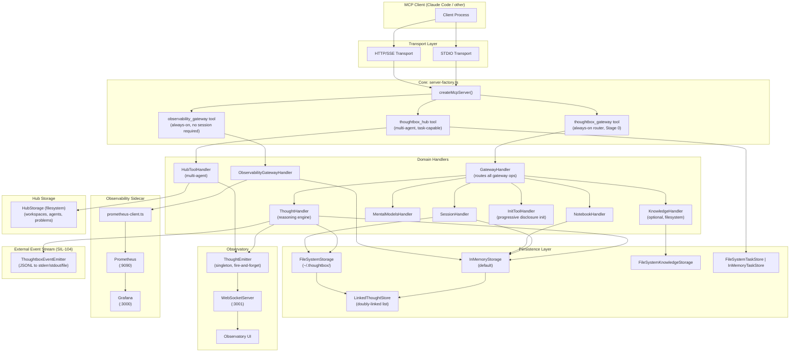
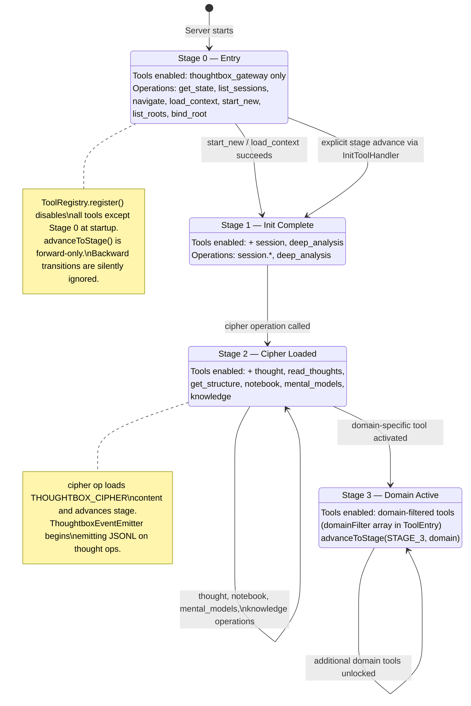
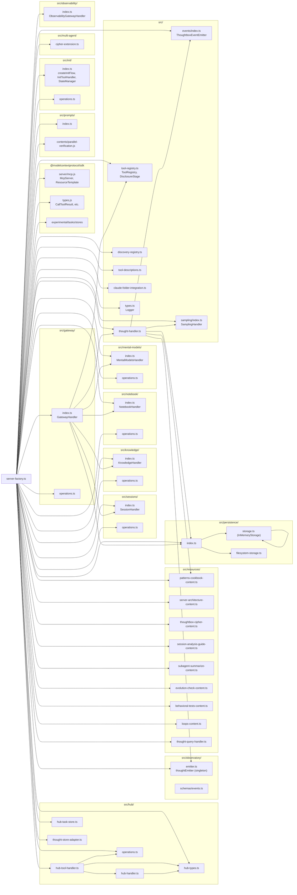
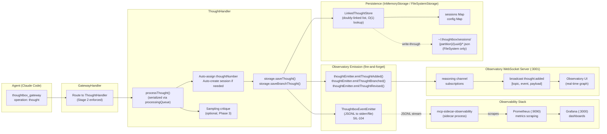

# Thoughtbox MCP Server — Architecture Atlas and Prioritized Action Plan

**Generated:** 2026-02-18
**Source revision:** `main` (pre-commit, working tree dirty)

---

## Part 1: Architecture Diagrams

The diagrams below are derived from reading `src/server-factory.ts` (all imports verified), `src/thought-handler.ts`, `src/tool-registry.ts`, `src/hub/hub-tool-handler.ts`, and `src/observatory/schemas/events.ts`.

---

### Diagram 1: System Architecture — Top-Level Modules



---

### Diagram 2: Progressive Disclosure State Machine



---

### Diagram 3: Module Dependency Graph (from server-factory.ts imports)



---

### Diagram 4: Hub Domain Model

```mermaid
erDiagram
    AgentIdentity {
        string agentId PK
        string name
        string role "coordinator | contributor"
        string profile "MANAGER|ARCHITECT|DEBUGGER|SECURITY|RESEARCHER|REVIEWER"
        string clientInfo
        string registeredAt
    }

    Workspace {
        string id PK
        string name
        string description
        string createdBy FK
        string mainSessionId
        string createdAt
        string updatedAt
    }

    WorkspaceAgent {
        string agentId FK
        string role "coordinator | contributor"
        string joinedAt
        string status "online | offline"
        string lastSeenAt
        string currentWork "problemId"
    }

    Problem {
        string id PK
        string workspaceId FK
        string title
        string description
        string createdBy FK
        string assignedTo FK
        string status "open|in-progress|resolved|closed"
        string branchId
        number branchFromThought
        string resolution
        string parentId FK
        string createdAt
        string updatedAt
    }

    Comment {
        string id PK
        string agentId FK
        string content
        string createdAt
    }

    Proposal {
        string id PK
        string workspaceId FK
        string title
        string description
        string sourceBranch
        string problemId FK
        string status "open|reviewing|merged|rejected"
        string createdBy FK
    }

    Consensus {
        string id PK
        string workspaceId FK
        string name
        string description
        string thoughtRef
        string branchId
        string createdBy FK
    }

    Channel {
        string workspaceId FK
        string problemId FK
        array messages
    }

    HubEvent {
        string type "problem_created|message_posted|proposal_merged|consensus_marked|workspace_created|problem_status_changed"
        string workspaceId
        object data
    }

    AgentIdentity ||--o{ WorkspaceAgent : "joins as"
    Workspace ||--o{ WorkspaceAgent : "has members"
    Workspace ||--o{ Problem : "contains"
    Workspace ||--o{ Proposal : "contains"
    Workspace ||--o{ Consensus : "records"
    Problem ||--o{ Comment : "has"
    Problem ||--o{ Channel : "has"
    Problem ||--o{ Problem : "depends on / parent of"
    Proposal ||--o| Problem : "addresses"
    AgentIdentity ||--o{ Problem : "creates/claims"
    AgentIdentity ||--o{ Proposal : "creates"
    AgentIdentity ||--o{ Consensus : "endorses"
    Workspace ..> HubEvent : "emits"
```

---

### Diagram 5: Data Flow — Thought to Grafana



---

## Part 2: Prioritized Action Plan

### Phase 0: Triage — Unstaged Working Tree (Immediate)

The working tree has 65 files changed: 289 insertions, 6829 deletions.
No code is lost — all deletions are intentional cleanup verified against git history.

#### 0.1 `.claude/` Deletions (intentional consolidation)

**What exists:** 52 deleted files across `.claude/agents/`, `.claude/commands/`, `.claude/hooks/`, `.claude/knowledge/`, `.claude/skills/`, `.claude/team-prompts/`.

**What happened:** These project-local agent/skill files were migrated out of the repo (into a plugin or global config).
The `agents/` top-level directory (3 new files) replaces the `.claude/agents/` location.

**Action:** Stage all `.claude/` deletions together as one atomic commit.

```bash
git add .claude/
git commit -m "chore(.claude): remove project-local agent/skill scaffolding (migrated to plugin)"
```

- Files affected: All `.claude/**` deleted entries in git status
- Priority: P0 — cleans noise from all future diffs
- Complexity: small (mechanical staging)

#### 0.2 `agents/` Additions (new top-level agent directory)

**What exists:** `agents/claude-md-updater.md`, `agents/improvement-reasoner.md`, `agents/loop-orchestrator.md`

**Action:** Stage and commit as the replacement agent definitions.

```bash
git add agents/
git commit -m "feat(agents): add top-level agent definitions for loop orchestration and improvement reasoning"
```

- Files affected: `agents/*.md`
- Priority: P0
- Complexity: small

#### 0.3 `.gitignore` Changes

**What changed:** 3 lines added.
Read the diff to confirm what is being excluded before staging.

```bash
git diff .gitignore
git add .gitignore
```

- Files affected: `.gitignore`
- Priority: P0
- Complexity: small

#### 0.4 `CLAUDE.md` Rewrite

**What changed:** 223 lines inserted, net +223.
This is likely a major rewrite of project instructions for Claude Code.
Requires careful review before staging (see Phase 2 action item 3).

- Files affected: `CLAUDE.md`
- Priority: P1 (review before committing)
- Complexity: medium

#### 0.5 `observability/` Changes

Three files modified:

- `observability/mcp-sidecar-observability/src/instrumentation.ts` — 11 line change
- `observability/mcp-sidecar-observability/src/upstream.ts` — 17 line change
- `observability/prometheus.yml` — 5 lines added

**Action:** Review diffs, then stage and commit as one observability update.

```bash
git add observability/
git commit -m "fix(observability): update instrumentation and prometheus scrape config"
```

- Files affected: `observability/**`
- Priority: P1
- Complexity: small

#### 0.6 `.beads/issues.jsonl` Changes

**What changed:** 128 line churn (issues updated).
This is automated issue tracking state.
Commit after all other Phase 0 commits so bead state reflects final picture.

- Files affected: `.beads/issues.jsonl`
- Priority: P1 (after 0.1–0.5)
- Complexity: small (mechanical)

#### 0.7 `src/resources/loops-content.ts` — Already Restored

File is modified in working tree (restored content).
Stage after verifying build passes.

- Files affected: `src/resources/loops-content.ts`
- Priority: P1
- Complexity: small

---

### Phase 1: Stop the Bleeding — P1 Bugs

#### 1.1 ESM Export Bug in `src/persistence/storage.ts`

**Status:** `InMemoryStorage` is the default storage class.
It is the only non-filesystem path for reasoning sessions.

**Observed issue pattern:** When the project is built with `tsc` targeting ESM (`"module": "NodeNext"` or `"ESNext"` in `tsconfig.json`),
any `require()` calls or CommonJS patterns in the compiled output indicate a misconfiguration.

**Specific investigation needed:**

Read `tsconfig.json` and `src/persistence/index.ts` exports to confirm whether:

- `export { InMemoryStorage, LinkedThoughtStore } from './storage.js'` resolves correctly after `tsc` compilation
- The `.js` extension on the import is present in source (it is — verified in `persistence/index.ts` line 32)
- The `type: "module"` field is set in `package.json`

**Likely root cause:** A circular import or a file that uses `import()` dynamically where the compiled output uses `require()`.
The `LinkedThoughtStore` is imported by `filesystem-storage.ts` which then re-exports through `index.ts`.
If any file in the chain lacks the `.js` extension on relative imports, `tsc --module NodeNext` will emit a broken reference.

**Fix needed:**

1. Run `npm run build 2>&1` and capture the exact TSC error.
2. For each error of the form `ERR_REQUIRE_ESM` or `Cannot find module`, add `.js` to the import path in the source `.ts` file.
3. Verify `filesystem-storage.ts` line `import { LinkedThoughtStore } from './storage.js'` — confirm `.js` suffix is present.

- Files affected: `src/persistence/storage.ts`, `src/persistence/filesystem-storage.ts`, `src/persistence/index.ts`
- Priority: P1
- Complexity: small (once the exact error is identified)

#### 1.2 Hub Event Payload Shapes Mismatched with Observatory

**Observed mismatch:**

`src/hub/hub-handler.ts` defines `HubEvent.type` as:

```typescript
type: 'problem_created' | 'problem_status_changed' | 'message_posted' |
      'proposal_created' | 'proposal_merged' | 'consensus_marked' | 'workspace_created'
```

`src/observatory/emitter.ts` defines `ThoughtEmitterEvents["hub:event"]` as:

```typescript
{ type: string; workspaceId: string; data: Record<string, unknown> }
```

The emitter accepts `type: string` (loose), but the WebSocket channel consumers in `src/observatory/channels/` may narrow the type.

**The bridging path in `server-factory.ts` (line ~500):**

```typescript
onEvent: (event) => {
  thoughtEmitter.emitHubEvent(event);  // bridges HubEvent → ThoughtEmitterEvents["hub:event"]
}
```

**The schema in `src/observatory/schemas/events.ts` does not define a `HubEventPayloadSchema`.**
The schemas file defines `ThoughtAddedPayloadSchema`, `SessionStartedPayloadSchema`, etc., but hub events are passed through as raw `{ type, workspaceId, data }` without Zod validation.

**Specific mismatch:** `ThoughtAddedPayloadSchema` (line 43) expects `agentId?: string` and `agentRole?: AgentRoleSchema`, but when `ThoughtHandler` emits `thought:added` it passes `agentId` from `ThoughtData.agentId`.
The `ThoughtData` interface has `agentId?: string` and `agentName?: string` — but `agentName` is never passed to the observatory event, meaning the Observatory UI cannot display agent names without a lookup.

**Fix needed:**

1. Add `HubEventPayloadSchema` to `src/observatory/schemas/events.ts` with the union type matching `HubEvent.type`.
2. Validate hub events on emission with `HubEventPayloadSchema.parse(event)` or `.safeParse(event)`.
3. Pass `agentName` through `thought:added` events so the UI can display it without a secondary lookup.

- Files affected: `src/observatory/schemas/events.ts`, `src/observatory/emitter.ts`, `src/hub/hub-handler.ts`, `src/thought-handler.ts`
- Priority: P1
- Complexity: medium

---

### Phase 2: Documentation Alignment

#### 2.1 `CLAUDE.md` Rewrite

**Current state:** Working tree has `+223` lines added (unstaged).
The existing committed `CLAUDE.md` contains the `Meta_Skill Patterns` section with Dual Persistence, Progressive Disclosure, Thompson Sampling, and Multi-Layer Security patterns.

**Sections to verify are present in the rewrite:**

- Thompson Sampling for Reasoning Strategies — core architectural pattern
- Dual Persistence Architecture — still relevant even though SQLite is removed in favor of InMemoryStorage
- Progressive Disclosure pattern — directly implemented in `tool-registry.ts`
- Improvement Loop Learnings section (auto-generated)

**Sections to add:**

- Gateway Tool Architecture — document that `thoughtbox_gateway` is the sole entry point as of the consolidation
- Hub Progressive Disclosure — document the 3-stage hub operation flow (`STAGE_OPERATIONS[0/1/2]` in `hub-types.ts`)
- Observatory event taxonomy — list all `ThoughtEmitterEvents` types

**Sections to remove/update:**

- Any references to individual tools (`thoughtbox`, `thoughtbox_cipher`, `session`) — these are now sub-operations of `thoughtbox_gateway`
- SQLite references in Dual Persistence — storage is now `InMemoryStorage` + `FileSystemStorage` (no SQLite)

- Files affected: `CLAUDE.md`
- Priority: P2
- Complexity: medium

#### 2.2 `AGENTS.md` — References to Deleted `.claude/` Files

**Specific stale references to fix:**

- `AGENTS.md` references `.claude/skills/workflow/SKILL.md` — deleted
- References `.claude/commands/hdd/hdd.md` — verify if this was also deleted
- References `agentic-dev-team/agentic-dev-team-spec.md` — verify this file still exists

**Action:** Read `AGENTS.md` in full, cross-reference each referenced path with the actual filesystem, and update or remove broken links.

- Files affected: `AGENTS.md`
- Priority: P2
- Complexity: small

#### 2.3 `docs/docs-for-llms/ARCHITECTURE.md` Corrections

**What needs updating (if this file exists):**

- Tool list: should reflect that `thoughtbox_gateway`, `thoughtbox_hub`, and `observability_gateway` are the three registered tools (not individual tools)
- Storage: update any SQLite references to InMemoryStorage + FileSystemStorage
- Progressive Disclosure: update stage descriptions to match `tool-registry.ts` exactly (4 stages: 0=Entry, 1=Init Complete, 2=Cipher Loaded, 3=Domain Active)

**Action:** Check if this file exists, then apply corrections.

- Files affected: `docs/docs-for-llms/ARCHITECTURE.md` (if it exists)
- Priority: P2
- Complexity: medium

#### 2.4 `CONTRIBUTING.md` — `thick_read` Reference

**Location:** `CONTRIBUTING.md` line 36 reads:
> "We use structured commit messages optimized for code comprehension tools like `thick_read`."

**Issue:** `thick_read` is an internal tool reference that external contributors will not recognize.
It is also not defined or linked anywhere in the public documentation.

**Fix needed:** Either link to what `thick_read` is, replace with a generic phrase ("code archaeology tools"), or remove the reference entirely.

- Files affected: `CONTRIBUTING.md`
- Priority: P2
- Complexity: small (one line change)

---

### Phase 3: Cleanup

#### 3.1 Flatten Sub-Operation Arg Shapes (UX Improvement)

**Current shape** (all operations):

```json
{ "operation": "thought", "args": { "content": "...", "branchId": "..." } }
```

**Better shape** for simple operations:

```json
{ "operation": "thought", "content": "...", "branchId": "..." }
```

**Scope:** `gatewayToolInputSchema` in `src/gateway/gateway-handler.ts` and the corresponding `GatewayHandler.handle()` dispatch.
This is a breaking change for any client calling the current API.

**Recommendation:** Do not flatten — the current `args` envelope is consistent across all operations and makes routing cleaner.
Document this explicitly in the gateway spec instead of changing it.

- Files affected: `src/gateway/gateway-handler.ts`, `src/gateway/operations.ts`, `specs/gateway-tool.md`
- Priority: P3 (defer or reject)
- Complexity: large (breaking API change)

#### 3.2 `dgm-specs/` Empty Placeholder Cleanup

**What exists:** `dgm-specs/` directory contains `AGENT-TEAMS-INTEGRATION-ANALYSIS.md`, `archive/`, `benchmarks/registry.yaml`, `config.yaml`.
The benchmarks directory has `registry.yaml` but the actual benchmark implementations may be missing.

**Action:** Audit `dgm-specs/` contents, remove empty placeholder directories, or file issues for the missing implementations.

- Files affected: `dgm-specs/`
- Priority: P3
- Complexity: small

#### 3.3 Husky v10 Upgrade

**Current state:** Unknown — check `package.json` for the installed husky version.

**Action:**

1. Read `package.json` to check current husky version.
2. If on v8 or v9, upgrade: `npm install --save-dev husky@latest`.
3. Update `.husky/` hook scripts if the v10 API changed.
4. Verify pre-commit hooks still run after upgrade.

- Files affected: `package.json`, `.husky/`
- Priority: P3
- Complexity: small

#### 3.4 Prune Stale Remote Branches

**Action:**

```bash
git fetch --prune
git branch -r | grep -v "HEAD\|main"
```

Review and delete any merged feature branches that were not cleaned up.

- Files affected: remote refs only
- Priority: P3
- Complexity: small

---

### Phase 4: Release

#### 4.1 v2.0.0 Release Checklist

The gateway-only architecture (single `thoughtbox_gateway` entry point replacing all individual tools) is a breaking change for any client that called individual tools by name.
This warrants a major version bump.

**Current version in `server-factory.ts`:** `"1.2.2"` (line 194, hardcoded string, `// Keep in sync with package.json version`).

**Pre-release checklist:**

1. Confirm `package.json` version matches `src/server-factory.ts` version string — update both to `2.0.0`.
2. Audit `CHANGELOG.md` to ensure all breaking changes since last release are documented.
3. Run the full test suite: `npm test`.
4. Run the build: `npm run build` — zero TSC errors required.
5. Verify ESM export bug (Phase 1 item 1.1) is resolved before release.
6. Verify hub event payload mismatch (Phase 1 item 1.2) is resolved.
7. Update `docs/docs-for-llms/ARCHITECTURE.md` to reflect the v2 tool surface.
8. Tag: `git tag -a v2.0.0 -m "Gateway-only architecture: single thoughtbox_gateway entry point"`.
9. Push tag: `git push origin v2.0.0`.
10. Publish to npm: `npm publish` (if applicable).

- Files affected: `package.json`, `src/server-factory.ts`, `CHANGELOG.md`, `docs/`
- Priority: P1 (gate on Phase 1 bugs being fixed)
- Complexity: medium

---

## Summary Table

| # | Action | Files | Priority | Complexity |
|---|--------|-------|----------|------------|
| 0.1 | Stage `.claude/` deletions | `.claude/**` (52 files) | P0 | small |
| 0.2 | Stage `agents/` additions | `agents/*.md` | P0 | small |
| 0.3 | Stage `.gitignore` changes | `.gitignore` | P0 | small |
| 0.4 | Review and stage `CLAUDE.md` rewrite | `CLAUDE.md` | P1 | medium |
| 0.5 | Stage `observability/` changes | `observability/**` | P1 | small |
| 0.6 | Stage `.beads/issues.jsonl` | `.beads/issues.jsonl` | P1 | small |
| 0.7 | Stage restored `loops-content.ts` | `src/resources/loops-content.ts` | P1 | small |
| 1.1 | Fix ESM export bug in persistence | `src/persistence/*.ts` | P1 | small |
| 1.2 | Fix hub event payload mismatch | `src/observatory/schemas/events.ts`, `src/observatory/emitter.ts`, `src/hub/hub-handler.ts` | P1 | medium |
| 2.1 | Rewrite CLAUDE.md sections | `CLAUDE.md` | P2 | medium |
| 2.2 | Fix stale `.claude/` refs in AGENTS.md | `AGENTS.md` | P2 | small |
| 2.3 | Correct ARCHITECTURE.md | `docs/docs-for-llms/ARCHITECTURE.md` | P2 | medium |
| 2.4 | Remove `thick_read` ref in CONTRIBUTING.md | `CONTRIBUTING.md` | P2 | small |
| 3.1 | Evaluate arg shape flattening (likely reject) | `src/gateway/gateway-handler.ts` | P3 | large |
| 3.2 | Clean up `dgm-specs/` | `dgm-specs/` | P3 | small |
| 3.3 | Upgrade Husky to v10 | `package.json`, `.husky/` | P3 | small |
| 3.4 | Prune stale remote branches | remote refs | P3 | small |
| 4.1 | v2.0.0 release | `package.json`, `src/server-factory.ts`, `CHANGELOG.md` | P1 (gate) | medium |

---

## Appendix: Key Architectural Invariants

The following invariants were verified directly from source and must be preserved in all future changes:

1. **Single entry point:** `thoughtbox_gateway` is the only tool clients should use for reasoning.
   `thoughtbox_hub` is for multi-agent coordination.
   `observability_gateway` is for metrics queries.
   No other tools are registered.

2. **Forward-only disclosure:** `ToolRegistry.advanceToStage()` silently ignores backward transitions.
   Backward reset only occurs via `ToolRegistry.reset()`, used in testing.

3. **Fire-and-forget observatory:** `thoughtEmitter.safeEmit()` catches all listener errors.
   Observatory failures never propagate back to the reasoning path.

4. **Serialized thought processing:** `ThoughtHandler.processingQueue` is a promise chain that serializes concurrent thoughts.
   This prevents race conditions when multiple agents write to the same session simultaneously.

5. **Per-session MCP isolation:** `ThoughtHandler` stores `mcpSessionId` at construction time.
   `HubToolHandler` maintains a per-session identity map (`sessionIdentities: Map<string, string | null | undefined>`).
   Each MCP connection gets its own isolated state.

6. **LinkedThoughtStore is sole truth:** As of the current codebase, `LinkedThoughtStore` is the only storage structure for thoughts.
   The comment "sole source of truth" in `InMemoryStorage.saveThought()` (line 707) confirms double-storage was removed.

7. **Version string duplication:** `src/server-factory.ts` line 194 hardcodes `"1.2.2"`.
   This must be kept in sync with `package.json` manually — there is no automated enforcement.
