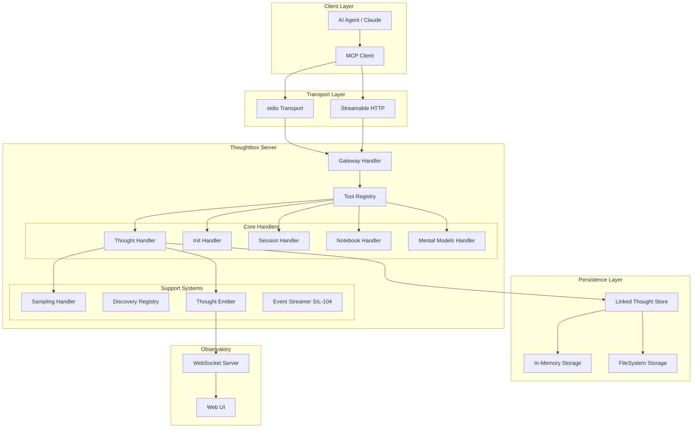
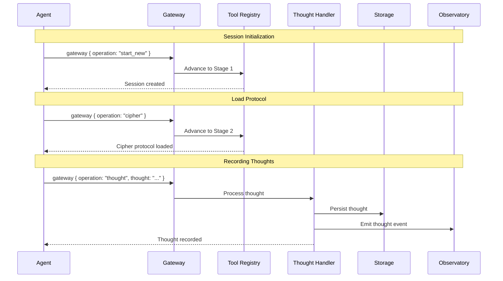
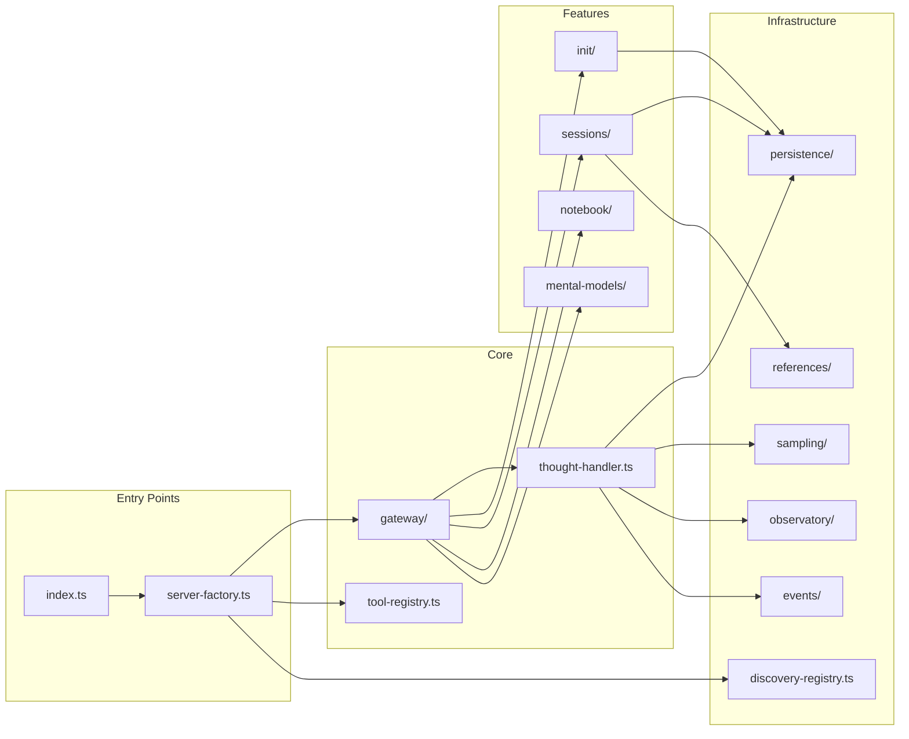
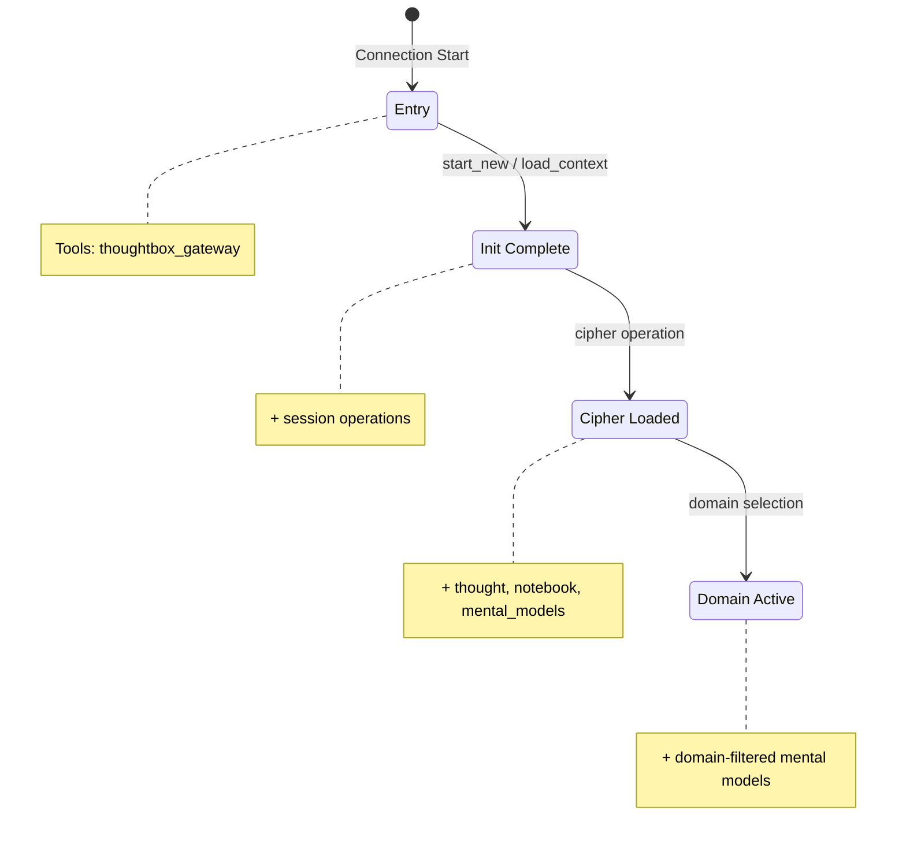
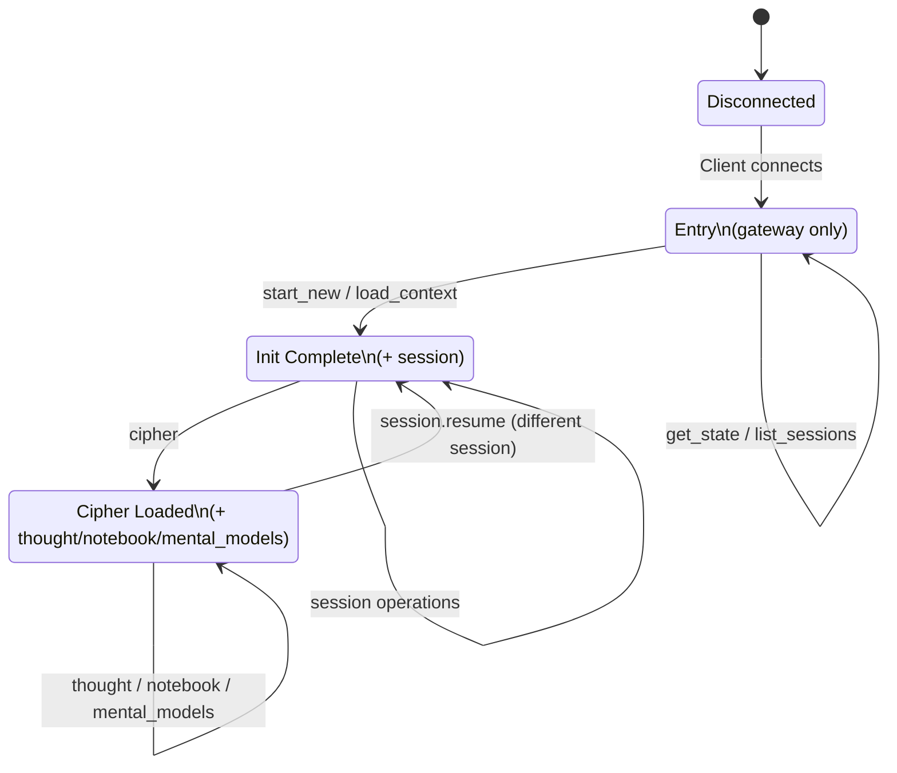
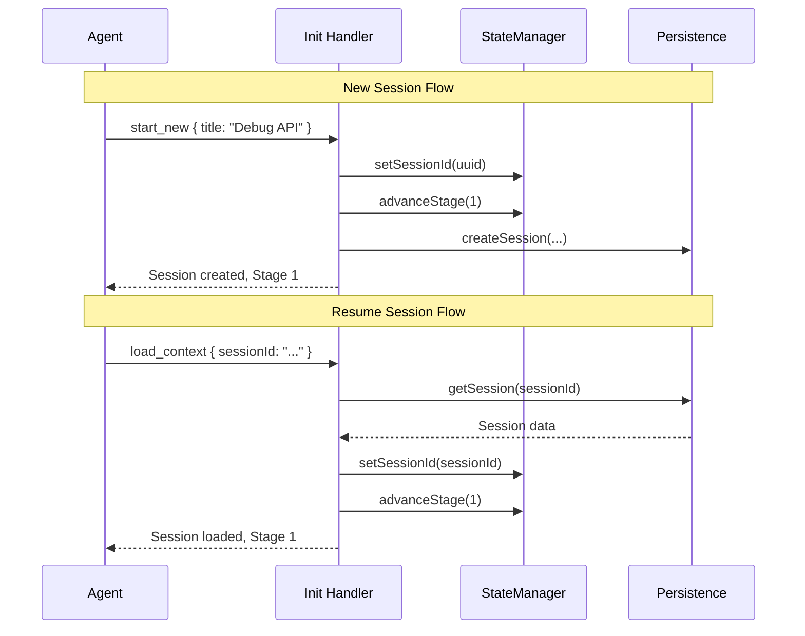
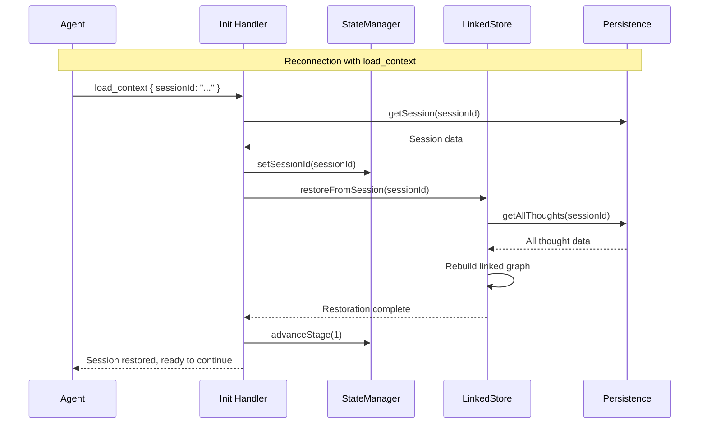
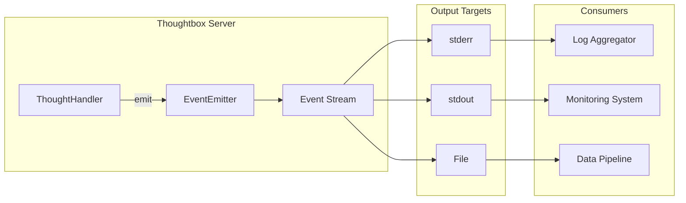
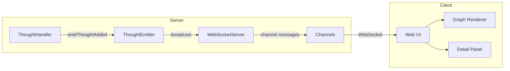
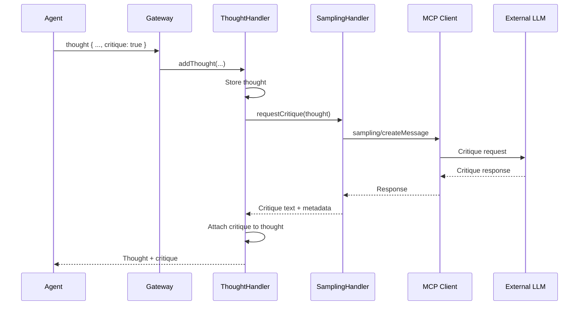

# Thoughtbox Server Architecture

> **Version:** 1.3.0
> **Last Updated:** 2026-01-21
> **Purpose:** Source of truth for Thoughtbox server architecture and data design

---

## Documentation Index

| Document | Description |
|----------|-------------|
| **[ARCHITECTURE.md](./ARCHITECTURE.md)** (this file) | System overview, diagrams, core concepts |
| **[DATA-MODELS.md](./DATA-MODELS.md)** | Complete data model schemas (~40 types) |
| **[TOOL-INTERFACES.md](./TOOL-INTERFACES.md)** | Gateway routing, tool specs, storage interface |
| **[CONFIGURATION.md](./CONFIGURATION.md)** | Environment variables, cipher protocol, appendices |

---

## System Overview

Thoughtbox is an MCP (Model Context Protocol) server providing infrastructure for structured reasoning. It functions as a "reasoning ledger" for AI agents, enabling:

- **Thought Chain Management**: Track reasoning across multiple thoughts with revisions and branches
- **Auto-Numbering (SIL-102)**: Optional thought numbers - server auto-assigns if omitted
- **Session Continuity (SIL-103)**: Seamless state restoration on reconnect via `restoreFromSession()`
- **Event Streaming (SIL-104)**: JSONL event output for external consumers
- **Progressive Disclosure**: Stage-based tool availability for guided agent onboarding
- **Formal Protocol**: Cipher notation for deterministic server-side parsing
- **Real-Time Visualization**: Observatory WebSocket server for live reasoning graphs
- **Autonomous Critique**: MCP sampling API integration for LLM-based critique loops

---

## Component Interaction Flow

---

## Module Dependency Graph

---

## Progressive Disclosure System

The Tool Registry manages 4 stages of tool availability:

| Stage | Name | Tools Available | Trigger |
|-------|------|-----------------|---------|
| **0** | Entry | `thoughtbox_gateway` | Connection start |
| **1** | Init Complete | + `session`, `deep_analysis` operations | `start_new` or `load_context` |
| **2** | Cipher Loaded | + `thought`, `read_thoughts`, `get_structure`, `notebook`, `mental_models` | `cipher` operation |
| **3** | Domain Active | + domain-filtered mental models | Domain selected |

**Implementation:** `src/tool-registry.ts`

---

## Session Management

### State Machine

### Session Lifecycle

### Session Continuity (SIL-103)

When an MCP connection resets (client disconnect, network interruption), Thoughtbox preserves session state:

**Key behaviors:**
- Full thought chain reconstruction from persistence
- Branch and revision links restored
- Next thought number calculated automatically
- Seamless continuation from last thought

**Implementation:** `src/sessions/handlers.ts:restoreFromSession()`

---

## Event Streaming (SIL-104)

External consumers can receive Thoughtbox events via JSONL streaming:

**Event Types:**
- `thought_added` - New thought recorded
- `thought_revised` - Thought revision created
- `branch_created` - New branch started
- `session_started` - New session created
- `session_loaded` - Existing session loaded
- `cipher_loaded` - Protocol notation loaded
- `stage_changed` - Progressive disclosure stage advanced

**Configuration:** See [CONFIGURATION.md](./CONFIGURATION.md#event-streaming)

---

## Observatory (Real-Time Visualization)

| Feature | Description |
|---------|-------------|
| Live Graph | Real-time reasoning visualization |
| Snake Layout | Compact left-to-right flow |
| Branch Rendering | Hierarchical branch display |
| Node Expansion | Click to explore thought details |
| Session Switching | Multi-session support |
| Detail Panel | Full thought inspection |

**Default port:** 1729 (taxicab number)

---

## Sampling Handler (Autonomous Critique)

---

## Key Architectural Patterns

### Gateway-Only Architecture

All operations route through a single `thoughtbox_gateway` tool. This bypasses client tool list refresh limitations common in streaming HTTP.

### Linked Thought Store

O(1) thought lookups via node ID map. Supports trees through multiple `next` pointers per node.

### Progressive Disclosure

Stage-based tool visibility guides agents through proper initialization sequence.

### Fire-and-Forget Events

Observatory emitter doesn't block reasoning on listener failures.

### Atomic Filesystem Writes

FileSystemStorage uses temp files + atomic rename to prevent corruption.

---

## Quick Reference

### Core Data Types

| Type | Purpose | See |
|------|---------|-----|
| `ThoughtData` | Individual reasoning step | [DATA-MODELS.md](./DATA-MODELS.md#thoughtdata-schema) |
| `Session` | Container for thought chains | [DATA-MODELS.md](./DATA-MODELS.md#session-schema) |
| `ThoughtNode` | Graph node for linked store | [DATA-MODELS.md](./DATA-MODELS.md#thoughtnode-schema-linked-store) |

### Gateway Operations

| Operation | Stage | Purpose | See |
|-----------|-------|---------|-----|
| `start_new` | 0 → 1 | Create new session | [TOOL-INTERFACES.md](./TOOL-INTERFACES.md#gateway-architecture) |
| `load_context` | 0 → 1 | Resume existing session (SIL-103) | [TOOL-INTERFACES.md](./TOOL-INTERFACES.md#gateway-architecture) |
| `cipher` | 1 → 2 | Load protocol notation | [CONFIGURATION.md](./CONFIGURATION.md#cipher-protocol) |
| `thought` | 2 | Record reasoning step (SIL-102 auto-number) | [TOOL-INTERFACES.md](./TOOL-INTERFACES.md#thought-tool) |
| `read_thoughts` | 2 | Query thoughts from session | [TOOL-INTERFACES.md](./TOOL-INTERFACES.md#read-thoughts-tool) |
| `get_structure` | 2 | Get reasoning graph topology | [TOOL-INTERFACES.md](./TOOL-INTERFACES.md#get-structure-tool) |
| `deep_analysis` | 1 | Advanced session pattern analysis | [TOOL-INTERFACES.md](./TOOL-INTERFACES.md#deep-analysis-tool) |

### Configuration

| Variable | Default | See |
|----------|---------|-----|
| `THOUGHTBOX_TRANSPORT` | `http` | [CONFIGURATION.md](./CONFIGURATION.md#environment-variables) |
| `THOUGHTBOX_STORAGE` | `fs` | [CONFIGURATION.md](./CONFIGURATION.md#environment-variables) |
| `PORT` | `1731` | [CONFIGURATION.md](./CONFIGURATION.md#environment-variables) |
| `THOUGHTBOX_EVENT_OUTPUT` | `none` | [CONFIGURATION.md](./CONFIGURATION.md#event-streaming) |

---

*This document is the source of truth for Thoughtbox server architecture.*

*For detailed specifications, see: [Data Models](./DATA-MODELS.md) | [Tool Interfaces](./TOOL-INTERFACES.md) | [Configuration](./CONFIGURATION.md)*
