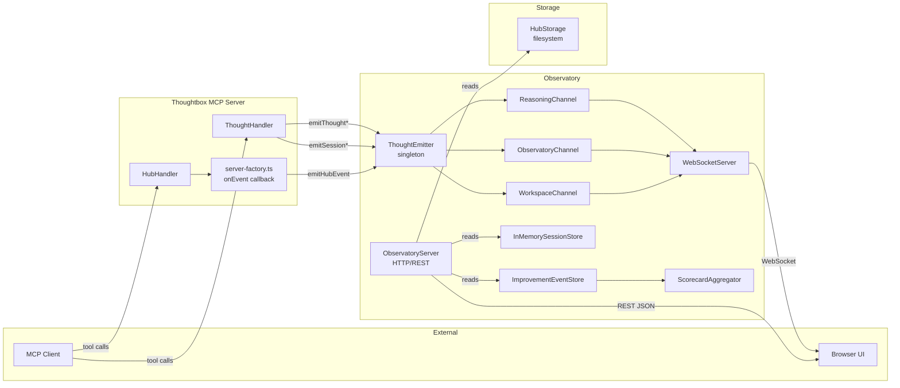
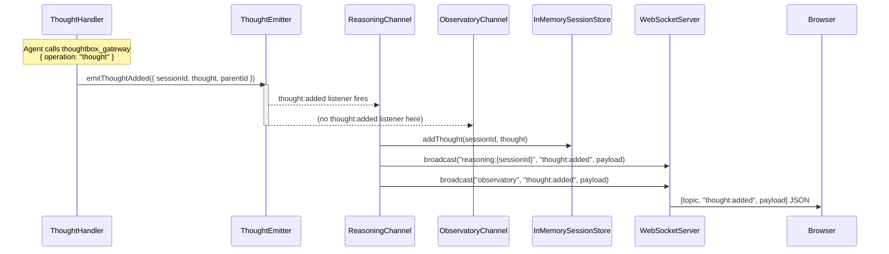
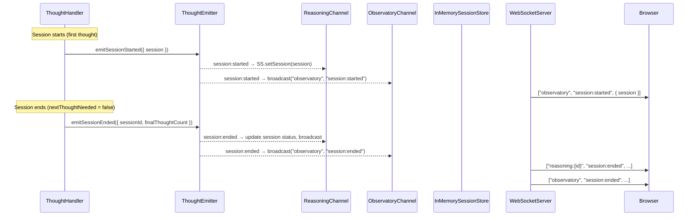
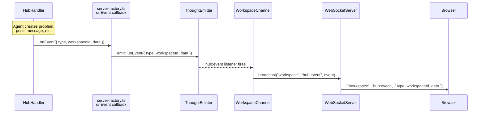
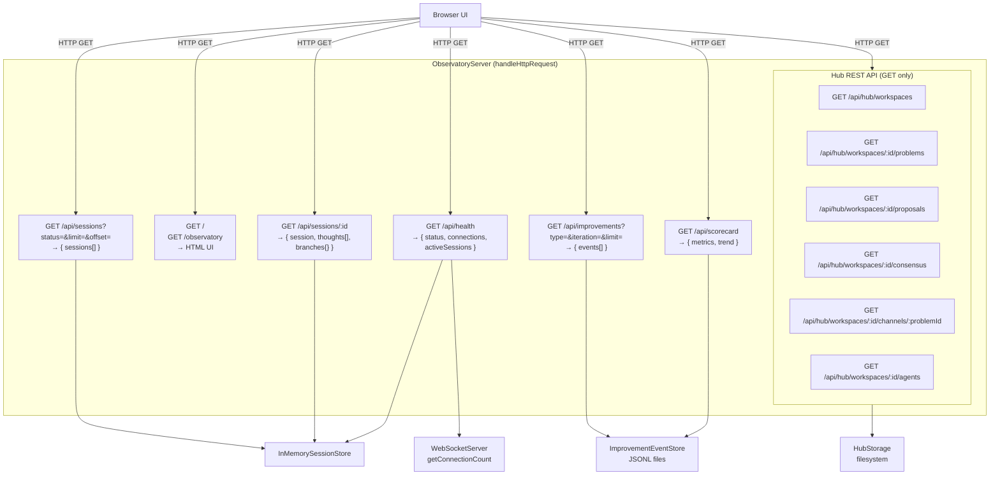
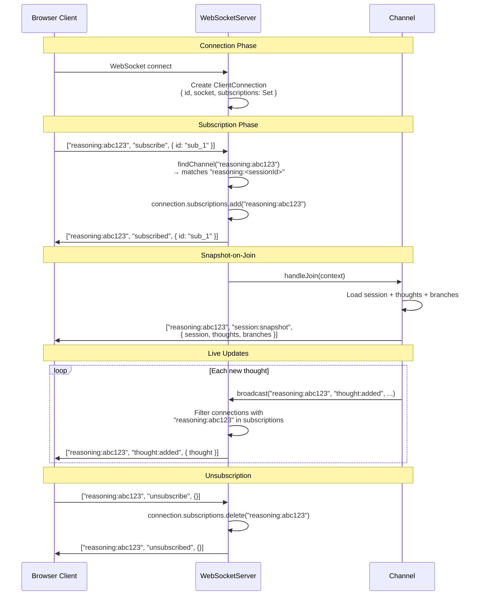

# Observatory Architecture

The Observatory is Thoughtbox's real-time observability subsystem. It provides a WebSocket-based streaming interface and REST API for monitoring reasoning sessions, hub collaboration events, and self-improvement loop progress — all without affecting the observed processes.

## Key Files

| File | Role |
|------|------|
| `src/observatory/emitter.ts` | `ThoughtEmitter` singleton — fire-and-forget event bus |
| `src/observatory/ws-server.ts` | `WebSocketServer` — connection/subscription manager |
| `src/observatory/channel.ts` | `Channel` base class — topic-pattern routing |
| `src/observatory/channels/reasoning.ts` | `ReasoningChannel` + `InMemorySessionStore` |
| `src/observatory/channels/observatory.ts` | `ObservatoryChannel` — global session/improvement events |
| `src/observatory/channels/workspace.ts` | `WorkspaceChannel` — hub event bridge |
| `src/observatory/server.ts` | `ObservatoryServer` — HTTP handler, REST API, startup |
| `src/observatory/config.ts` | `ObservatoryConfig` — env-based configuration |
| `src/observatory/improvement-store.ts` | `ImprovementEventStore` — JSONL persistence for SIL events |
| `src/observatory/scorecard-aggregator.ts` | `ScorecardAggregator` — metrics computation |
| `src/observatory/schemas/thought.ts` | Zod schemas for Thought, Session, Branch |
| `src/index.ts` | Startup wiring — `maybeStartObservatory()` |
| `src/server-factory.ts` | Hub event bridging — `thoughtEmitter.emitHubEvent()` |

---

## Diagram 1 — High-Level System Context

Shows the Observatory's position relative to the rest of the system: external actors (MCP clients, browser UI) and internal event producers (ThoughtHandler, HubHandler).



### Critical Invariant

The `ThoughtEmitter` is **fire-and-forget**. Calls are synchronous, return immediately, and listener errors never propagate back to the caller. The act of observation does NOT affect the reasoning process.

---

## Diagram 2 — Event Push Path: Thoughts

The complete path from a thought being recorded to it appearing in a browser via WebSocket.



### Session Lifecycle Events



### Hub Event Push Path



---

## Diagram 3 — REST Pull Path

HTTP request/response flows. The `ObservatoryServer` serves REST endpoints for querying state that accumulates in the `InMemorySessionStore` and `HubStorage`.



---

## Diagram 4 — Internal Component Architecture

All Observatory components and their relationships, showing data ownership and dependencies.

```mermaid
classDiagram
    class ThoughtEmitter {
        -instance: ThoughtEmitter
        +getInstance() ThoughtEmitter
        +emitThoughtAdded(data)
        +emitThoughtRevised(data)
        +emitThoughtBranched(data)
        +emitSessionStarted(data)
        +emitSessionEnded(data)
        +emitHubEvent(data)
        +emitImprovementEvent(data)
        +emitAgentSpawned(data)
        +emitTaskCreated(data)
        -safeEmit(event, data)
    }

    class WebSocketServer {
        -connections: Map~string, ClientConnection~
        -channels: Channel[]
        -maxConnections: number
        +registerChannel(channel)
        +broadcast(topic, event, payload)
        +start(portOrServer)
        +stop()
        +getConnectionCount() number
        -handleConnection(socket)
        -handleMessage(connection, data)
        -handleSubscribe(connection, topic)
        -findChannel(topic)
    }

    class Channel {
        -pattern: string
        -segments: TopicSegment[]
        -handlers: Map~string, RegisteredHandler~
        -joinHandler: JoinHandler
        +match(topic) TopicParams
        +on(event, schema, handler)
        +onJoin(handler)
        +handleJoin(context)
        +handleEvent(event, context, payload) boolean
    }

    class InMemorySessionStore {
        -sessions: Map~string, Session~
        -thoughts: Map~string, Thought[]~
        -branches: Map~string, Record~
        -MAX_SESSIONS: 1000
        +setSession(session)
        +addThought(sessionId, thought)
        +getSession(sessionId)
        +getActiveSessions() Session[]
        +getAllSessions() Session[]
        -cleanupOldSessions()
    }

    class ObservatoryServer {
        +start()
        +stop()
        +getWss() WebSocketServer
        +isRunning() boolean
        -handleHttpRequest(req, res)
        -handleHubApi(url, req, res)
    }

    class ImprovementEventStore {
        +initialize()
        +subscribe()
        +listEvents(filter) ImprovementEvent[]
        +summarize(filter) Summary
    }

    class ScorecardAggregator {
        +computeScorecard(opts) Scorecard
    }

    class ObservatoryConfig {
        +enabled: boolean
        +port: number = 1729
        +cors: string[]
        +path: string = "/ws"
        +maxConnections: number = 100
        +httpApi: boolean = true
    }

    ThoughtEmitter <.. Channel : listens to events
    WebSocketServer *-- Channel : registers 1..*
    Channel <|-- ReasoningChannel : pattern="reasoning:~sessionId~"
    Channel <|-- ObservatoryChannel : pattern="observatory"
    Channel <|-- WorkspaceChannel : pattern="workspace"
    ReasoningChannel --> InMemorySessionStore : reads/writes
    ObservatoryServer --> WebSocketServer : owns
    ObservatoryServer --> InMemorySessionStore : reads
    ObservatoryServer ..> ImprovementEventStore : creates per request
    ObservatoryServer ..> ScorecardAggregator : creates per request
    ObservatoryServer ..> HubStorage : reads (injected)
    ScorecardAggregator --> ImprovementEventStore : reads
    ObservatoryServer ..> ObservatoryConfig : configured by
```

---

## Diagram 5 — Channel Subscription Model

Topic patterns, subscription lifecycle, and snapshot-on-join behavior.



### Topic Patterns

| Channel | Pattern | Dynamic Params | Snapshot on Join |
|---------|---------|----------------|------------------|
| ReasoningChannel | `reasoning:<sessionId>` | `sessionId` | Full session state (session + thoughts + branches) |
| ObservatoryChannel | `observatory` | (none) | Active sessions list |
| WorkspaceChannel | `workspace` | (none) | None (clients fetch via REST) |

### Message Wire Format

All WebSocket messages use the same 3-tuple JSON format:

```json
[topic, event, payload]
```

Examples:
```json
["reasoning:abc123", "subscribe", { "id": "sub_1" }]
["reasoning:abc123", "thought:added", { "thought": {...}, "sessionId": "abc123" }]
["observatory", "session:started", { "session": {...} }]
["workspace", "hub:event", { "type": "problem_created", "workspaceId": "ws_1", "data": {...} }]
```

---

## Startup Wiring

The Observatory is conditionally started during server initialization:

```mermaid
flowchart TD
    Start["src/index.ts<br/>main()"]
    CS[createStorage<br/>→ { storage, hubStorage }]
    MSO[maybeStartObservatory<br/>hubStorage?]
    Config[loadObservatoryConfig<br/>from env vars]
    Check{THOUGHTBOX_OBSERVATORY_ENABLED<br/>== 'true'?}
    Create[createObservatoryServer<br/>{ config, hubStorage }]
    StartSrv[server.start]
    Register[Register channels:<br/>reasoning, observatory, workspace]
    Attach[Attach WSS to HTTP server]
    Listen["Listen on port<br/>(default 1729)"]

    Start --> CS --> MSO --> Config --> Check
    Check -- No --> Skip[Return null]
    Check -- Yes --> Create --> StartSrv --> Register --> Attach --> Listen
```

Environment variables:
- `THOUGHTBOX_OBSERVATORY_ENABLED=true` — enable the server
- `THOUGHTBOX_OBSERVATORY_PORT=1729` — HTTP/WS port
- `THOUGHTBOX_OBSERVATORY_CORS=*` — allowed origins
- `THOUGHTBOX_OBSERVATORY_PATH=/ws` — WebSocket path
- `THOUGHTBOX_OBSERVATORY_MAX_CONN=100` — max concurrent connections
