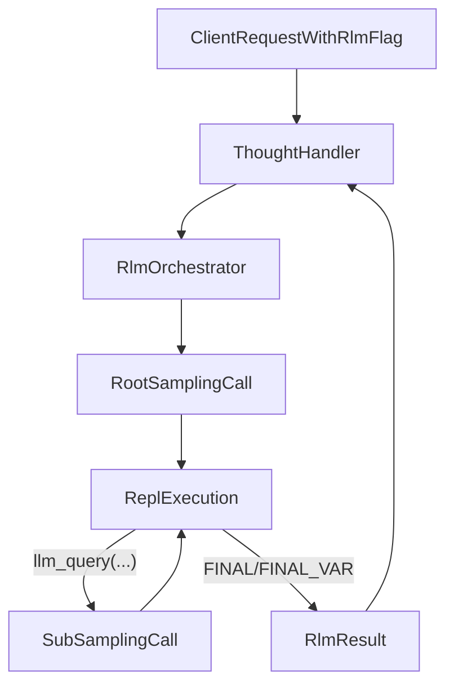

# RLM Sampling Workflow (Depth = 1)

## Goal

Use a depth‑1 Recursive Language Model loop to handle large context (project corpus + session reasoning) without stuffing everything into a single prompt. Root LM plans and issues REPL actions; sub‑LM calls happen through `sampling/createMessage` (MCP client required).

## Preconditions

- MCP client connected with `sampling/createMessage` capability.
- Explicit trigger from caller (no auto-heuristics).
- Context sources available:
  - Project corpus / index (files readable by Thoughtbox).
  - All thoughts from the current session.
  - Prior sessions (bounded and possibly summarized).
- REPL execution constrained and sandboxed (no arbitrary host access).

## Triggering

- Client sets an explicit flag (e.g., `rlm: true`) and supplies the user query (e.g., `rlmQuery`).
- No automatic invocation by the server.

## Context Policy

Include:

- Current session thoughts (full text).
- Prior sessions: bounded set (e.g., most recent N or summarized) to avoid explosion.
- Project corpus/index as strings/chunks (code, docs).

Exclude:

- Secrets: `.env`, tokens, credentials, SSH keys, cloud configs.
- OS/user metadata not needed for reasoning.
- Arbitrary binaries or large media; use text extractions/summaries instead.

Preparation rules:

- Chunk long files; prefer structural splits (sections/functions) over naive token cuts.
- Summarize older sessions before inclusion; keep raw text for the active session.
- Keep a budget per sub-call; cap total characters per `llm_query` payload.

## Workflow (depth = 1)



Step detail:

1) ThoughtHandler receives `rlm: true` + query, builds context bundle per policy.  
2) RLM orchestrator seeds REPL with `context`, `llm_query`, `FINAL`, `FINAL_VAR`, `print`.  
3) Root LM call (sampling) returns instructions + ```repl``` blocks.  
4) Execute REPL blocks safely; when `llm_query` is called, dispatch another sampling call (sub‑LM) with the provided chunk.  
5) Loop until `FINAL(...)` or `FINAL_VAR(...)`; return the final answer and attach to thought metadata.  

## Benefits

- Handles repo-scale + multi-session reasoning without single-prompt overflow.
- Reduces context rot via selective, programmatic inspection.
- Can parallelize sub-calls in future; today remains sequential depth‑1.

## Drawbacks / Risks

- Higher latency and cost variance (long trajectories).
- Dependent on sampling support; degrade gracefully if unavailable.
- REPL misuse risk: must sandbox built-ins and I/O.
- Coverage risk: poor chunking or summarization can miss facts.

## Guardrails & Limits

- Fixed max iterations for the root loop; timeout per sampling call.
- Truncate REPL stdout/stderr in returns to the LM.
- Safe built-ins only; forbid `eval/exec`, raw network, and unbounded file access.
- Cap payload size per `llm_query`; reject overly large chunks.

## Outputs

- RLM answer stored with the thought (alongside critique if present).
- Record model name and timestamp for traceability.

## Operational Notes

- Keep model hints separate for root vs. sub‑LM calls (root = higher intelligence priority; sub = cost‑balanced).
- If sampling is missing (`METHOD_NOT_FOUND`), skip RLM but do not fail the thought.
