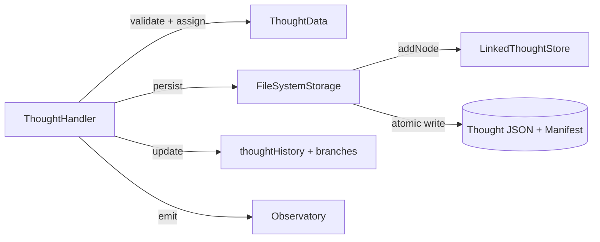
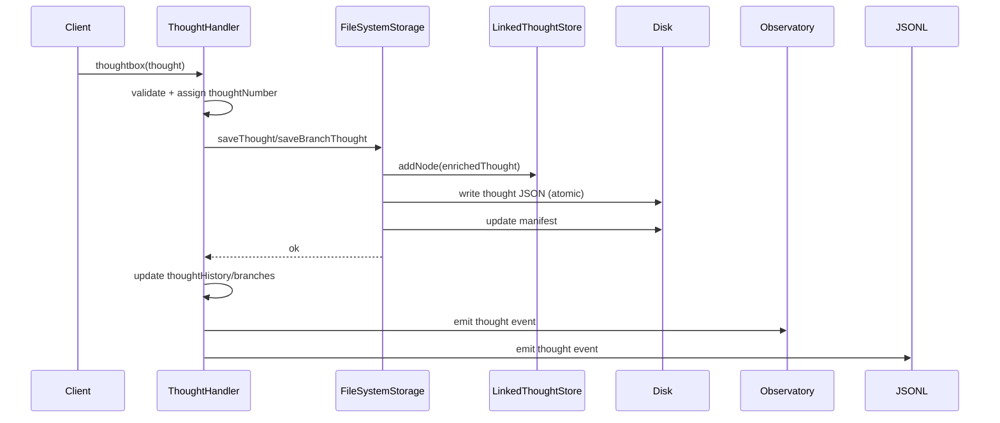
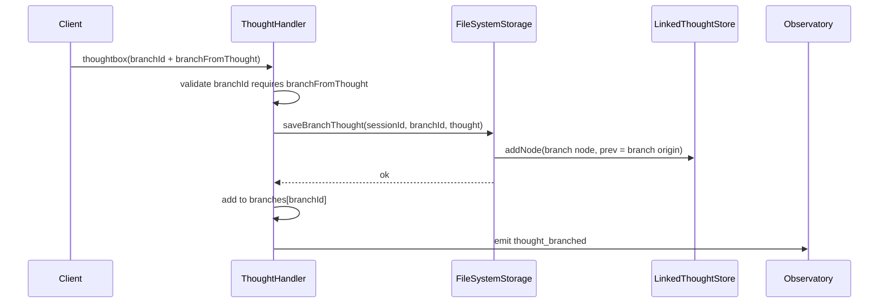
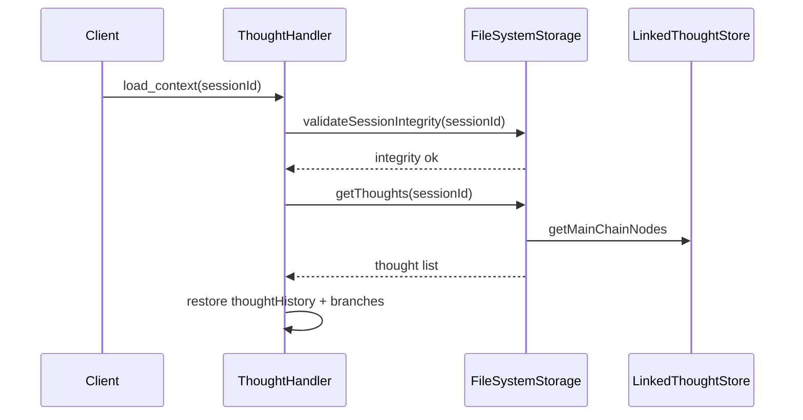

# Thoughtbox Version-Control Architecture

This document captures the current implementation of Thoughtbox's version-control-like
reasoning ledger. It focuses on the thought lifecycle, persistence, branching, and
revision chains, with concrete code references.

---

## System Context

```mermaid
graph TD
  Client[MCP Client] -->|thoughtbox tool| ThoughtHandler
  ThoughtHandler --> Storage[ThoughtboxStorage]
  Storage --> FS[(Filesystem)]
  Storage --> LinkedStore[LinkedThoughtStore]
  ThoughtHandler --> Observatory[Observatory Events]
  ThoughtHandler --> JSONL[Event Stream (JSONL)]

  subgraph Core
    ThoughtHandler
    Storage
    LinkedStore
  end
```

**Key entry points**
- Thought ingestion: `src/thought-handler.ts`
- Storage interface: `src/persistence/types.ts`
- In-memory index: `src/persistence/storage.ts`
- Filesystem persistence: `src/persistence/filesystem-storage.ts`
- Revision analysis: `src/revision/revision-index.ts`

---

## Core Data Structures

**Session (top-level container)**
- `src/persistence/types.ts` → `Session`

**ThoughtData (atomic record)**
- `src/persistence/types.ts` → `ThoughtData`
- Includes `thoughtNumber`, `branchId`, `branchFromThought`, `isRevision`, `revisesThought`

**ThoughtNode (linked + tree structure)**
- `src/persistence/types.ts` → `ThoughtNode`
- Doubly-linked list with `next[]` for branches

---

## Storage Layout (Filesystem)

From `src/persistence/filesystem-storage.ts`:

```
~/.thoughtbox/
└── projects/{project}/sessions/{partition}/{sessionId}/
    ├── manifest.json
    ├── 001.json
    ├── 002.json
    └── branches/{branchId}/
        ├── 001.json
        └── 002.json
```

**Manifest**
- Tracks main chain and branch files
- Updated on each thought write

---

## Component Architecture



**Important: two in-memory views**
1) `LinkedThoughtStore` inside the storage layer  
2) `thoughtHistory` and `branches` inside `ThoughtHandler`

These are updated in different steps, which matters for drift analysis.

---

## Thought Write Flow (Current Implementation)



**Key fact**
- Storage updates its own in-memory index (`LinkedThoughtStore`) **before** disk write.
- `ThoughtHandler` updates its own in-memory history **after** disk write succeeds.

---

## Branching Flow



Branch rules are enforced in `src/thought-handler.ts`:
- `branchId` requires `branchFromThought`
- Branch origin is always on the main chain

---

## Revision Chain Flow

```mermaid
graph TD
  T1[Thought 1] --> R2[Revision of 1]
  R2 --> R3[Revision of revision]

  subgraph RevisionIndexBuilder
    R2 -->|revisesThought=1| M1[metadata.revisedBy=[2]]
    R3 -->|revisesThought=2| M2[metadata.revisedBy=[3]]
  end
```

Revision metadata is computed by `RevisionIndexBuilder`:
- Builds reverse pointers (`revisedBy`)
- Computes `revisionDepth`
- Groups chains via `revisionChainId`

---

## Session Load / Restore Flow



`validateSessionIntegrity` verifies:
- manifest exists
- thought files listed in manifest exist on disk
- branch files listed in manifest exist on disk

---

## Drift Considerations (Where to Look)

Potential drift can happen across these layers:

1) `LinkedThoughtStore` vs on-disk files  
   - `saveThought` adds to `LinkedThoughtStore` before disk write.
2) `ThoughtHandler` memory vs storage layer  
   - `thoughtHistory/branches` update happens after persistence succeeds.

If you want “memory first, immediate persist,” that implies:
- Updating `ThoughtHandler` memory **before** storage writes, or
- Explicitly treating `LinkedThoughtStore` as the canonical in-memory index (and
  re-aligning any other in-memory caches to read from it).

---

## Key Files (Quick Index)

- Thought ingestion and ordering: `src/thought-handler.ts`
- Linked structure: `src/persistence/storage.ts` (`LinkedThoughtStore`)
- Disk writes + manifest: `src/persistence/filesystem-storage.ts`
- Types: `src/persistence/types.ts`
- Revision chain logic: `src/revision/revision-index.ts`

